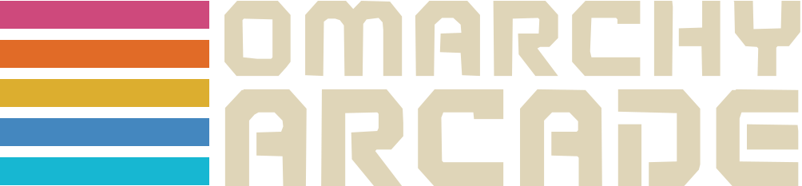

<p align="center">
  
</p>

<p align="center">
  <strong>The Native Offline Desktop Game Suite & Retro Arcade Launcher for Omarchy Linux.</strong>
</p>

<p align="center">
  
  
  
  
  
  
</p>

---

<p align="center">
  
</p>

## Rediscover Pure Arcade Gaming

Modern gaming on phones and mainstream operating systems has been ruined by mandatory logins, internet DRM checks, tracking SDKs, and unskippable video ads. When you lose cell signal on a flight, commute on a train, or work off-grid, modern games refuse to even launch.

**Omarchy Arcade** brings back the joy of authentic personal computing: instant, distraction-free games you actually own on your machine, built with high-performance native **Qt6 / QML** and hardware-accelerated vectors.

* 🔌 **True Offline Play:** Zero internet sockets, zero accounts, zero telemetry, and zero DRM. Works forever—on flights, off-grid, during outages, or whenever you want to disconnect.
* ⚡ **Keyboard-Primary for Power Users:** Full Vim (`HJKL`) and Arrow key navigation, numbers `1`–`9` for instant category switching, and `/` search. Designed from the ground up for tiling window managers.
* 🎨 **Live System Theme Sync:** Automatically reads your active Omarchy system theme (`~/.config/omarchy/current/theme/colors.toml`) in real time. Switch themes (`Super + Space`) and the entire arcade shifts colors instantly.
* 🪟 **Tiling-Native Process Lifecycle:** Launch any game and the launcher hides itself automatically to keep your workspace clear. Close the game, and the launcher reappears and regains active focus instantly.
* 💾 **Tactile 3.5" Disk Presentation:** Nostalgic floppy disks with painted retro box art, animated selection halos, and Steam-style modal sheets featuring live gameplay previews.

---

## 438 KB vs 231 MB: The Future of Lean Software

When you download a casual title like 2048 on modern mobile app stores (such as Ketchapp's edition), the download footprint exceeds **231 MB**. By contrast, Omarchy Arcade's 2048 is **438 KB**—roughly 1/500th the size:

| Metric | Mobile App Store Release | Omarchy Arcade |
| :--- | :--- | :--- |
| **Download / Install Size** | **231.3 MB** | **438 KB** (~0.4 MB) |
| **Footprint Ratio** | ~500× larger | ~1/500th the size |
| **Third-Party Ad SDKs** | AppLovin, AdMob, Mintegral, Unity Ads | **Zero** |
| **Analytics & Trackers** | Attribution SDKs, telemetry, crash reporting | **Zero** |
| **Network Activity** | Constant ad auctions & video streaming | **Zero network sockets** (Offline forever) |

> [!NOTE]
> **A Shift in Software Craft:**  
> We love Ketchapp's app and play it ourselves—this comparison is not picking on mobile studios. In the ad-funded app store era, ad mediation networks and tracking SDKs were the only way developers could survive. The bloat was an inevitable byproduct of the monetization model.
>
> Omarchy Arcade is a glimpse of what software looks like when creation becomes effortless: games and everyday tools no longer need to be advertising engines. Without monetization machinery, we return to pure, lean, joyful software that respects the user and their hardware.

---

## Choose Your Installation Method

Install Omarchy Arcade however you prefer—as an automated single command, a native system package, a portable executable, or a sandboxed container.

### Option 1: Standalone AppImage (Zero-Install Executable)

Download the single `Omarchy_Arcade-x86_64.AppImage` executable from [GitHub Releases](https://github.com/bigcjat/omarchyarcade/releases), make it executable, and run—zero git cloning and zero system changes:

```bash
chmod +x Omarchy_Arcade-x86_64.AppImage
./Omarchy_Arcade-x86_64.AppImage
```

---

### Option 2: One-Line Installer (Fastest for Omarchy)

Run this single command in your terminal. It installs **only the launcher application** (no git repository, no developer clone):

```bash
curl -sSL https://raw.githubusercontent.com/bigcjat/omarchyarcade/main/install.sh | bash
```

**What this sets up automatically:**
- Places the standalone launcher executable in `~/.local/bin/arcade`.
- Installs the retro vector icon in `~/.local/share/icons/`.
- Registers `omarchy-arcade.desktop` in your application launcher (Rofi / Walker / Fuzzel).
- Adds floating window rules and binds **`Super + G`** in `~/.config/hypr/hyprland.conf`.

---

### Option 3: Flatpak (KDE Qt6 Runtime)

Run the sandboxed Flatpak package:

```bash
cd packaging/flatpak
flatpak-builder --user --install --force-clean build-dir org.omarchy.Arcade.yml
flatpak run org.omarchy.Arcade
```

---

### Option 4: Native Arch / Omarchy Package (`pacman`)

Install directly via `pacman`:

```bash
curl -sSLO https://github.com/bigcjat/omarchyarcade/releases/latest/download/omarchy-arcade-1.0.0-1-any.pkg.tar.zst
sudo pacman -U omarchy-arcade-1.0.0-1-any.pkg.tar.zst
```

*Cleanly uninstall anytime with `sudo pacman -R omarchy-arcade`.*

---

## The 34 Games Included

Every game includes full offline documentation, keyboard controls mappings, and standalone launch capabilities:

| Game | Category | Install Size | Highlight | Documentation |
| :--- | :--- | :--- | :--- | :--- |
| **2048** | Blocks & Merging | **455 KB** | Harmonic pentatonic pitch chimes & smooth tile slides. | [Manual](games/2048/README.md) |
| **TetraBlocks** | Blocks & Merging | **287 KB** | Guideline falling block puzzle with SRS kicks & ghost piece. | [Manual](games/tetrablocks/README.md) |
| **ByteSnake** | Puzzles & Logic | **203 KB** | Sub-frame input buffering and progressive speed ramping. | [Manual](games/bytesnake/README.md) |
| **VectorPong** | Tabletop & Board | **209 KB** | Ball spin slicing and adaptive AI paddle physics. | [Manual](games/vectorpong/README.md) |
| **CyberSweeper** | Puzzles & Logic | **250 KB** | Deduction puzzle with guaranteed safe first click. | [Manual](games/cybersweeper/README.md) |
| **DropFour** | Tabletop & Board | **220 KB** | Tactile 4-in-a-row with heuristic lookahead AI. | [Manual](games/dropfour/README.md) |
| **BrickBash** | Action Arcade | **238 KB** | High-energy breakout with segmented paddle deflections. | [Manual](games/brickbash/README.md) |
| **VoidInvaders** | Action Arcade | **304 KB** | Descending alien armadas with destructible bunkers. | [Manual](games/voidinvaders/README.md) |
| **CyberFlap** | Action Arcade | **224 KB** | Airborne reflex runner with dynamic pitch aerodynamics. | [Manual](games/cyberflap/README.md) |
| **DinoRunner** | Action Arcade | **380 KB** | Endless prehistoric runner with day/night lighting. | [Manual](games/dinorunner/README.md) |
| **VectorDrift** | Action Arcade | **457 KB** | Vector wireframe space combat with Newtonian momentum. | [Manual](games/vectordrift/README.md) |
| **CyberHop** | Action Arcade | **393 KB** | Traffic and river hazard navigation with grid-snapped leaps. | [Manual](games/cyberhop/README.md) |
| **ByteMan** | Action Arcade | **488 KB** | Classic 28×31 maze with 4 pursuit ghost algorithms. | [Manual](games/byteman/README.md) |
| **WordGuess** | Word & Deduction | **291 KB** | 5-letter deduction word puzzle with 3D tile flips. | [Manual](games/wordguess/README.md) |
| **CratePusher** | Puzzles & Logic | **363 KB** | Warehouse crate-pushing with verified solvable levels. | [Manual](games/cratepusher/README.md) |
| **OrbPop** | Action Arcade | **522 KB** | Hexagonal bubble shooter with laser ricochet guide. | [Manual](games/orbpop/README.md) |
| **GemSwap** | Puzzles & Logic | **561 KB** | Match-3 cascades with Flame, Star, and Hyper power gems. | [Manual](games/gemswap/README.md) |
| **GalacticSwarm** | Action Arcade | **1.3 MB** | Alien flight waves with Boss Galaga tractor beam rescue. | [Manual](games/galacticswarm/README.md) |
| **ByteCity** | Simulation | **4.9 MB** | Authentic 1989 Micropolis C++ city simulation with Dr. DHH, Studio Ghibli visuals, annual budgets, loans, disasters, and overlays. | [Manual](games/bytecity/README.md) |
| **KeiRacer** | Action Arcade | **1.2 MB** | Pseudo-3D highway racer starring the Slow Car Racing League with authentic multi-car drivetrain physics. | [Manual](games/keiracer/README.md) |
| **Blackjack 21** | Cards & Casino | **659 KB** | Authentic casino 21 with custom vector decks, probability engine, and dealer AI. | [Manual](games/blackjack/README.md) |
| **Chess** | Board Strategy & Chess | **588 KB** | Calibrated multi-tier AI (Novice to Expert) with glowing vector pieces. | [Manual](games/chess/README.md) |
| **Checkers** | Board Strategy & Checkers | **511 KB** | Multi-tier AI with mandatory jump chains and king coronation. | [Manual](games/checkers/README.md) |
| **Solitaire** | Cards & Casino | **602 KB** | Klondike with 3D card flips, vector decks, Draw 1/3, and auto-foundation. | [Manual](games/solitaire/README.md) |
| **Video Poker** | Cards & Casino | **721 KB** | 8-Game Casino Video Terminal with Dual-Era CRT switcher and Double-Up gamble. | [Manual](games/videopoker/README.md) |
| **Backgammon** | Tabletop & Board | **355 KB** | Tactile classic board strategy with doubling cube, multiple themes, and lookahead AI. | [Manual](games/backgammon/README.md) |
| **Reversi** | Tabletop & Board | **427 KB** | Timeless 8×8 disc-flipping strategy with valid move projections and multi-tier AI. | [Manual](games/reversi/README.md) |
| **Bīdama** | Casual Aim & Physics | **492 KB** | Japanese tatami marbles tribute to Lose Your Marbles with urushi pitch line and dual gravity collapse. | [Manual](games/bidama/README.md) |
| **OmarchyBolo II** | Action Arcade | **1.0 MB** | Classic tactical armored tank warfare inspired by Stuart Cheshire's Bolo with P2P WebRTC. | [Manual](games/omarchybolo/README.md) |
| **Starframe** | Action Arcade | **1.0 MB** | Tactical neon vector space shooter with 3 starfighter classes, CRT bloom, and kinetic shield ramming. | [Manual](games/starframe/README.md) |
| **Slime's Adventure** | Action Arcade | **1.1 MB** | Subterranean cavern gravity runner with dough-rolling Japanese teardrop slime. | [Manual](games/slimesadventure/README.md) |
| **Dr. Virus** | Blocks & Merging | **544 KB** | Retro medical puzzle with cascading gravity, living reactive viruses, and multi-stage progression. | [Manual](games/drvirus/README.md) |
| **WordCircle** | Word & Trivia | **571 KB** | Circular anagram crossword puzzle adventure with dual input and bonus word banking. | [Manual](games/wordcircle/README.md) |
| **Parking Jam** | Puzzles & Logic | **3.5 MB** | Tactile sliding Japanese vehicle escape puzzle with 56 verified multi-step levels. | [Manual](games/parkingjam/README.md) |

---

## Keyboard Controls Cheatsheet

The launcher is designed for total keyboard efficiency without ever reaching for a mouse:

| Key | Action |
| :--- | :--- |
| **`←` `↑` `→` `↓`** / **`H` `J` `K` `L`** | Browse through floppy disks across the grid |
| **`1` – `9`** | Jump directly to category (*All, Action, Puzzles, Blocks, Tabletop, Word...*) |
| **`[` / `]`** or **`Tab` / `Shift+Tab`** | Cycle through categories forward / backward |
| **`/`** or **`Ctrl+F`** | Instant search filter (*type to filter any game, tag, or ref*) |
| **`Escape`** | Exit search / close detail modal / return to grid |
| **`Enter` / `Space`** | Open game presentation sheet (*press Enter again to play*) |
| **`?` / `F1`** | Open About & Credits dialog |
| **`M`** | Toggle audio mute across all games |

---

## Contributing & License

* **Adding New Games:** Use the standardized starter template in [`template/`](template/) and the guide in [`template/README_TEMPLATE.md`](template/README_TEMPLATE.md).
* **Artwork Prompts:** See [`assets/COVER_ART_GUIDE.md`](assets/COVER_ART_GUIDE.md) for illustrated box art generation instructions.
* **License:** Released under the **MIT License**. See [LICENSE](LICENSE) for details.
