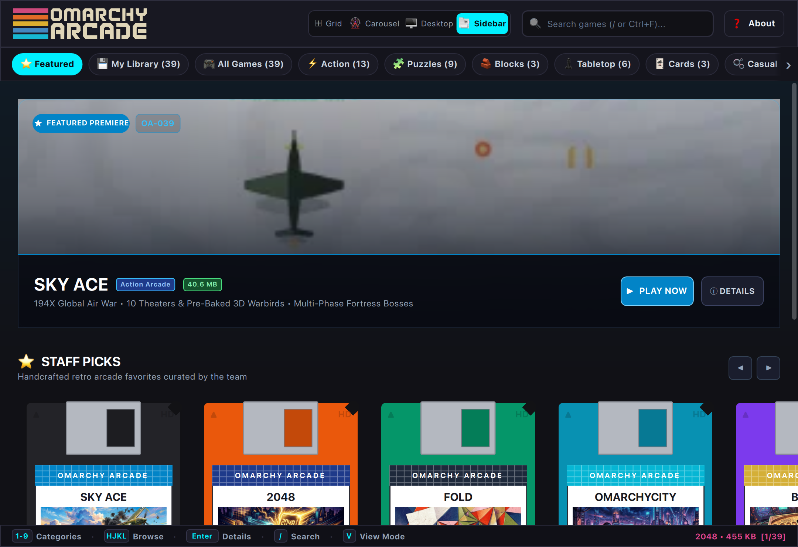

<p align="center">
  
</p>

<p align="center">
  <strong>The Native Offline Desktop Game Suite & Retro Arcade Launcher for Omarchy Linux.</strong>
</p>

<p align="center">
  
  
  
  
  
  
</p>

---

<p align="center">
  
</p>

## Rediscover Pure Arcade Gaming

Modern gaming on phones and mainstream operating systems has been ruined by mandatory logins, internet DRM checks, tracking SDKs, and unskippable video ads. When you lose cell signal on a flight, commute on a train, or work off-grid, modern games refuse to even launch.

**Omarchy Arcade** brings back the joy of authentic personal computing: instant, distraction-free games you actually own on your machine, built with high-performance native **Qt6 / QML** and hardware-accelerated vectors.

* 🔌 **True Offline Play:** Zero internet sockets, zero accounts, zero telemetry, and zero DRM. Works forever—on flights, off-grid, during outages, or whenever you want to disconnect.
* ⭐ **Featured Discovery Experience:** Starts directly on a curated showcase featuring the **Sky Ace** hero video trailer, Staff Picks floppy carousel, and newest release shelf.
* ⚡ **Keyboard-Primary for Power Users:** Full Vim (`HJKL`) and Arrow key navigation, numbers `1`–`9` for instant category switching, and `/` search. Designed from the ground up for tiling window managers.
* 🎨 **Live System Theme Sync:** Automatically reads your active Omarchy system theme (`~/.config/omarchy/current/theme/colors.toml`) in real time. Switch themes (`Super + Space`) and the entire arcade shifts colors instantly.
* 🪟 **Tiling-Native Process Lifecycle:** Launch any game and the launcher hides itself automatically to keep your workspace clear. Close the game, and the launcher reappears and regains active focus instantly.
* 💾 **Tactile 3.5" Disk Presentation:** Nostalgic floppy disks with painted retro box art, animated selection halos, and Steam-style modal sheets featuring live gameplay previews.

### Technology & Architecture

While the majority of Omarchy Arcade titles are built with native declarative **Qt6 / QML and JavaScript** for ultra-lightweight, 60+ FPS vector gameplay, the arcade suite accommodates specialized runtimes:

* **OmarchyBolo II (`games/omarchybolo`):** Written in **TypeScript** as a true multiplatform architecture that runs seamlessly both as a native desktop client in the launcher and directly in any modern web browser with peer-to-peer WebRTC networking.
* **Sky Ace (`games/skyace`):** Powered by a custom **Python & PySide6 / QPainter** tactical flight engine with pre-baked 3D aircraft frames, dynamic bank physics, carrier landings, and zero heavy external game library dependencies.
* **OmarchyCity (`games/bytecity`):** Integrates the legendary 1989 **C++ Micropolis** city simulation core for high-speed local urban modeling.

---

## 438 KB vs 231 MB: The Future of Lean Software

When you download a casual title like 2048 on modern mobile app stores (such as Ketchapp's edition), the download footprint exceeds **231 MB**. By contrast, Omarchy Arcade's 2048 is **438 KB**—roughly 1/500th the size:

| Metric | Mobile App Store Release | Omarchy Arcade |
| :--- | :--- | :--- |
| **Download / Install Size** | **231.3 MB** | **438 KB** (~0.4 MB) |
| **Footprint Ratio** | ~500× larger | ~1/500th the size |
| **Third-Party Ad SDKs** | AppLovin, AdMob, Mintegral, Unity Ads | **Zero** |
| **Analytics & Trackers** | Attribution SDKs, telemetry, crash reporting | **Zero** |
| **Network Activity** | Constant ad auctions & video streaming | **Zero network sockets** (Offline forever) |

> [!NOTE]
> **A Shift in Software Craft:**  
> We love Ketchapp's app and play it ourselves—this comparison is not picking on mobile studios. In the ad-funded app store era, ad mediation networks and tracking SDKs were the only way developers could survive. The bloat was an inevitable byproduct of the monetization model.
>
> Omarchy Arcade is a glimpse of what software looks like when creation becomes effortless: games and everyday tools no longer need to be advertising engines. Without monetization machinery, we return to pure, lean, joyful software that respects the user and their hardware.

---

## Installation

Omarchy Arcade is lightweight, cross-platform, and runs natively on **Omarchy & all Linux distributions**, **macOS**, and **Windows 10/11**.

---

### 🐧 Omarchy & Linux

Omarchy Arcade works out-of-the-box on **any Linux distribution** (Omarchy, Arch, Ubuntu, Debian, Fedora, openSUSE, Pop!_OS, Linux Mint, etc.).

#### Option A: One-Command Quick Install (Recommended)
Installs only the lightweight launcher application (under 1 MB, zero git clone, zero developer baggage):

```bash
curl -sSL https://raw.githubusercontent.com/bigcjat/omarchyarcade/main/install.sh | bash
```

* **On Omarchy / Arch:** Automatically configures native `python-pyside6` via `pacman`.
* **On All Other Linux Distros (Ubuntu, Debian, Fedora, etc.):** Automatically provisions an isolated user environment with PySide6 in `~/.local/share/omarchy-arcade/venv` (zero `sudo` required).
* **Desktop Integration:** Installs `omarchy-arcade.desktop` to your system app launcher (Walker, Rofi, Fuzzel, GNOME, KDE) and provides the `arcade` terminal command.

#### Option B: Standalone AppImage (Zero-Install Portable Executable)
Download the standalone `Omarchy_Arcade-x86_64.AppImage` from [GitHub Releases](https://github.com/bigcjat/omarchyarcade/releases), make it executable, and double-click to play anywhere:

```bash
chmod +x Omarchy_Arcade-x86_64.AppImage
./Omarchy_Arcade-x86_64.AppImage
```

#### Option C: Native Arch / Omarchy Package (`pacman` / `makepkg`)
Build and install natively via the included [`PKGBUILD`](PKGBUILD):

```bash
git clone https://github.com/bigcjat/omarchyarcade.git
cd omarchyarcade
makepkg -si
```

#### Option D: Flatpak (Flathub Sandboxed Runtime)
```bash
cd packaging/flatpak
flatpak-builder --user --install --force-clean build-dir org.omarchy.Arcade.yml
flatpak run org.omarchy.Arcade
```

---

### 🍏 macOS (Apple Silicon & Intel)

Omarchy Arcade runs natively with full Retina high-DPI support on macOS 12 Monterey, 13 Ventura, 14 Sonoma, and 15 Sequoia.

#### Option A: One-Command Quick Install (Recommended)
Open Terminal and run:

```bash
curl -sSL https://raw.githubusercontent.com/bigcjat/omarchyarcade/main/install.sh | bash
```

* Automatically provisions an isolated user environment with PySide6 (zero Homebrew or Xcode required).
* Registers a native `Omarchy Arcade.app` in `~/Applications` so it appears in **Spotlight**, **Launchpad**, and Finder.
* Adds the `arcade` command to your terminal.

#### Option B: Standalone DMG
Download `Omarchy_Arcade-macOS.dmg` from [GitHub Releases](https://github.com/bigcjat/omarchyarcade/releases), double-click to mount, and drag **Omarchy Arcade** into your Applications folder.

---

### 🪟 Windows 10 & 11

Omarchy Arcade runs natively with hardware-accelerated DirectX 11 / OpenGL Qt Quick rendering and WASAPI audio.

#### Option A: One-Command Quick Install (PowerShell)
Open PowerShell and run:

```powershell
irm https://raw.githubusercontent.com/bigcjat/omarchyarcade/main/packaging/windows/install.ps1 | iex
```

* Installs the launcher payload to `%LOCALAPPDATA%\omarchy-arcade` (under 1 MB).
* Automatically provisions an isolated virtual environment with PySide6.
* Creates high-DPI **Start Menu** and **Desktop** shortcuts (`Omarchy Arcade.lnk`).
* Adds the `arcade` CLI shortcut to your command line.

#### Option B: Portable Release Zip
Download `Omarchy_Arcade-Windows-x64.zip` from [GitHub Releases](https://github.com/bigcjat/omarchyarcade/releases), extract anywhere, and double-click `Launch_Arcade.bat`.

---

## The 40 Games Included

Every game includes full offline documentation, keyboard controls mappings, and standalone launch capabilities:

| Game | Category | Install Size | Highlight | Documentation |
| :--- | :--- | :--- | :--- | :--- |
| **2048** | Blocks & Merging | **455 KB** | Harmonic pentatonic pitch chimes & smooth tile slides. | [Manual](games/2048/README.md) |
| **TetraBlocks** | Blocks & Merging | **287 KB** | Guideline falling block puzzle with SRS kicks & ghost piece. | [Manual](games/tetrablocks/README.md) |
| **ByteSnake** | Puzzles & Logic | **203 KB** | Sub-frame input buffering and progressive speed ramping. | [Manual](games/bytesnake/README.md) |
| **VectorPong** | Tabletop & Board | **209 KB** | Ball spin slicing and adaptive AI paddle physics. | [Manual](games/vectorpong/README.md) |
| **CyberSweeper** | Puzzles & Logic | **250 KB** | Deduction puzzle with guaranteed safe first click. | [Manual](games/cybersweeper/README.md) |
| **DropFour** | Tabletop & Board | **220 KB** | Tactile 4-in-a-row with heuristic lookahead AI. | [Manual](games/dropfour/README.md) |
| **BrickBash** | Action Arcade | **238 KB** | High-energy breakout with segmented paddle deflections. | [Manual](games/brickbash/README.md) |
| **VoidInvaders** | Action Arcade | **304 KB** | Descending alien armadas with destructible bunkers. | [Manual](games/voidinvaders/README.md) |
| **CyberFlap** | Action Arcade | **224 KB** | Airborne reflex runner with dynamic pitch aerodynamics. | [Manual](games/cyberflap/README.md) |
| **DinoRunner** | Action Arcade | **380 KB** | Endless prehistoric runner with day/night lighting. | [Manual](games/dinorunner/README.md) |
| **VectorDrift** | Action Arcade | **457 KB** | Vector wireframe space combat with Newtonian momentum. | [Manual](games/vectordrift/README.md) |
| **CyberHop** | Action Arcade | **393 KB** | Traffic and river hazard navigation with grid-snapped leaps. | [Manual](games/cyberhop/README.md) |
| **ByteMan** | Action Arcade | **488 KB** | Classic 28×31 maze with 4 pursuit ghost algorithms. | [Manual](games/byteman/README.md) |
| **WordGuess** | Word & Deduction | **291 KB** | 5-letter deduction word puzzle with 3D tile flips. | [Manual](games/wordguess/README.md) |
| **CratePusher** | Puzzles & Logic | **363 KB** | Warehouse crate-pushing with verified solvable levels. | [Manual](games/cratepusher/README.md) |
| **OrbPop** | Action Arcade | **522 KB** | Hexagonal bubble shooter with laser ricochet guide. | [Manual](games/orbpop/README.md) |
| **GemSwap** | Puzzles & Logic | **561 KB** | Match-3 cascades with Flame, Star, and Hyper power gems. | [Manual](games/gemswap/README.md) |
| **GalacticSwarm** | Action Arcade | **1.3 MB** | Alien flight waves with Boss Galaga tractor beam rescue. | [Manual](games/galacticswarm/README.md) |
| **OmarchyCity** | Simulation | **4.9 MB** | Authentic 1989 Micropolis C++ city simulation with Dr. DHH, Studio Ghibli visuals, annual budgets, loans, disasters, and overlays. | [Manual](games/bytecity/README.md) |
| **KeiRacer** | Action Arcade | **1.2 MB** | Pseudo-3D highway racer starring the Slow Car Racing League with authentic multi-car drivetrain physics. | [Manual](games/keiracer/README.md) |
| **Blackjack 21** | Cards & Casino | **659 KB** | Authentic casino 21 with custom vector decks, probability engine, and dealer AI. | [Manual](games/blackjack/README.md) |
| **Chess** | Board Strategy & Chess | **588 KB** | Calibrated multi-tier AI (Novice to Expert) with glowing vector pieces. | [Manual](games/chess/README.md) |
| **Checkers** | Board Strategy & Checkers | **511 KB** | Multi-tier AI with mandatory jump chains and king coronation. | [Manual](games/checkers/README.md) |
| **Solitaire** | Cards & Casino | **602 KB** | Klondike with 3D card flips, vector decks, Draw 1/3, and auto-foundation. | [Manual](games/solitaire/README.md) |
| **Video Poker** | Cards & Casino | **721 KB** | 8-Game Casino Video Terminal with Dual-Era CRT switcher and Double-Up gamble. | [Manual](games/videopoker/README.md) |
| **Backgammon** | Tabletop & Board | **355 KB** | Tactile classic board strategy with doubling cube, multiple themes, and lookahead AI. | [Manual](games/backgammon/README.md) |
| **Reversi** | Tabletop & Board | **427 KB** | Timeless 8×8 disc-flipping strategy with valid move projections and multi-tier AI. | [Manual](games/reversi/README.md) |
| **Bīdama** | Casual Aim & Physics | **492 KB** | Japanese tatami marbles tribute to Lose Your Marbles with urushi pitch line and dual gravity collapse. | [Manual](games/bidama/README.md) |
| **OmarchyBolo II** | Action Arcade | **1.0 MB** | Classic tactical armored tank warfare inspired by Stuart Cheshire's Bolo (*TypeScript multiplatform: native desktop & direct browser via WebRTC*). | [Manual](games/omarchybolo/README.md) |
| **Starframe** | Action Arcade | **1.0 MB** | Tactical neon vector space shooter with 3 starfighter classes, CRT bloom, and kinetic shield ramming. | [Manual](games/starframe/README.md) |
| **Slime's Adventure** | Action Arcade | **1.1 MB** | Subterranean cavern gravity runner with dough-rolling Japanese teardrop slime. | [Manual](games/slimesadventure/README.md) |
| **Dr. Virus** | Blocks & Merging | **544 KB** | Retro medical puzzle with cascading gravity, living reactive viruses, and multi-stage progression. | [Manual](games/drvirus/README.md) |
| **WordCircle** | Word & Trivia | **571 KB** | Circular anagram crossword puzzle adventure with dual input and bonus word banking. | [Manual](games/wordcircle/README.md) |
| **Parking Jam** | Puzzles & Logic | **1.3 MB** | Tactile sliding Japanese vehicle escape puzzle with 56 verified multi-step levels. | [Manual](games/parkingjam/README.md) |
| **Nuts Sort** | Puzzles & Logic | **1.0 MB** | Tactile isometric nut & bolt color sorting puzzle with 10,000+ solvable levels. | [Manual](games/nutssort/README.md) |
| **Fold** | Puzzles & Logic | **1.2 MB** | Tactile geometric paper folding & crease logic puzzle with 100 historical archetypes. | [Manual](games/fold/README.md) |
| **Mahjong Solitaire** | Puzzles & Logic | **1.0 MB** | True 3D hardware-accelerated obsidian tile matching with 5-tier elevation depth. | [Manual](games/mahjongsolitaire/README.md) |
| **Pipe Punk** | Puzzles & Logic | **1.1 MB** | Victorian steampunk boiler pipe puzzle with real-time fluid dynamics, cast-iron obstacles & analog gauges. | [Manual](games/pipepunk/README.md) |
| **Sky Ace** | Action Arcade | **40.6 MB** | 194X WW2 Pacific & Global aerial combat (*Python / PySide6 QPainter engine with 3D pre-baked warbirds, bank physics & carrier landings*). | [Manual](games/skyace/README.md) |
| **DomainRush** | Action Arcade | **828 KB** | 5-player tactical territory battle with laser trails, multi-archetype bot AI, and first-to-50% dominance sprint. | [Manual](games/domainrush/README.md) |

---

## Keyboard Controls Cheatsheet

The launcher is designed for total keyboard efficiency without ever reaching for a mouse:

| Key | Action |
| :--- | :--- |
| **`←` `↑` `→` `↓`** / **`H` `J` `K` `L`** | Browse through floppy disks across the grid |
| **`1` – `9`** | Jump directly to category (*All, Action, Puzzles, Blocks, Tabletop, Word...*) |
| **`[` / `]`** or **`Tab` / `Shift+Tab`** | Cycle through categories forward / backward |
| **`/`** or **`Ctrl+F`** | Instant search filter (*type to filter any game, tag, or ref*) |
| **`Escape`** | Exit search / close detail modal / return to grid |
| **`Enter` / `Space`** | Open game presentation sheet (*press Enter again to play*) |
| **`?` / `F1`** | Open About & Credits dialog |
| **`M`** | Toggle audio mute across all games |

---

## Contributing

* **Adding New Games:** Use the standardized starter template in [`template/`](template/) and the guide in [`template/README_TEMPLATE.md`](template/README_TEMPLATE.md).
* **Artwork Prompts:** See [`assets/COVER_ART_GUIDE.md`](assets/COVER_ART_GUIDE.md) for illustrated box art generation instructions.
