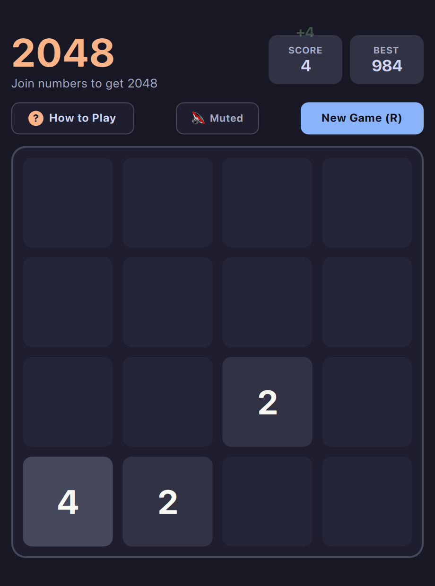

# 2048 (QML / QtQuick)



A minimalist, high-performance **2048** implementation written in **QML** and **JavaScript**, styled with a sleek dark palette.

Built natively with hardware acceleration for **Omarchy Linux**.

---

## Features
* **Dynamic Omarchy Theming:** Automatically synchronizes with all 22 Omarchy system themes by reading `~/.config/omarchy/current/theme/colors.toml`. Live hot-reloads when changing themes via `Super + Space`!
* **WCAG Contrast-Aware:** Automatically calculates luminance to switch tile and text colors cleanly between light themes (like **Snow**) and dark themes (**Gruvbox**, **Nord**, **Tokyo Night**, **Catppuccin**).
* **Retro Console Startup Screen:** Snappy ~1.0-second arcade startup sequence featuring an **Omarchy Arcade** vector emblem, staggered retro horizontal stripes, diagonal glint sheen, and subtle CRT scanlines (skips immediately on any key/click).
* **Fluid Animations:** Smooth tile sliding (`Easing.OutCubic`), bouncy merge pulses, pop-in spawn animations, and smooth color fades when themes switch.
* **Keyboard-First Controls:**
  * **Vim Keys:** `H` (Left), `J` (Down), `K` (Up), `L` (Right)
  * **WASD:** `W` (Up), `A` (Left), `S` (Down), `D` (Right)
  * **Arrow Keys:** `←`, `↑`, `→`, `↓`
  * **Full / Compact View:** `Shift+F` (or click `⛶` / `🔲` button)
  * **Mute / Unmute:** `M` (Default: Muted)
  * **Restart / Help:** `R` (Restart), `?` / `Esc` (Help dialog)
* **Dynamic Sound Effects (Zero-Overhead & Defaulted to Mute):**
  * Pitch-scaled harmonic synth chimes that ascend pentatonically based on tile value merged ($4 \rightarrow 2048$).
  * Subtle tactile arcade tick on slide moves and retro sweep on game over.
  * **Defaulted to Muted** (`🔇 Muted`) on startup with **zero CPU/audio overhead** when muted.
  * Toggle audio anytime via the subheader button or by pressing **`M`**.
  * Ultra-efficient memory-resident playback using native system sound APIs and pipewire/alsa on Linux.
* **Touch & Trackpad Gestures:** Two-finger trackpad swipes and 1-finger click/drag with single-move debouncing.
* **Tiling-Ready:** Adapts to any window geometry down to tiny 260×320 Hyprland splits without clipping.
* **Ultra Lightweight:** Sits at ~30–45 MB RAM with 0% idle CPU and a 438 KB install footprint.

---

## Running

### From the arcade root:
```bash
./.venv/bin/python games/2048/main.py
```

### Launch directly in a specific theme:
```bash
./.venv/bin/python games/2048/main.py --theme snow
./.venv/bin/python games/2048/main.py --theme gruvbox
./.venv/bin/python games/2048/main.py --theme tokyonight
./.venv/bin/python games/2048/main.py --theme catppuccin
```

---

## Running on Omarchy Linux

On Omarchy, Qt6 and QML run out of the box with zero setup.

### Option 1: Standalone QML
```bash
# If not already present: sudo pacman -S qt6-declarative
qml6 main.qml
```

### Option 2: Python + PySide6
```bash
# Install PySide6 via pacman:
sudo pacman -S python-pyside6
python main.py
```

### Option 3: Embed in Quickshell
Because Omarchy uses Quickshell, the `Item` tree in `main.qml` can be loaded directly as an interactive desktop widget or floating scratchpad tile!

---

## Attribution
* Original 2048 created by [Gabriele Cirulli](https://github.com/gabrielecirulli/2048), based on 1024 by Veewo Studio and conceptually similar to Threes by Asher Vollmer.
