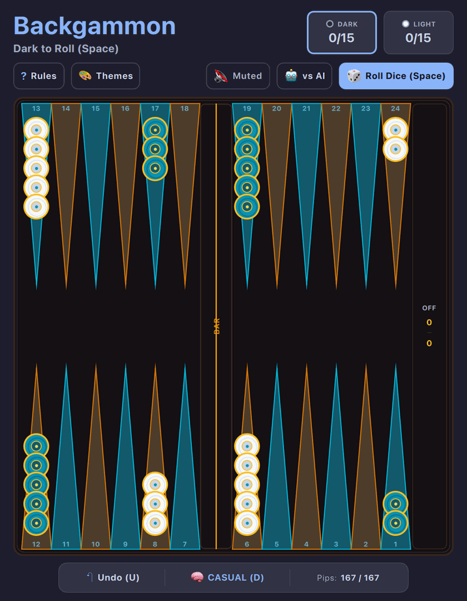

# Backgammon (QML / QtQuick)



An authentic, tactile implementation of **Backgammon**, one of the oldest and most celebrated board games in human history (famously pre-installed as *Internet Backgammon* on Windows ME, XP, and 7).

Built natively with hardware acceleration for **Omarchy Linux**.

---

## Features

* **12 Luxury Color-Theory Board Palettes:** Inspired by high-end artisanal and handcrafted luxury backgammon boards (Morpho Turquoise, Cobalt Rosette, Nordic Horizon, Hermès Malachite, Aegean Wave, Tokyo Cyber, Vegas Mahogany, Obsidian & Gold, Amethyst & Rose, Tuscan Terracotta, Hakone Woodcraft, Monaco Grand Prix).
* **Interactive Theme Picker Gallery:** Click `🎨 Themes` in the subheader to browse visual swatch previews of all 12 artisanal board sets, or press `T` to cycle instantly.
* **Persistent Preferences:** Automatically saves chosen board theme, sound state, and best records across sessions via `QSettings`.
* **Authentic 15-Checker Backgammon Rules:** Full 24-point board geometry, central dividing Bar, and Bear-Off Tray.
* **Dice & Doubles:** Roll two dice (1–6); rolling doubles awards **4 moves** of that value!
* **Hitting Blots:** Land on an isolated single opponent checker to send it to the Bar.
* **Bar Re-entry Priority:** Strict enforcement requiring knocked-off checkers to re-enter the opponent's home quadrant before any other checkers advance.
* **Bearing Off:** Complete home quadrant check unlocks bearing off checkers towards victory.
* **Win Multipliers:** Evaluates and awards **Single Win** (1 pt), **Gammon** (2 pts), and **Backgammon** (3 pts).
* **Live Pip Count Tracker:** Continuous calculation and comparison of distance-to-home for both Dark and Light.
* **Intelligent AI Engine:** Three difficulty tiers (**Novice**, **Casual**, and **Master**) with turn sequence permutation search optimizing primes, anchors, blot safety, and pip race pace.
* **Pass & Play / Solo Modes:** Toggle seamlessly between vs AI and 2-Player local tabletop mode.
* **Full Keyboard & Mouse Controls:** Press `Space` to roll, click checkers to highlight legal targets, or use keyboard navigation.
* **Dynamic Omarchy Theming:** Real-time hot-reloading across all 22 system themes with WCAG-compliant high-contrast checkers and buttons.

---

## Controls

| Action | Primary Key | Secondary / Mouse |
| :--- | :--- | :--- |
| **Roll Dice** | `Space` | Click center Dice or "Roll Dice" button |
| **Select Checker** | Click checker stack | Click checker on board or Bar |
| **Move to Target** | Click highlighted target point | Click target circle or "OFF" tray |
| **Board Themes** | `T` (cycle) | Click `🎨 Themes` in subheader for gallery modal |
| **Undo Move** | `U` | Click "Undo" in bottom toolbar |
| **Cycle Difficulty** | `D` | Click Difficulty pill in bottom toolbar |
| **Toggle Game Mode** | `P` | Click Mode toggle in subheader |
| **Full / Compact View** | `Shift+F` | Click `⛶` / `🔲` button |
| **Mute / Unmute** | `M` | Click audio button in subheader |
| **Restart Game** | `R` | Click "New Game" |
| **How to Play** | `?` or `Esc` | Click "?" button |

---

## Running

### From the Arcade Root:

```bash
./.venv/bin/python games/backgammon/main.py
```

### With a Specific Theme:

```bash
./.venv/bin/python games/backgammon/main.py --theme tokyonight
./.venv/bin/python games/backgammon/main.py --theme gruvbox
./.venv/bin/python games/backgammon/main.py --theme catppuccin-latte
```

---

## Author & Credits

Created by **Chris Thompson** ([@bigcjat](https://github.com/bigcjat)) with assistance from **Gemini**.

---

## License

* Released under the **MIT License**.
