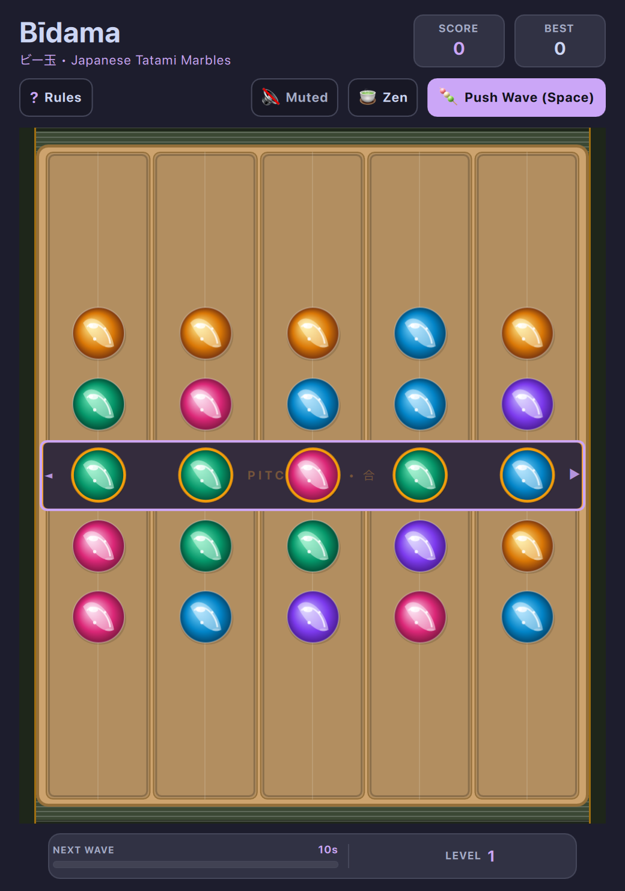

# Bīdama (ビー玉) • Japanese Tatami Marbles (QML / QtQuick)



An authentic, tactile Japanese tabletop tribute to *Lose Your Marbles* (Microsoft Plus! 98), reimagined as a serene yet thrilling summer pastime played on woven tatami matting with handcrafted glass bīdama marbles, hinoki cypress chutes, and a black urushi lacquer pitch line.

Built natively with hardware acceleration for **Omarchy Linux**.

---

## Features

* **Authentic Horizontal Sliding & Pitch Line Mechanics:** Select any of the 9 horizontal rows and slide it left or right with seamless wrap-around.
* **The Urushi Pitch Line (Center Row):** Align 3, 4, or 5 matching glass bīdama along the center black urushi lacquer channel with gold kintsugi trim to shatter them.
* **Dual Inward Gravity Collapse:** When pitch line marbles shatter, upper columns collapse downward and lower columns collapse upward into the center, triggering cascading chain combos!
* **5 Artisanal Japanese Bīdama:**
  * **Ramune Sky Blue (ラムネ):** Classic translucent soda-bottle marble with trapped air bubbles.
  * **Matcha Jade (抹茶):** Green tea glass swirl with internal ribbon whorls.
  * **Sakura Quartz (桜):** Cherry blossom pink with milky white filaments.
  * **Yuzu Amber (柚子):** Sunlit golden citrus amber with reflective flecks.
  * **Asagao Indigo (朝顔):** Deep summer morning glory violet-blue swirl.
* **Special Marbles & Obstacles:**
  * ✦ **Hanabi Bomb (花火):** Detonates in a $3 \times 3$ festival spark burst when aligned on the pitch line.
  * ★ **Wild Opal (オパール):** Iridescent glass that substitutes for any color.
  * 石 **Kyoto Zen Basalt Stone:** Heavy river stone obstacle that must be blasted away with bombs or cleared with adjacent combos.
* **Tactile Summer Sound Design:** Authentic wooden slides, glass clacks, and the shimmering ring of a traditional glass **Fūrin (風鈴, summer wind chime)** during multi-cascade streaks!
* **Game Modes:**
  * **🍵 Zen Endless Flow:** Keep the tatami board clear and score massive combos as incoming marble waves roll in.
  * **🤖 vs AI Opponent:** Play against an intelligent lookahead AI that slides rows tactically.
* **Full Keyboard & Mouse Controls:** Navigate rows with `W/S`, `Up/Down`, or Vim `J/K`; slide rows with `A/D`, `Left/Right`, or Vim `H/L`, or drag with mouse/touch.
* **Dynamic Omarchy Theming:** Real-time hot-reloading across all 22 system themes with WCAG-compliant high-contrast elements.

---

## Controls

| Action | Primary Key | Secondary / Mouse |
| :--- | :--- | :--- |
| **Select Row** | `W` / `S` or `↑` / `↓` | `K` / `J` or Click any row |
| **Slide Row Left** | `A` or `←` | `H` or Drag row left |
| **Slide Row Right** | `D` or `→` | `L` or Drag row right |
| **Push Next Wave** | `Space` | Click "Push Wave" in subheader |
| **Toggle Game Mode** | `P` | Click "Zen" / "vs AI" in subheader |
| **Full / Compact View** | `Shift+F` | Click `⛶` / `🔲` button |
| **Mute / Unmute** | `M` | Click audio button in subheader |
| **Restart Game** | `R` | Click "New Game" |
| **Rules & Help** | `?` or `Esc` | Click "?" button |

---

## Running

### From the Arcade Root:

```bash
./.venv/bin/python games/bidama/main.py
```

### With a Specific Theme:

```bash
./.venv/bin/python games/bidama/main.py --theme tokyonight
./.venv/bin/python games/bidama/main.py --theme catppuccin-latte
./.venv/bin/python games/bidama/main.py --theme gruvbox
```

---

## Author & Credits

Created by **Chris Thompson** ([@bigcjat](https://github.com/bigcjat)) with assistance from **Gemini**.
