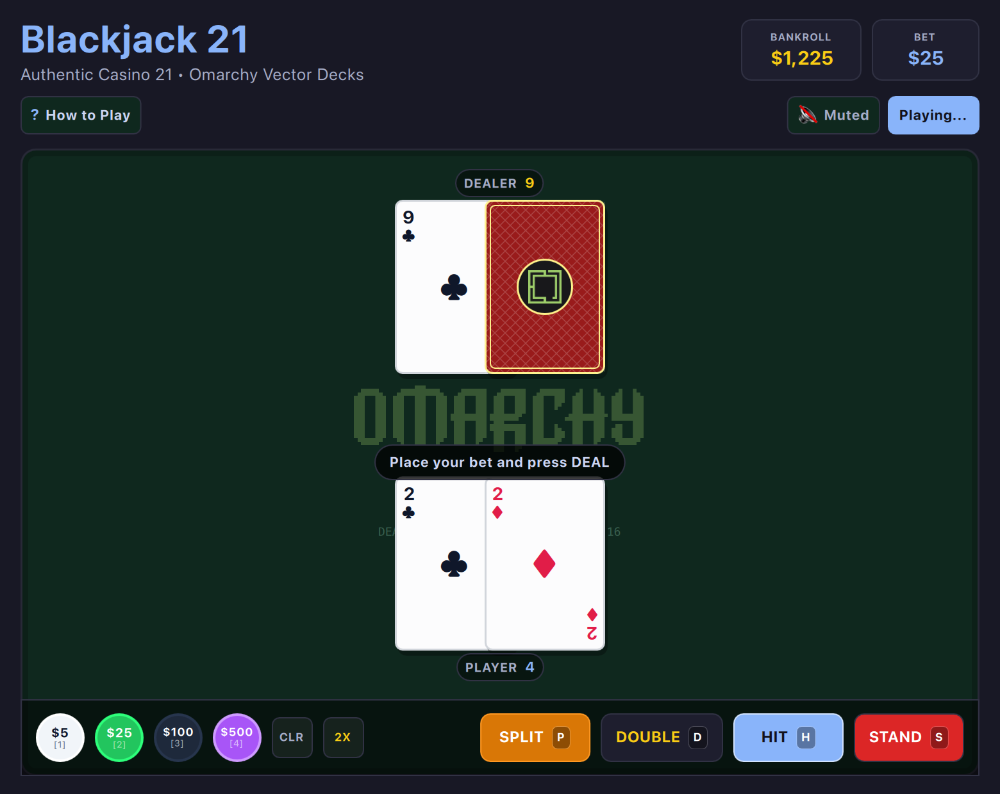

# Blackjack 21 (QML / QtQuick)



An authentic, tactile casino Blackjack table game featuring custom Omarchy-branded playing card decks, smooth 3D card flips, realistic chip betting, and standard 3:2 payouts.

Built natively with hardware acceleration for **Omarchy Linux**.

---

## Features

* **Table & Deck Customization:** Choose from 4 custom vector card backs (**Synthwave** retro 80s neon grid & sunset, **Crimson** casino velvet & gold filigree, **Obsidian** cyber circuits, and **Sapphire** Monte Carlo diamond lattice) and 4 table felt colors (**Classic Emerald**, **Midnight Navy**, **Casino Crimson**, and **Obsidian Dark**) with smooth cross-fade animations and persistent saving.
* **Real-Time Probability Engine & Strategy Advisor:** Calculates player hit bust chance, dealer bust probability based on visible upcards, and recommends the mathematically optimal Basic Strategy move (`STAND`, `HIT`, `DOUBLE`, `SPLIT`) live with `O` toggle.
* **Authentic Casino Insurance (2 to 1):** Offers insurance when dealer shows an Ace; dealer peeks hole card for natural 21 before player turn to protect doubled/split bets.
* **Pair Splitting Mechanics:** Separate pairs (e.g. 2s, 8s, Aces) into independent hands with hotkey `P`, individual bets, and active-hand golden ring indicator.
* **Shoe Penetration & Reshuffle Meter:** Live counter and visual depletion bar tracking the 6-deck continuous shoe (312 cards) and cut-card reshuffles.
* **100% True Offline Play:** Zero internet required or used. No network sockets, zero cloud dependencies, zero telemetry, and zero ads. Plays completely offline forever.
* **Dynamic Omarchy Theming:** Automatically synchronizes with all 22 Omarchy system themes by reading `~/.config/omarchy/current/theme/colors.toml`. Live hot-reloads when changing themes via `Super + Space`!
* **Standardized 2048 Arcade Layout:** Top title & stats header with Bankroll and Bet cards, subheader with sound toggle and quick action buttons, and responsive playfield.
* **Responsive Toolbar Emoji Collapse:** When windows are narrow or toolbars crowded, control buttons automatically collapse into compact icon/emoji buttons (`🎨`, `💡`, `?`, `🔇`, `🔄`) so controls never push off-screen or smash together.
* **Retro Console Startup Screen:** ~1.0-second arcade startup sequence with CRT scanlines, retro stripes, and vector glint sheen (skips instantly on any key/click).
* **Keyboard-First Controls:** Single-key tactile hotkeys across all actions: Space to Deal, H to Hit, S to Stand, D to Double, P to Split, I to Insure, O for Odds, T for Table Settings, 1–4 for Chips.
* **Zero-Overhead Audio:** Zero-overhead native audio (CoreAudio on macOS / PipeWire & ALSA on Linux), defaulted to muted (`M` to toggle) with 0% CPU consumption when silent.
* **Responsive Tiling:** Smoothly adapts to any window geometry down to narrow tiling window manager splits without clipping.
* **Persistent Bankroll & Stats:** Automatically saves your bankroll, deck style, and felt style across sessions via `QSettings`.

---

## Controls

| Action | Primary Key | Secondary / Alt | Mouse / Touch |
| :--- | :--- | :--- | :--- |
| **Deal Hand** | `Space` / `Enter` | `R` | Click "DEAL" button |
| **Hit (Draw Card)** | `H` | `Space` (during play) | Click "HIT" button |
| **Stand (Hold Hand)** | `S` | `Enter` (during play) | Click "STAND" button |
| **Double Down** | `D` | — | Click "DOUBLE" button |
| **Split Pair** | `P` | — | Click "SPLIT" button |
| **Take Insurance (2:1)** | `I` / `Y` | — | Click "INSURANCE" button |
| **Decline Insurance** | `N` / `Space` | `Esc` | Click "DECLINE" button |
| **Toggle Table Settings** | `T` | — | Click "🎨 Table" button |
| **Toggle Odds Advisor** | `O` | — | Click "Odds (O)" subheader button |
| **Bet $5 / $25 / $100 / $500** | `1` / `2` / `3` / `4` | — | Click chip in tray |
| **Clear / Double Bet** | `C` / `X` | — | Click "CLR" / "2X" |
| **Full / Compact View** | `Shift+F` | — | Click `⛶` / `🔲` button |
| **Mute / Unmute** | `M` | — | Click audio button in subheader |
| **Rules & Help** | `?` or `Esc` | — | Click "Rules" button |

---

## Running

### From the Arcade Root:

```bash
./.venv/bin/python games/blackjack/main.py
```

### With a Specific Theme:

```bash
./.venv/bin/python games/blackjack/main.py --theme gruvbox
./.venv/bin/python games/blackjack/main.py --theme tokyonight
./.venv/bin/python games/blackjack/main.py --theme catppuccin
./.venv/bin/python games/blackjack/main.py --theme snow
```

---

## Author & Credits

Created by **Chris Thompson** ([@bigcjat](https://github.com/bigcjat) • [@bigcjat](https://x.com/bigcjat)) with assistance from **Gemini**.

---

## License & Attribution

* Released under the **MIT License**.
