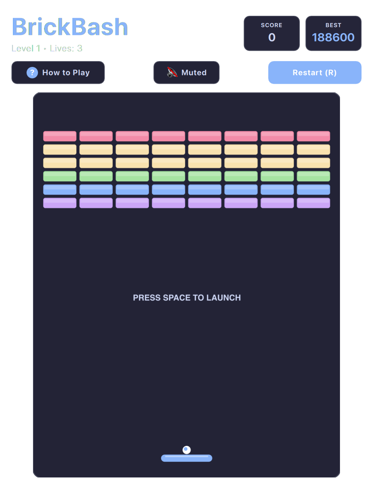

# BrickBreaker (QML / QtQuick)



A sleek, modern arcade brick-busting game engineered with buttery smooth ball physics, segmented paddle deflection dynamics, and satisfying shattering particle effects.

Built natively with hardware acceleration for **Omarchy Linux**.

---

## Features

* **Precision Paddle Physics:** Angle of ball deflection dynamically calculates based on distance from paddle center, granting precise aim control.
* **Multi-Tiered Brick Layers:** Distinct colored brick rows with escalating point values and structural durability.
* **Volley Combo Multiplier:** Consecutive brick hits without losing the ball compound your score multiplier.
* **Particle Shatter Bursts:** Satisfying vector debris explosions upon brick destruction.
* **Flexible Input:** Supports mouse/trackpad pointer tracking, arrow keys, WASD, and Vim (`H`/`L`).
* **Dynamic Omarchy Theming:** Color palettes automatically map to the active desktop theme.

---

## Controls

| Action | Primary Key | Secondary / Vim | Mouse / Pointer |
| :--- | :--- | :--- | :--- |
| **Move Paddle** | `A` / `D` | `←` / `→` or Vim `H` / `L` | Mouse Movement / Trackpad |
| **Launch Ball** | `Space` | `Enter` | Left Click |
| **Full / Compact View** | `Shift+F` | — | Click `⛶` / `🔲` button |
| **Mute Audio** | `M` | — | Click Mute button |
| **Restart** | `R` | — | Click "Restart" |
| **Help** | `?` or `Esc` | — | Click "How to Play" |

---

## Running

```bash
./.venv/bin/python games/brickbash/main.py
```

---

## License

* Released under the **MIT License**.
