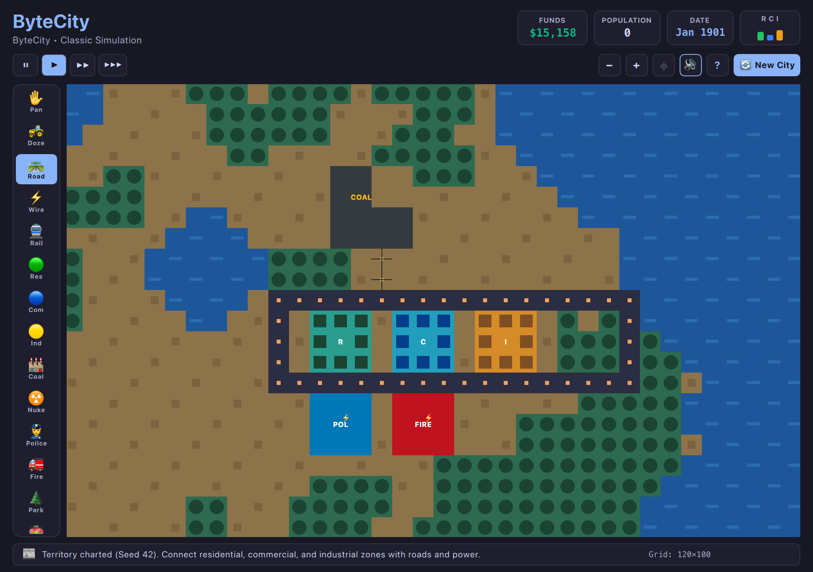

# OmarchyCity • Omarchy Arcade

An authentic, legally safe, uncompromised city builder for the Omarchy Linux desktop arcade suite, powered by Will Wright's open-source 1989 **Micropolis (GPLv3)** C++ simulation core and guided by **Dr. DHH**, paired with a responsive **2D top-down arcade viewport** adhering to the Omarchy Arcade template design.



---

## Key Features

1. **Authentic 1989 Simulation Engine:**
   - 100% genuine C++ simulation logic (Micropolis GPLv3) compiled natively (`libmicropolis.dylib` on macOS, `libmicropolis.so` on Linux).
   - Full cellular automaton zoning rules, power grid propagation, traffic, pollution, land value gradients, and crime rates.
   - Dynamic RCI (Residential, Commercial, Industrial) economic demand gauges with clickable 10-Year and 120-Year demographic trend graphs.
   - Live city treasury, population count, approval rating, and calendar.

2. **2D Orthographic Arcade Viewport:**
   - High-performance `CityViewport` (`QQuickPaintedItem`) with pure mathematical 2D rendering (`QPainter`).
   - Adheres strictly to Omarchy theme tokens (Catppuccin Macchiato, Mocha, Latte, etc.).
   - Crisp pixel-art and hand-crafted Studio Ghibli inspired tiles, road connections, power lines, and live unpowered alerts (`⚡`).
   - Smooth pan (drag right/middle mouse or WASD / Arrows) and zoom (mouse wheel or `+` / `-`).

3. **Construction Palette:**
   - **Bulldozer ($1):** Clear terrain, demolish buildings, and clear rubble.
   - **Roads ($10):** Connect zones and conduct traffic.
   - **Power Lines ($5):** Transmit electricity across rivers and terrain.
   - **Transit Rails ($20):** High-capacity transit corridors reducing road congestion.
   - **Residential Zone ($100):** High and low density housing.
   - **Commercial Zone ($100):** Offices and retail commerce.
   - **Industrial Zone ($100):** Light manufacturing and heavy industry.
   - **Seaport ($3000) & Airport ($10000):** Global trade and international travel.
   - **Coal ($3000) & Nuclear ($5000) Power Plants:** Fuel your metropolis.
   - **Police ($500) & Fire ($500) Departments:** Maintain law, order, and safety.
   - **Parks ($10):** Beautify land and raise surrounding property values.

4. **Annual Budget Audits & Municipal Loans:**
   - Automatic year-end financial audit popup in December (with optional auto-budgeting).
   - Adjustable city tax rate ($0\% - 20\%$) and dedicated departmental maintenance sliders for Roads, Police, and Fire.
   - Consequences for underfunding: pothole decay, rising crime waves, and uncontrolled conflagrations.
   - Municipal bank credit line ($10,000 loan, 21-year debt service @ $500/yr, and early payoff).
   - Bankruptcy game-over state if deficit exceeds -$5,000 without loan credit.

5. **Disaster Control Center & Animated Sprites:**
   - Trigger authentic SimCity disasters on demand: Firestorms, Flooding, Kaiju Rampage, Tornadoes, Earthquakes, and Nuclear Meltdowns.
   - Animated procedural sprites rendered live in the simulation: Kaiju monsters, Tornadoes, Ships, Airplanes, Helicopters, Trains, and Explosions.

6. **Tile Query Inspector & Diagnostic Overlays:**
   - Tile Query tool (`?`) inspecting zone classification, building name, powered status, road access, land value, crime rate, and pollution levels with golden/cyan target brackets.
   - Diagnostic visual overlay heatmaps: `🏙️ Normal`, `⚡ Power`, `🟣 Smog`, `🔴 Crime`, `🟢 Land Value`, and `🚗 Traffic`.

7. **Population Milestones & Civic Rewards:**
   - Golden trophy popup celebrations for reaching Town (2,000), City (10,000), Capital (50,000), Metropolis (100,000), and Megalopolis (500,000).
   - Unlocks civic reward monuments including the Mayor's Estate and Megalopolis Statue.

8. **Municipal Guidance by Dr. DHH:**
   - Real-time counsel from Chief Municipal Architect Dr. DHH on budget sanity, power connectivity, and zone balance.
   - Proactive emergency slide-in alerts during critical crises (treasury depletion, power grid failure, active disasters).

---

## Controls

| Action | Control |
| :--- | :--- |
| **Pan Camera** | Click & Drag (Right or Middle Mouse Button), or WASD / Arrows / Vim HJKL |
| **Zoom In / Out** | Mouse Wheel Scroll, or `+` / `-` keys |
| **Place Tool / Zone** | Left Click on Map (Road, Wire, Rail, Doze support click-and-drag) |
| **Select Tool** | Click tool in left dock or number hotkeys |
| **Simulation Speed** | `Space` (Pause/Resume), `1` (Normal), `2` (Fast), `3` (Ultra) |
| **Audio Mute** | `M` key or click Speaker icon |
| **City Graphs** | Click `RCI` Demand Gauge or `📈 Graphs` button |
| **Annual Budget** | Click `🏛️ Budget` button or wait for December year-end audit |
| **Disasters Menu** | Click `🌪️ Disasters` button |
| **Diagnostic Overlays** | Click overlay pills (`Normal`, `Power`, `Smog`, `Crime`, `Value`, `Traffic`) |
| **Tile Query Inspector** | Select `?` tool and click any city tile |
| **Advisor Briefing** | Click `Dr. DHH` badge or `Advisor` button |
| **Help / Handbook** | Click Question icon |
| **Inaugurate New City** | Click `New City` button in header |
| **Full / Compact View** | `Shift+F` (or click `⛶` / `🔲` button) |

---

## Running ByteCity

```bash
# Launch directly with Python
python3 games/bytecity/main.py

# Launch with a specific Omarchy theme
python3 games/bytecity/main.py --theme catppuccin-latte
```

---

## Credits

Created by **Chris Thompson** ([@bigcjat](https://github.com/bigcjat) • [@bigcjat](https://x.com/bigcjat)) with assistance from **Gemini**.
Based on the open-source **Micropolis (SimCity)** simulation engine created by Will Wright (GPLv3).
