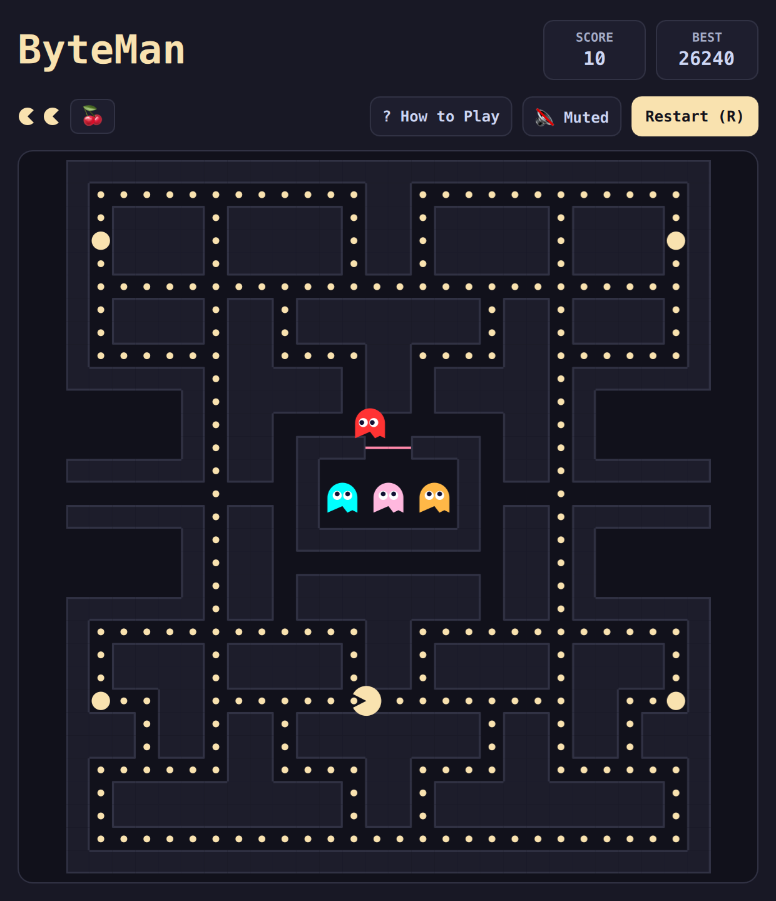

# ByteMan (QML / QtQuick)



A retro arcade maze classic reimagined with modern aesthetics. Guide ByteMan through the labyrinth, munching on data packets and energizers while evading four distinct cybersecurity ghosts with specialized pursuit algorithms.

Built natively with hardware acceleration for **Omarchy Linux**.

---

## Features

* **Authentic Maze Topology:** Faithful 28×31 labyrinth featuring side warp tunnels, ghost pen house, and corner power energizers.
* **4 Distinct Ghost AIs:**
  * **Aka (Red):** Direct pursuer targeting ByteMan's current location.
  * **Momo (Pink):** Ambush strategist targeting 4 tiles ahead of ByteMan's trajectory.
  * **Mizu (Cyan):** Flanking tactician using vector mirror targeting based on Aka's offset.
  * **Daidai (Orange):** Timid wanderer that approaches ByteMan then retreats to his corner.
* **Frightened Blue Mode:** Chomp power energizers to invert ghosts into edible frightened blue entities for combo points (200, 400, 800, 1600).
* **Pre-Turn Input Buffering:** Smooth cornering with responsive keyboard buffering so ByteMan never misses an intersection.
* **Vector Aesthetic:** Smooth anti-aliased Canvas rendering adapting directly to the active desktop theme.

---

## Controls

| Action | Primary Key | Secondary / Vim |
| :--- | :--- | :--- |
| **Move Up** | `W` or `↑` | Vim `K` |
| **Move Down** | `S` or `↓` | Vim `J` |
| **Move Left** | `A` or `←` | Vim `H` |
| **Move Right** | `D` or `→` | Vim `L` |
| **How to Play** | `?` or `/` | Click "? How to Play" |
| **Full / Compact View** | `Shift+F` | Click `⛶` / `🔲` button |
| **Mute / Unmute** | `M` | Click Mute button |
| **Restart Game** | `R` | Click "Restart (R)" |

---

## Running

```bash
./.venv/bin/python games/byteman/main.py
```

---

## License

* Released under the **MIT License**.
