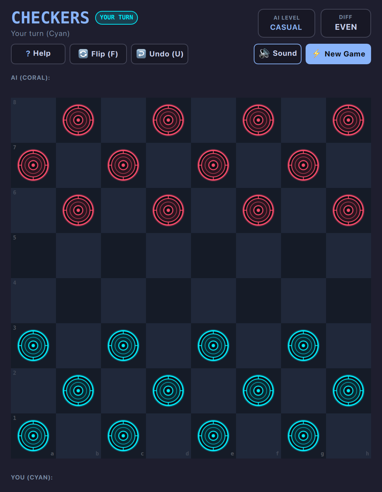

# Checkers (QML / QtQuick)



A sleek, responsive vector checkers game with an authentic arcade-noir aesthetic, multi-tier self-contained AI engine, mandatory jump enforcement, multi-jump chaining, and king coronation mechanics.

Built natively with hardware acceleration for **Omarchy Linux**.

---

## Features

* **Neo-Arcade Dual-Contour Vector Pieces:** Concentric vector discs custom-rendered in Electric Cyan (Player 1 / White) and Neon Coral (Computer / Black) on an 8×8 dark slate obsidian board.
* **100% Self-Contained AI Engine:** Pure Python draughts engine featuring Alpha-Beta pruning, forced capture move ordering, center control heuristics, and back-rank defense strategy. Zero external dependencies or packages required.
* **4 Calibrated ELO Difficulties:**
  * **Novice (~900 ELO):** Depth-1 search with a 25% random blunder rate, ideal for casual and beginner players.
  * **Casual (~1300 ELO):** Depth-3 search with piece advancement and center board dominance.
  * **Club (~1650 ELO):** Depth-5 search with forced jump sequencing and king mobility.
  * **Expert (~2000 ELO):** Depth-7 search with deep tactical foresight and endgame trap resolution.
* **Full Standard Rules (American / English Draughts):**
  * **Mandatory Captures:** If a jump is available anywhere on the board, it must be taken!
  * **Multi-Jump Chains:** Continuously leaps through multi-capture paths until no jumps remain.
  * **King Coronation:** Reaching the opponent's back rank crowns a King with vector royal regalia and bidirectional movement/captures.
* **Instant Legal Move Reticles:** Displays soft glowing cyan destination pips for quiet steps and pulsing neon coral hazard rings for legal jump captures.
* **Tactile Two-Click & Drag-and-Drop:** Move pieces either by clicking a piece and destination, or by dragging and dropping directly with responsive snapback.
* **Captured Discs & Material Advantage:** Real-time dual trays displaying eliminated pieces alongside a live material advantage counter (`+2`, `EVEN`, etc.).
* **Board Flip & Move Undo:** Flip board perspective at any time with `F` (allowing play as White or Black against the computer) and undo moves with `U`.
* **Dynamic Omarchy Theming:** Automatically synchronizes with all 22 Omarchy system themes by reading `~/.config/omarchy/current/theme/colors.toml`. Live hot-reloads when changing themes via `Super + Space`!
* **Standardized 2048 Arcade Layout:** Canonical header with turn indicator badge (`YOUR TURN` / `JUMP REQUIRED!`), AI level selector, and score difference card.
* **Responsive Toolbar Emoji Collapse:** When windows are narrow or toolbars crowded, control buttons automatically collapse into compact icon/emoji buttons (`?`, `🔄`, `↩️`, `🔇`, `⚡`) so controls never push off-screen or smash together.
* **Retro Console Startup Screen:** ~1.0-second arcade startup sequence with CRT scanlines, retro stripes, and vector glint sheen (skips instantly on any key/click).
* **Keyboard-First Controls:** Single-key tactile hotkeys: `U` to Undo, `F` to Flip, `D` to cycle Difficulty, `R` to Restart, `M` to Mute, `?` for Help.
* **Zero-Overhead Audio:** Zero-overhead native audio (CoreAudio on macOS / PipeWire & ALSA on Linux), defaulted to muted (`M` to toggle) with 0% CPU consumption when silent.
* **100% True Offline Play:** Zero internet required or used. No network sockets, zero cloud dependencies, zero telemetry, and zero ads. Plays completely offline forever.

---

## Controls

| Action | Primary Key | Secondary / Alt | Mouse / Touch |
| :--- | :--- | :--- | :--- |
| **Select / Move Piece** | Click Piece + Target | Drag & Drop | Left Click / Drag |
| **Undo Move** | `U` | `Ctrl + Z` | Click "Undo (U)" button |
| **Flip Board (White/Black)** | `F` | — | Click "Flip (F)" button |
| **Cycle AI Difficulty** | `D` | — | Click "AI LEVEL" card |
| **New Game (Restart)** | `R` | — | Click "New Game" button |
| **Mute / Unmute** | `M` | — | Click audio button in subheader |
| **Rules & Help** | `?` or `Esc` | `/` | Click "Help" button |

---

## Running

### From the Arcade Root:

```bash
./.venv/bin/python games/checkers/main.py
```

### With a Specific Theme:

```bash
./.venv/bin/python games/checkers/main.py --theme catppuccin
./.venv/bin/python games/checkers/main.py --theme tokyonight
./.venv/bin/python games/checkers/main.py --theme nord
```

### Without Splash Screen:

```bash
./.venv/bin/python games/checkers/main.py --no-splash
```

---

## Project Structure

```
games/checkers/
├── main.py              # PySide6 host, QSettings, Audio dispatcher, AI backend worker
├── main.qml             # Responsive vector board, move reticles, king crowning
├── ai_engine.py         # Pure Python Checkers engine with Alpha-Beta search
├── CheckersEngine.js    # Bundled move validation and jump rules for QML
├── SplashScreen.qml     # Canonical arcade startup animation
├── Themes.js            # Palette definitions for all 22 Omarchy desktop themes
├── assets/              # Dual-contour vector SVGs
│   ├── man_cyan.svg / man_coral.svg
│   └── king_cyan.svg / king_coral.svg
└── sounds/              # Low-latency SFX (move, capture jump, coronation dock, win)
```
