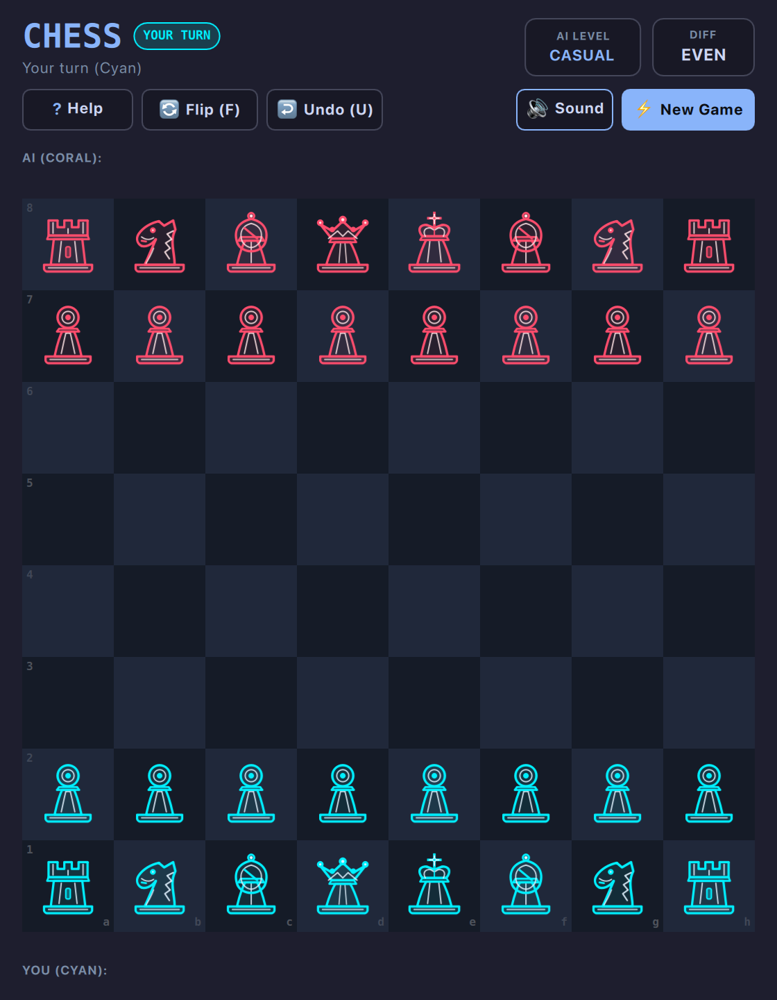

# Chess (QML / QtQuick)



A sleek, responsive vector chess game with an authentic arcade-noir aesthetic, multi-tier self-contained AI engine, instant legal move reticles, and full standard FIDE rules.

Built natively with hardware acceleration for **Omarchy Linux**.

---

## Features

* **Neo-Arcade Dual-Contour Vector Pieces:** Custom geometric vector chess set rendered in Electric Cyan (White / Player 1) and Neon Coral (Black / Computer) on a dark slate obsidian chessboard.
* **100% Self-Contained AI Engine:** Powered by a pure Python engine featuring PeSTO's Piece-Square Tables (tapered midgame and endgame positional evaluation), Negamax with Alpha-Beta pruning, Quiescence search, and an Opening Book. Zero external dependencies or packages required.
* **4 Calibrated ELO Difficulties:**
  * **Novice (~900 ELO):** Relaxed depth-1 search with occasional blunder chance, ideal for beginners.
  * **Casual (~1300 ELO):** Depth-2 positional evaluation with standard opening theory.
  * **Club (~1650 ELO):** Depth-3 search with Quiescence capture resolution and tactical awareness.
  * **Expert (~2000 ELO):** Depth-4 search with deep capture search, piece-square table positional mastery, and opening book mastery.
* **Tactile Two-Click & Drag-and-Drop Interaction:** Move pieces either by clicking a piece and then a valid target square, or by dragging and dropping pieces directly with visual snapback.
* **Instant Legal Move Reticles:** Displays soft glowing cyan destination pips for quiet moves and neon coral hazard rings for legal captures.
* **King In-Check Radar:** Automatically highlights and pulses a neon crimson warning halo on any King currently under check.
* **Pawn Promotion Modal:** Futuristic overlay allowing promotion selection to Queen, Rook, Bishop, or Knight with hotkeys `Q`, `R`, `B`, `N`.
* **Captured Pieces & Material Advantage:** Real-time dual trays displaying captured pieces alongside a live material advantage counter (`+3`, `EVEN`, etc.).
* **Board Flip & Move Undo:** Flip board perspective at any time with `F` (allowing play as White or Black against the computer) and undo moves with `U`.
* **Dynamic Omarchy Theming:** Automatically synchronizes with all 22 Omarchy system themes by reading `~/.config/omarchy/current/theme/colors.toml`. Live hot-reloads when changing themes via `Super + Space`!
* **Standardized 2048 Arcade Layout:** Canonical header with turn indicator badge, AI level selector, and material differential card.
* **Responsive Toolbar Emoji Collapse:** When windows are narrow or toolbars crowded, control buttons automatically collapse into compact icon/emoji buttons (`?`, `🔄`, `↩️`, `🔇`, `⚡`) so controls never push off-screen or smash together.
* **Retro Console Startup Screen:** ~1.0-second arcade startup sequence with CRT scanlines, retro stripes, and vector glint sheen (skips instantly on any key/click).
* **Keyboard-First Controls:** Single-key tactile hotkeys: `U` to Undo, `F` to Flip, `D` to cycle Difficulty, `R` to Restart, `M` to Mute, `?` for Help.
* **Zero-Overhead Audio:** Zero-overhead native audio (CoreAudio on macOS / PipeWire & ALSA on Linux), defaulted to muted (`M` to toggle) with 0% CPU consumption when silent.
* **100% True Offline Play:** Zero internet required or used. No network sockets, zero cloud dependencies, zero telemetry, and zero ads. Plays completely offline forever.

---

## Controls

| Action | Primary Key | Secondary / Alt | Mouse / Touch |
| :--- | :--- | :--- | :--- |
| **Select / Move Piece** | Click Piece + Target | Drag & Drop | Left Click / Drag |
| **Pawn Promotion Choice** | `Q` / `R` / `B` / `N` | `1` / `2` / `3` / `4` | Click Piece in Modal |
| **Undo Move** | `U` | `Ctrl + Z` | Click "Undo (U)" button |
| **Flip Board (White/Black)** | `F` | — | Click "Flip (F)" button |
| **Cycle AI Difficulty** | `D` | — | Click "AI LEVEL" card |
| **New Game (Restart)** | `R` | — | Click "New Game" button |
| **Mute / Unmute** | `M` | — | Click audio button in subheader |
| **Rules & Help** | `?` or `Esc` | `/` | Click "Help" button |

---

## Running

### From the Arcade Root:

```bash
./.venv/bin/python games/chess/main.py
```

### With a Specific Theme:

```bash
./.venv/bin/python games/chess/main.py --theme catppuccin
./.venv/bin/python games/chess/main.py --theme tokyonight
./.venv/bin/python games/chess/main.py --theme nord
```

### Without Splash Screen:

```bash
./.venv/bin/python games/chess/main.py --no-splash
```

---

## Project Structure

```
games/chess/
├── main.py              # PySide6 host, QSettings, Audio dispatcher, AI backend worker
├── main.qml             # Responsive vector chessboard, move reticles, promotion modal
├── ai_engine.py         # Pure Python PeSTO PST + Negamax + Alpha-Beta chess engine
├── chess.js             # Bundled move validation and FIDE rule engine (.pragma library)
├── SplashScreen.qml     # Canonical arcade startup animation
├── Themes.js            # Palette definitions for all 22 Omarchy desktop themes
├── assets/              # Clean dual-contour vector SVGs for all 6 piece types
│   ├── pawn_cyan.svg / pawn_coral.svg
│   ├── knight_cyan.svg / knight_coral.svg
│   ├── bishop_cyan.svg / bishop_coral.svg
│   ├── rook_cyan.svg / rook_coral.svg
│   ├── queen_cyan.svg / queen_coral.svg
│   └── king_cyan.svg / king_coral.svg
└── sounds/              # Low-latency SFX (move, capture push, check threat, win)
```
