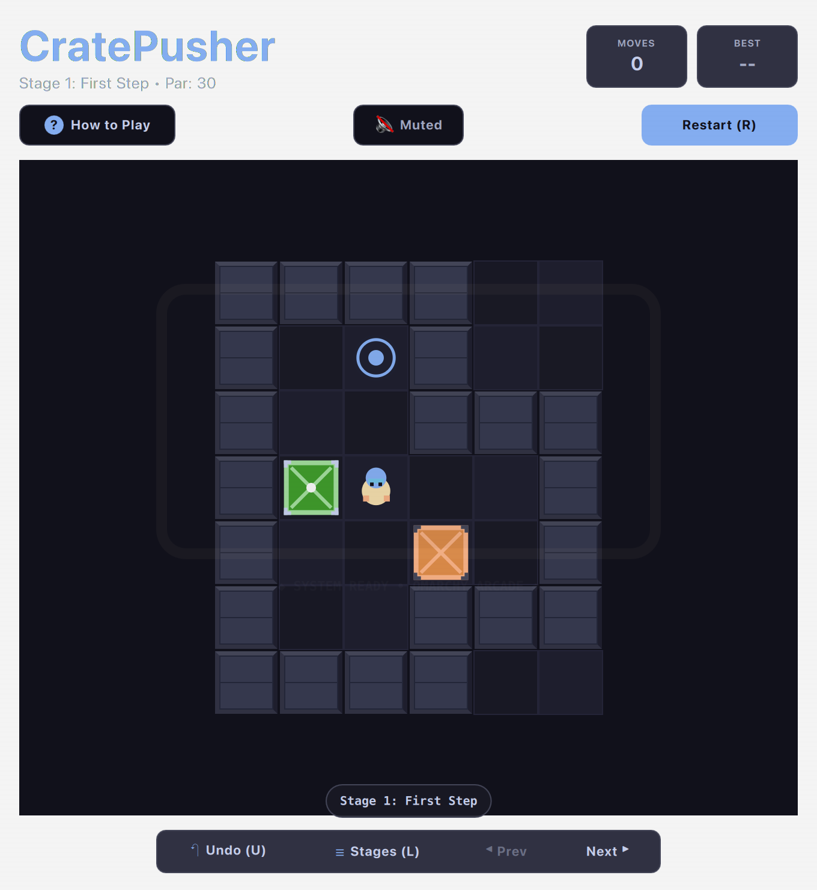

# CratePusher / Sokoban (QML / QtQuick)



A warehouse crate-pushing deduction puzzle featuring 100% verified solvable levels, infinite undo history, and an intuitive level progression system.

Runs natively with hardware acceleration on both **macOS** and **Linux (Omarchy)**.

---

## Features

* **Verified Solvable Levels:** Curated puzzle levels from David W. Skinner's celebrated *Microban* set, mathematically verified for solvability.
* **Unlimited Undo History:** Rewind moves and crate pushes effortlessly with `U`, `Backspace`, or `Z`.
* **Tactile Warehouse Audio:** Distinct footsteps on concrete, heavy wooden crate sliding friction, and harmonic chimes when crates seat on storage goals.
* **Level Progression & Persistence:** Unlocked levels and move-count records are preserved across restarts.
* **Theme-Aware Aesthetics:** Walls, wooden crates, and goal marks harmonize with your desktop color scheme.

---

## Controls

| Action | Primary Key | Secondary / Vim |
| :--- | :--- | :--- |
| **Move Up** | `W` or `↑` | Vim `K` |
| **Move Down** | `S` or `↓` | Vim `J` |
| **Move Left** | `A` or `←` | Vim `H` |
| **Move Right** | `D` or `→` | Vim `L` |
| **Undo Move** | `U` or `Backspace` | `Z` |
| **Previous / Next Level** | `[` / `]` | Header Navigation arrows |
| **Restart Level** | `R` | Subheader "Restart" |

---

## Running

```bash
./.venv/bin/python games/cratepusher/main.py
```

---

## License & Attribution

* Level designs from *Microban* by David W. Skinner (used with permission / public distribution).
* Released under the **MIT License**.
