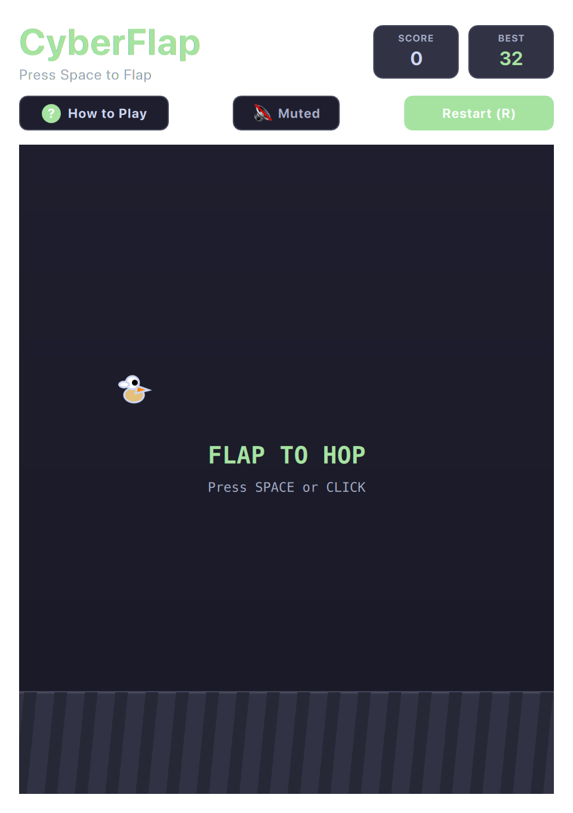

# CyberFlap (QML / QtQuick)



A high-framerate, reflex-testing airborne arcade runner. Maneuver through procedurally generated obstacle gates with snappy physics, dynamic pitch rotation, and instant input response.

Built natively with hardware acceleration for **Omarchy Linux**.

---

## Features

* **Sub-Millisecond Input Latency:** Instant flight impulses mapped to `Space`, `W`, `↑`, or click.
* **Dynamic Pitch Aerodynamics:** Realistic tilt rotation calculated dynamically from instantaneous vertical velocity.
* **Procedural Obstacle Columns:** Variable gap openings with color accents synced to your active desktop theme.
* **Score Banners & Milestones:** Visual chimes and celebration toasts as you surpass previous records.
* **Hardware-Accelerated 60 FPS:** Smooth scrolling with zero frame drops even during intense splits.

---

## Controls

| Action | Primary Key | Secondary / Vim | Mouse / Touch |
| :--- | :--- | :--- | :--- |
| **Flap Wings (Jump)** | `Space` | `W` or `↑` or Vim `K` | Left Click |
| **Full / Compact View** | `Shift+F` | — | Click `⛶` / `🔲` button |
| **Mute / Unmute** | `M` | — | Click Mute button |
| **Restart Game** | `R` | — | Click "Restart" |
| **Help** | `?` or `Esc` | — | Click "How to Play" |

---

## Running

```bash
./.venv/bin/python games/cyberflap/main.py
```

---

## License

* Released under the **MIT License**.
