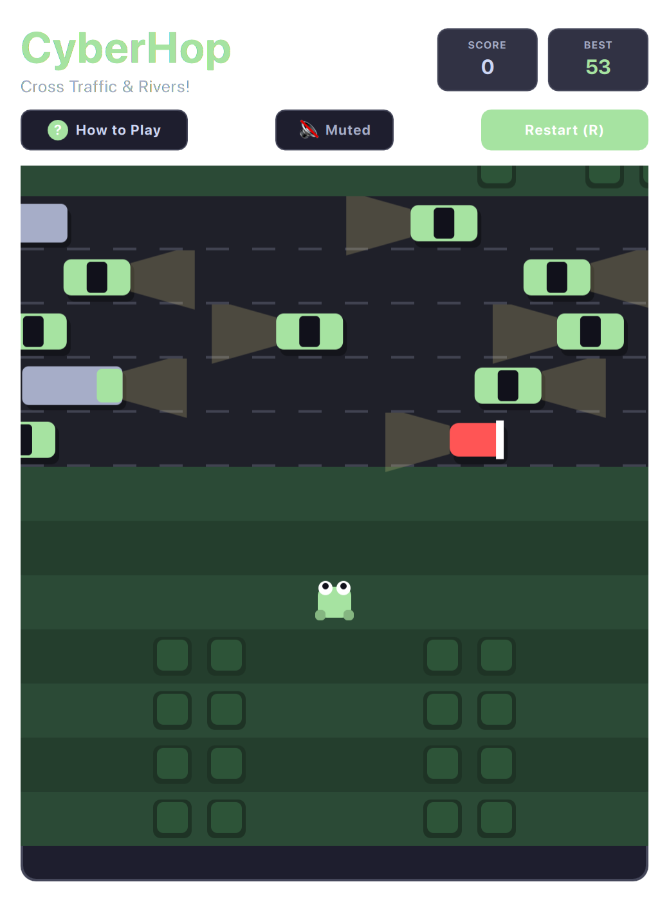

# Frogger (QML / QtQuick)



A retro arcade classic reimagined with modern design aesthetics. Guide your frog across frantic multi-lane highways and dangerous rushing rivers filled with floating logs and diving turtles to reach safety.

Built natively with hardware acceleration for **Omarchy Linux**.

---

## Features

* **Multi-Lane Traffic Simulation:** Multiple highway tiers featuring high-speed sports cars, bulldozers, and freight trucks with distinct velocities.
* **River Navigation:** River currents carrying floating cedar logs, crocodile hazards, and intermittent diving turtles.
* **Home Bay Progression:** Guide frogs safely into all 5 destination bays to advance to next Sector with increasing speed.
* **Countdown Pressure Bar:** Real-time remaining timer bar encouraging fast, decisive navigation.
* **Grid-Snapped Leaps:** Crisp hop animations with spatial movement sound chimes.

---

## Controls

| Action | Primary Key | Secondary / Vim |
| :--- | :--- | :--- |
| **Hop Up** | `W` or `↑` | Vim `K` |
| **Hop Down** | `S` or `↓` | Vim `J` |
| **Hop Left** | `A` or `←` | Vim `H` |
| **Hop Right** | `D` or `→` | Vim `L` |
| **Full / Compact View** | `Shift+F` | Click `⛶` / `🔲` button |
| **Mute / Unmute** | `M` | Click Mute button |
| **Restart** | `R` | Click "Restart" |

---

## Running

```bash
./.venv/bin/python games/cyberhop/main.py
```
