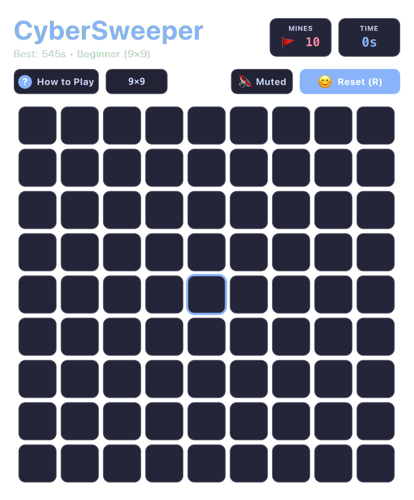

# Minesweeper (QML / QtQuick)



A modern, tactile implementation of the quintessential deduction puzzle. Features recursive zero-flood uncovering, chord double-click reveals, customizable difficulty tiers, and a guaranteed safe first click.

Built natively with hardware acceleration for **Omarchy Linux**.

---

## Features

* **Guaranteed Safe Opening:** First click is never a mine; the board algorithm distributes explosives dynamically after initial tile selection.
* **Recursive Zero Flood-Fill:** Instantaneous, animated cascading reveal of connected empty regions.
* **Chord Quick-Reveal:** Middle-clicking or double-clicking a numbered cell whose adjacent flags equal its number uncovers all remaining neighboring tiles.
* **Multiple Difficulties:** Beginner (9×9, 10 mines), Intermediate (16×16, 40 mines), and Expert (30×16, 99 mines).
* **Tactile Audio Feedback:** Distinct mechanical switch clicks on uncovers, flag placements, and chord completions.

---

## Controls

| Action | Mouse | Keyboard |
| :--- | :--- | :--- |
| **Reveal Tile** | Left Click | `Enter` / `Space` on focused tile |
| **Flag / Unflag Mine** | Right Click | `F` key |
| **Chord Reveal** | Middle Click / Left+Right Click | `C` key |
| **Navigate Grid** | Hover | `W`/`A`/`S`/`D`, Arrows, or Vim `H`/`J`/`K`/`L` |
| **Full / Compact View** | `Shift+F` | Click `⛶` / `🔲` button |
| **Mute Audio** | Subheader button | `M` |
| **New Game** | Subheader "Restart" | `R` |

---

## Running

```bash
./.venv/bin/python games/cybersweeper/main.py
```

---

## License

* Released under the **MIT License**.
