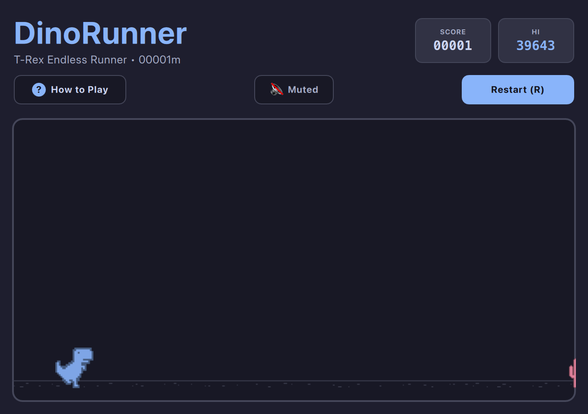

# CyberDash / Dino Runner (QML / QtQuick)



A high-speed endless runner featuring dynamic Day/Night atmospheric cycles, low-altitude jumping, ducking under incoming pterodactyls, and runtime desktop theme recoloring.

Runs natively with hardware acceleration on both **macOS** and **Linux (Omarchy)**.

---

## Features

* **Authentic Chrome Dino Mechanics:** Jump over cacti clusters and duck underneath diving prehistoric pterodactyls.
* **Dynamic Day / Night Cycles:** Smooth ambient lighting transitions between day and night phases as distance increases.
* **Theme-Aware Sprite Recoloring:** High-DPI sprites automatically adapt their color channels to match your active Omarchy system theme.
* **Milestone Chimes:** Audio chimes trigger on every 100-distance threshold.
* **Responsive Parallax Ground:** Endless terrain scrolling with randomized obstacle distribution.

---

## Controls

| Action | Primary Key | Secondary / Vim | Touch / Mouse |
| :--- | :--- | :--- | :--- |
| **Jump** | `Space` or `↑` | `W` or Vim `K` | Click screen |
| **Duck / Fast Fall** | `↓` | `S` or Vim `J` | Swipe Down |
| **Mute Audio** | `M` | — | Click Mute button |
| **Restart Game** | `R` | — | Click "Restart" |

---

## Running

```bash
./.venv/bin/python games/dinorunner/main.py
```

---

## License

* Released under the **MIT License**.
