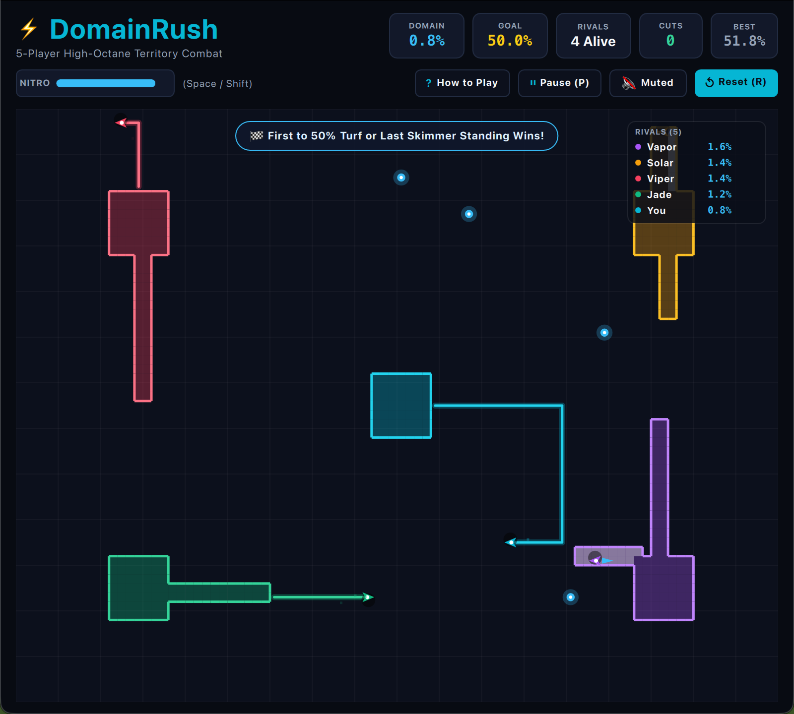
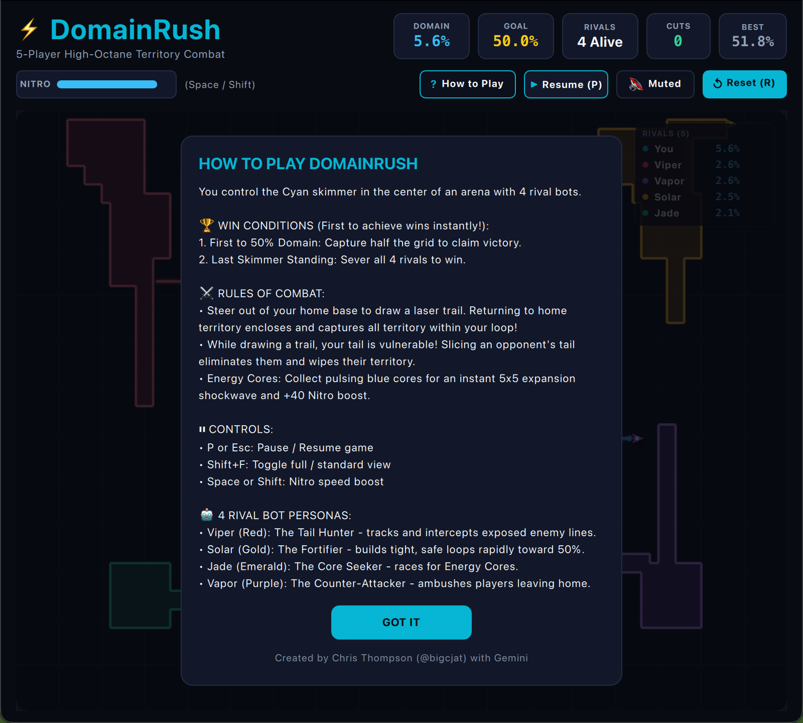

# DomainRush • 5-Player High-Octane Territory Combat

**DomainRush** (`OA-040`) is a fast-paced 5-player arcade territory battle built natively for Omarchy Arcade using PySide6, QML, and pure JavaScript.

  

---

## ⚡ Overview & Objective

Pilot your cyan combat skimmer from the center of the obsidian arena against 4 specialized AI rival skimmers. Carve through neutral space to leave a glowing laser trail, then loop back into your home territory to enclose and conquer everything inside.

### 🏆 Winning Conditions (First to achieve wins immediately):
1. **First to 50% Domain:** Capture 50.0% of the arena grid to trigger instant Dominance Victory.
2. **Last Skimmer Standing:** Sever all 4 rival skimmers' vulnerable trails to win as the sole survivor.

---

## 🎮 Controls

| Action | Primary Key | Secondary Key |
|---|---|---|
| **Steer Skimmer** | Arrow Keys | `W` `A` `S` `D` / Vim `H` `J` `K` `L` |
| **Nitro Boost** | `Space` | `Shift` |
| **Pause / Resume** | `P` | `Esc` / Click `Pause (P)` |
| **Full / Compact View** | `Shift + F` | Toggle floating micro-HUD |
| **Restart Match** | `R` | `Space` / `Enter` (at game end) |
| **Audio Mute** | `M` | Click Sound button |
| **How to Play & Rules** | `?` or `/` | Click How to Play button |

---

## 📸 In-Game Screenshots

### Live Arena Combat

### How to Play & Strategy Modal (Auto-Pauses Game)

---

## 🤖 4 Strategic AI Rival Personas

Each rival in the four outer quadrants runs a distinct tactical archetype:

1. **Viper (Red • The Tail Hunter):**
   - Scans radar for exposed opponent lines.
   - Calculates intercept angles to slice tails.
   - Triggers Nitro boost when closing in for a kill.
2. **Solar (Gold • The Territorial Fortifier):**
   - Expands in disciplined, compact loops (6–10 cells) close to home base.
   - Extremely hard to ambush due to minimal exposure time.
   - Steadily and rapidly stacks territory toward the 50% target.
3. **Jade (Emerald • The Core Seeker):**
   - Prioritizes Energy Cores that spawn in neutral territory.
   - Uses the instant 5×5 capture pulse to claim territory without long trails.
   - Stays along outer boundaries and evades combat skirmishes.
4. **Vapor (Purple • The Counter-Attacker):**
   - Patrols along neutral border margins.
   - Interposes between rivals and their bases to trap them in open space.

### 🛡️ Reactive Threat Detection & Survival
All bots continuously calculate distances between rivals and their exposed trail segments. If an enemy enters strike range (≤ 7 cells), the bot immediately aborts expansion, engages emergency Nitro boost, and navigates the shortest path back to its owned territory.

---

## 🔧 Architecture

- **PySide6 Host (`main.py`):**
  - Live desktop theme hot-reloading (`~/.config/omarchy/current/theme/colors.toml`).
  - Low-latency sound playback via CoreAudio (macOS) and PipeWire / PulseAudio / ALSA (Linux).
  - Persistent high-score & peak record management via `QSettings`.
- **QML Frontend (`main.qml`):**
  - High-performance 60 FPS `Canvas` rendering.
  - Responsive header layout with live Domain %, Goal (50.0%), and Alive Rival counter.
  - Modals and pause overlays isolated to the playing arena so the header is never obscured.
  - Floating micro-HUD mode (`Shift+F`) for Hyprland split-screen tiling.
  - Live Kill Feed & Event Notification banner.
  - Gold & Cyan Victory celebration screen with confetti particles.
- **Pure JavaScript Engine (`GameEngine.js`):**
  - 90×65 territory grid state with flood-fill polygon enclosure.
  - Collision detection, particle simulation, and multi-layered AI decision trees.

---

Created by **Chris Thompson** ([@bigcjat](https://github.com/bigcjat) • [@bigcjat](https://x.com/bigcjat)) with assistance from **Gemini**.
