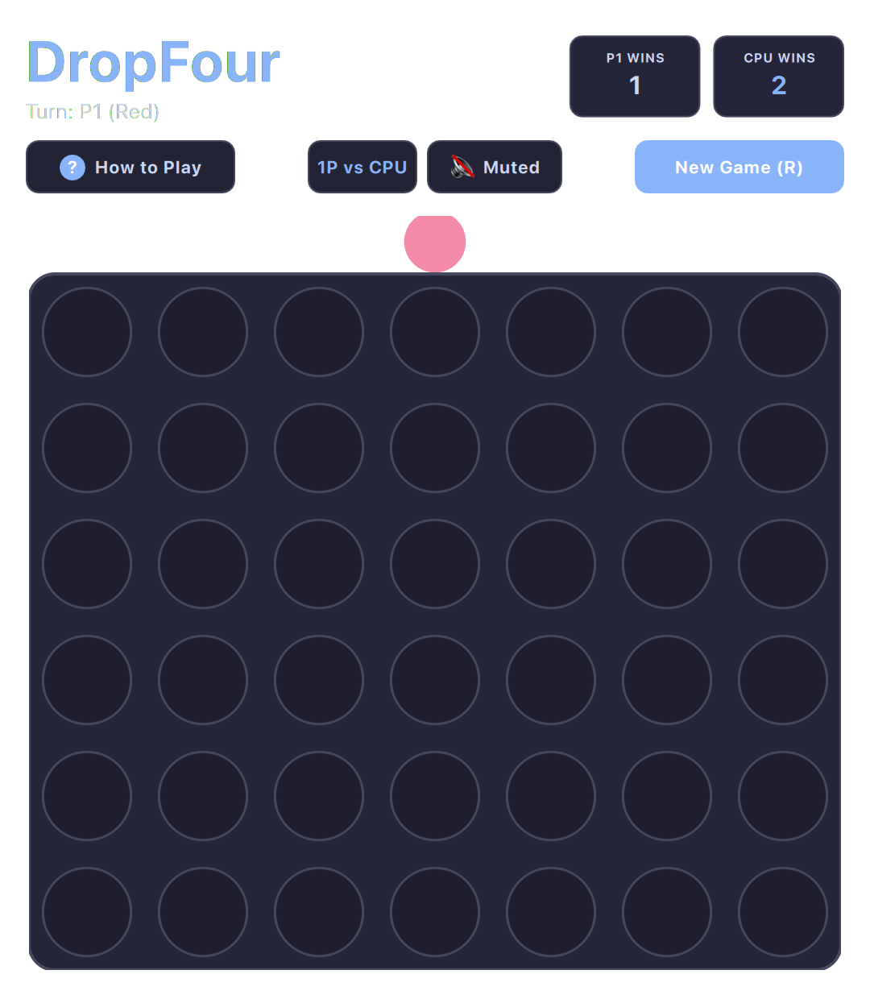

# Connect 4 (QML / QtQuick)



A polished, tactile implementation of the classic vertical four-in-a-row connection strategy game with satisfying gravity drop animations and an intelligent AI opponent.

Built natively with hardware acceleration for **Omarchy Linux**.

---

## Features

* **Authentic 7×6 Vertical Grid:** Clean, contrast-aware grid cutouts with glowing player discs.
* **Intelligent AI Opponent:** Smart heuristic evaluation engine capable of blocking wins, seeking opportunities, and challenging players at all skill levels.
* **Pass & Play / Solo Modes:** Toggle effortlessly between vs CPU and 2-player local pass-and-play.
* **Physics Drop Animations:** Natural gravity falling animations with subtle bounce settles when discs land.
* **Winning Sequence Highlighting:** Bright animated pulses along the connecting 4-disc vector (horizontal, vertical, or diagonal).
* **Full Keyboard & Mouse Support:** Drop discs using keys `1`–`7`, arrow navigation, or direct column clicks.

---

## Controls

| Action | Primary Key | Secondary / Mouse |
| :--- | :--- | :--- |
| **Select Column** | `A` / `D` or `←` / `→` | Hover over Column |
| **Drop Disc** | `Space` or `Enter` or `↓` | Click Column |
| **Direct Drop 1–7** | Number keys `1` through `7` | Click target column directly |
| **Toggle Mode (AI / 2P)** | `T` | Click Mode button in subheader |
| **Mute / Unmute** | `M` | Click Mute button |
| **Restart Game** | `R` | Click "Restart" |

---

## Running

```bash
./.venv/bin/python games/dropfour/main.py
```

---

## License

* Released under the **MIT License**.
