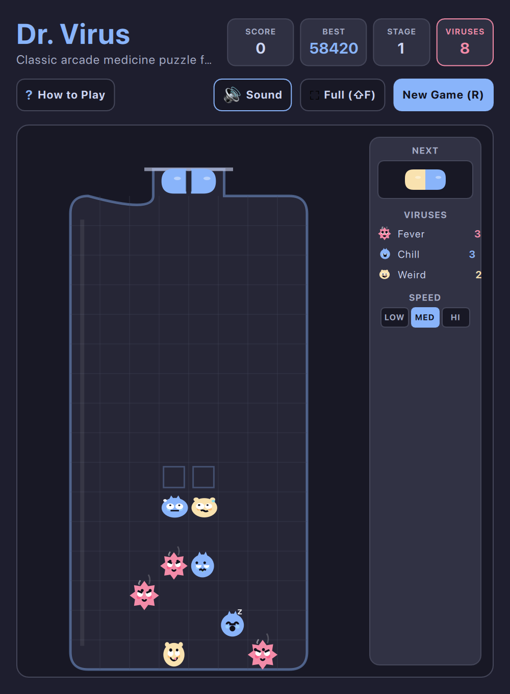

# Dr. Virus (QML / QtQuick)



A retro-futuristic arcade medicine puzzle game inspired by the legendary **Dr. Mario**, built natively in **QML** and **JavaScript** for the **Omarchy Arcade** ecosystem.

Eradicate pesky viral colonies by pairing colored vitamin capsules and triggering massive split-gravity chain cascades!

---

## Features
* **Classic & Modern Medicine Mechanics:** 8x16 glass medicine bottle, 3 expressive virus specimens (🔴 Fever, 🔵 Chill, 🟡 Weird), and dual-colored 2-segment vitamin capsules.
* **Living, Reactive Viruses:**
  - **Gaze Tracking:** Viruses look up at incoming capsules and ghost pieces as you maneuver them.
  - **Impending Threat Panic:** When a pill drops within 1–3 rows overhead, viruses tremble in terror, eyes widen into pinpricks, sweat droplets fly, and mouths drop open in panic.
  - **Illness Demeanors:** Fever Virus heaves with heavy panting breaths, flushed cheeks, and curling steam puffs; Chill Virus chatters its teeth with rapid shivering, pale frost, and a runny nose drop; Weird Virus wobbles like pudding with swaying antennae and a poked-out tongue.
  - **Boredom & Idling:** When idle, Chill yawns with floating "z" text, Fever rolls its eyes with tired sighs, and Weird daydreams cross-eyed.
  - **Mocking Laughter:** Whenever pills lock without eliminating any viruses, they bounce up and down in laughter with wide open cackling grins!
* **Line Elimination:** Match 4 or more segments of identical color vertically or horizontally to eliminate pills and eradicate viruses.
* **Uncoupled Cascading Split Gravity:** When one half of a pill clears, its surviving partner detaches and free-falls into spaces below, enabling chain-reaction combo bonuses.
* **Fluid Wall & Ceiling Kicks:** Full rotational SRS kicks against glass bottle walls and spawn bottleneck ceilings.
* **Next Capsule Preview & Specimen Counter:** Real-time side tray displaying upcoming capsules and animated viral specimen counters.
* **Multi-Stage Progression:** Advance through increasingly challenging stages with denser colonies and speed intervals. Retry current stage or restart from Stage 1 anytime.
* **Speed Selection:** Choose between `LOW`, `MED`, and `HI` fall speeds with custom score multipliers.
* **Dynamic Omarchy Theming:** Real-time hot-reloading from `~/.config/omarchy/current/theme/colors.toml` supporting all 22 Omarchy system color palettes.
* **Responsive Layout:** Compact/Tiled Desktop Mode (`Shift+F`) maximizing playfield for small window allocations in Hyprland/tiling window managers.
* **Zero-Latency Audio:** Native CoreAudio (macOS) and PipeWire / PulseAudio / ALSA (Linux) sound effects.

---

## Controls

* **Move Capsule:** `A` / `D` or `←` / `→` or Vim `H` / `L`
* **Rotate Clockwise:** `W` or `↑` or `X` or Vim `K`
* **Rotate Counter-Clockwise:** `Z`
* **Soft Drop:** `S` or `↓` or Vim `J`
* **Hard Drop (Instant Drop):** `Space`
* **Pause / Resume:** `P` or `Esc`
* **Full Playfield / Compact Mode:** `Shift+F`
* **Toggle Sound:** `M` (Defaults to Muted)
* **New Game (Stage 1):** `R`
* **Help Overlay:** `?`

---

## Running

### From the arcade workspace:
```bash
python games/drvirus/main.py
```

### With a specific theme:
```bash
python games/drvirus/main.py --theme catppuccin
python games/drvirus/main.py --theme tokyonight
python games/drvirus/main.py --theme gruvbox
```

---

## Technical Architecture
* **Frontend:** Declarative QML 2.15 + QtQuick Controls with smooth Canvas 2D rendering.
* **Game Engine:** Pure functional JavaScript (`GameEngine.js`) handling grid matrix physics, virus generation, SRS kicks, line matches, and uncoupled gravity cascades.
* **Host App:** Python 3 + PySide6 with QSettings persistence and low-latency audio dispatcher.
