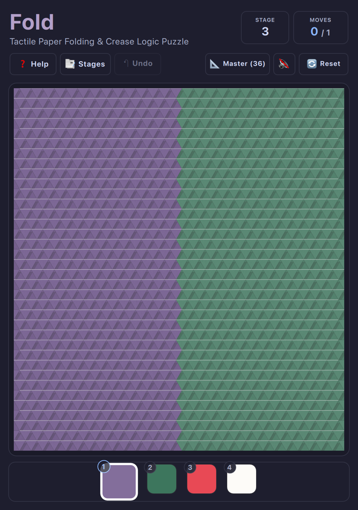

# Fold • Omarchy Arcade (OA-036)

A tactile Japanese origami paper-folding and geometric crease logic puzzle game built natively for **Omarchy Linux** and modern desktop window managers (Hyprland / macOS).

<p align="center">
  
</p>

---

## 📜 Game Overview

**Fold** challenges you to fold handcrafted sheets of Japanese washi paper along geometric crease lines, flipping layers of vibrant paper until the entire sheet collapses into a single target tile:

* **100% Offline Forever:** Zero trackers, zero cloud accounts, zero ads.
* **Fits on a Floppy Disk:** Lightweight ~1.2 MB total package size (comfortably under the 1.44 MB floppy budget).
* **100 Historical Geometric Archetypes:** Journey through authentic geometric tessellations spanning Roman Opus Tessellatum, Cosmatesque stone inlays, Moroccan zellij, Victorian tilework, and Japanese origami patterns (Asanoha, Seigaiha, Shippo).
* **Tactile Washi Paper Engine:** Real mulberry fiber textures, realistic 3D paper fold physics, soft shadow creases, and organic synthesized paper audio (folds, snaps, and victory koto).
* **Guaranteed Solvable Stages:** Every puzzle is generated with reverse-folding verification ensuring an elegant, logical solution within the target move limit (Par).
* **Omarchy Theme Synchronization:** Live hot-reloading from `~/.config/omarchy/current/theme/colors.toml` with Dark/Light OS auto-switching.
* **Full Undo & Level Select:** Infinite move backtracking with `U` / `↶ Undo`, restart with `R`, stage select modal with `L`, and responsive micro-HUD with `Shift+F`.

---

## 🕹️ How to Play

### Rules
1. **Fold Flaps:** Click or tap any outer paper flap or crease line to fold it inwards along that crease line.
2. **Layering:** When a flap folds over, its colored face flips and covers the underlying paper layer.
3. **Sequential Deduction:** Fold all sections in the correct sequence to reduce the multi-faceted origami sheet into a single unified square tile.
4. **Par Moves:** Complete the stage within or below the target move count (Par) to earn 3-star mastery.

---

## ⌨️ Controls Cheatsheet

| Key | Action |
| :--- | :--- |
| **Mouse Click** | Tap any triangular flap or crease to fold inwards |
| **`1` – `4`** | Select / preview palette color #1 through #4 |
| **`U`** | Undo previous fold |
| **`R`** | Restart current level |
| **`L`** | Open Stage / Level select modal |
| **`P`** / **`N`** | Previous / Next level |
| **`T`** | Cycle visual theme (*Washi Classic, Indigo Night, Matcha Garden, Sakura Spring, Urushi Lacquer, Imperial Gold*) |
| **`Shift+F`** | Toggle Full Playfield / Floating Micro-HUD |
| **`M`** | Toggle audio mute |
| **`?`** or **`Esc`** | Open How to Play modal |

---

## 🛠️ Running Standalone

Launch directly from the repository root:

```bash
./.venv/bin/python games/fold/main.py
```

Preview with specific desktop themes:

```bash
./.venv/bin/python games/fold/main.py --theme tokyonight
./.venv/bin/python games/fold/main.py --theme catppuccin-latte
./.venv/bin/python games/fold/main.py --theme gruvbox
```

Jump directly to a specific level:

```bash
./.venv/bin/python games/fold/main.py --level 42
```
