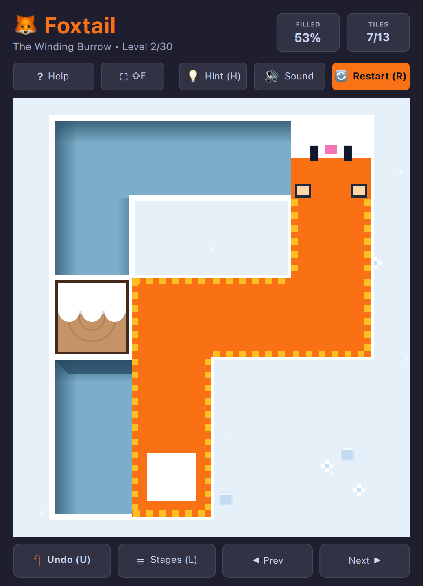

# Foxtail (QML / QtQuick)



Guide a clever voxel red fox across powdery snowdrifts to bury and fill every trench tile with its wonderfully bushy, fluffy tail!

Built natively with hardware acceleration for **Omarchy Linux**.

---

## Features

* **30 Handcrafted Winding Levels:** Beautiful non-convex contours including spirals, hairpin U-turns, bottlenecks, donuts, and islands—each mathematically verified for 100% solvability.
* **Fluffy Bushy Tail Mechanics:** Every step carves deep, shadowed snow trenches and extends the fox's luxurious segmented tail until every open tile is packed with snow and fluff.
* **Animated Character & Feedback:** The fox blinks naturally with closed eye slits and double-blinks. When hitting an unrecoverable dead-end, the fox comically squints (`> <`) with a cartoon sweat drop (`💧`), triggers a haptic screen shake, and automatically resets the stage.
* **Smart Hint System (`💡 Hint / H`):** Stuck on a tricky turn? Trigger the animated pulsing golden arrow indicator and toast clue to guide your next move.
* **Full Undo & Level Select:** Press `U` or `Z` to step backward through moves, `R` to restart, and `N` / `P` to navigate levels.
* **Tactile Winter Soundscape:** Crisp snow crunch footsteps (`step.wav`), trench carving sounds, golden victory chimes, and dead-end audio.
* **100% True Offline Play:** Zero internet required or used. No network sockets, zero cloud dependencies, zero telemetry, and zero ads. Plays completely offline forever.
* **Dynamic Omarchy Theming:** Automatically synchronizes with all 22 Omarchy system themes by reading `~/.config/omarchy/current/theme/colors.toml`. Live hot-reloads when changing themes via `Super + Space`!
* **Standardized 2048 Arcade Layout:** Top title & stats header, subheader with sound toggle and quick action buttons, and responsive play matrix.
* **Responsive Toolbar Emoji Collapse:** When windows are narrow or toolbars crowded, control buttons automatically collapse into compact icon/emoji buttons (`💡`, `?`, `🔇`, `🔄`) so controls never push off-screen or smash together.
* **Retro Console Startup Screen:** ~1.0-second arcade startup sequence with CRT scanlines, retro stripes, and vector glint sheen (skips instantly on any key/click).
* **Keyboard-First Controls:** Arrow keys, WASD, and Vim (`H`, `J`, `K`, `L`) navigation supported across all interactions.
* **Zero-Overhead Audio:** Zero-overhead native audio (PipeWire / ALSA), defaulted to muted (`M` to toggle) with 0% CPU consumption when silent.
* **Responsive Tiling:** Smoothly adapts to any window geometry down to narrow tiling window manager splits without clipping.
* **Persistent High Scores:** Saves completed levels and best records across sessions via `QSettings`.

---

## Controls

| Action | Primary Key | Secondary / Vim | Mouse / Touch |
| :--- | :--- | :--- | :--- |
| **Move Fox** | `Arrow Keys` | `W` / `A` / `S` / `D` or `H` / `J` / `K` / `L` | Drag / Click Adjacent Tile |
| **Hint** | `H` | — | Click `💡 Hint` Button |
| **Undo Step** | `U` | `Z` | Click `↶ Undo` Button |
| **Restart Level** | `R` | — | Click `🔄 Restart` Button |
| **Next / Prev Level** | `N` / `P` | `]` / `[` | Click Level Arrows |
| **Mute / Unmute** | `M` | — | Click `🔇 Audio` Button |
| **Full-Playfield HUD**| `Shift+F` | — | Click `⇧F` Button |
| **How to Play / Help**| `?` | `F1` or `Esc` | Click `? Help` Button |

---

## Running

### From the Arcade Root:

```bash
./.venv/bin/python games/foxtail/main.py
```

### With a Specific Theme:

```bash
./.venv/bin/python games/foxtail/main.py --theme snow
./.venv/bin/python games/foxtail/main.py --theme gruvbox
./.venv/bin/python games/foxtail/main.py --theme tokyonight
./.venv/bin/python games/foxtail/main.py --theme catppuccin
```

---

## Author & Credits

Created by **Chris Thompson** ([@bigcjat](https://github.com/bigcjat) • [@bigcjat](https://x.com/bigcjat)) with assistance from **Gemini**.
