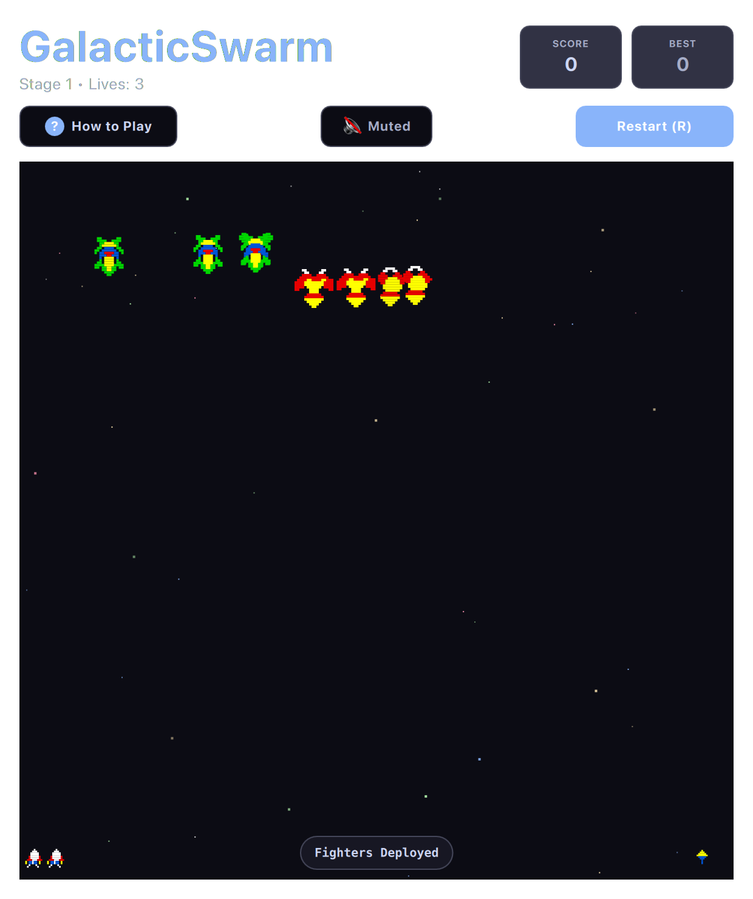

# Galaga (QML / QtQuick)



A faithful, high-octane recreation of the legendary space combat arcade shooter. Features swooping insectoid alien flight formations, tractor beam ship-capture mechanics, dual-fighter firepower, and a deep parallax starfield.

Runs natively with hardware acceleration on both **macOS** and **Linux (Omarchy)**.

---

## Features

* **Swooping Alien Formations:** Bees, Butterflies, and Boss Galagas enter in swooping parabolic curves before assembling in formation.
* **Tractor Beam & Dual Fighter:** Boss Galagas emit tractor beams to capture your fighter. Destroy the boss mid-swoop to liberate your captured craft and pilot a devastating double-barrel dual fighter!
* **Parallax Cosmic Starfield:** Multi-layered starfield with speed variations giving depth and motion.
* **Dual Hit Bosses:** Boss Galagas require two direct laser strikes to eliminate and yield bonus points when shot down during dives.
* **Full Audio Suite:** Classic laser discharges, dive sirens, capture beam pulses, and explosion rumbles.

---

## Controls

| Action | Primary Key | Secondary / Vim | Mouse |
| :--- | :--- | :--- | :--- |
| **Move Fighter Left** | `A` | `←` or Vim `H` | Mouse movement |
| **Move Fighter Right** | `D` | `→` or Vim `L` | Mouse movement |
| **Fire Lasers** | `Space` | `W` or `↑` or Vim `K` | Left Click |
| **Mute / Unmute** | `M` | — | Click Mute button |
| **Restart Game** | `R` | — | Click "Restart" |

---

## Running

```bash
./.venv/bin/python games/galacticswarm/main.py
```

---

## License

* Released under the **MIT License**.
