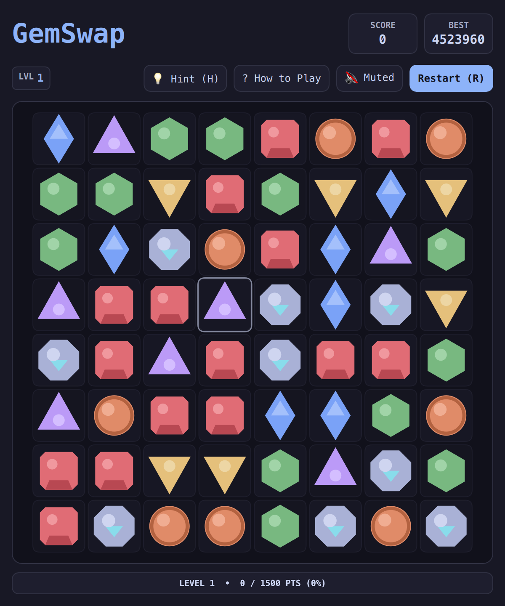

# GemSwap (QML / QtQuick)



A match-3 puzzle arcade classic built with clean geometric vector aesthetics. Swap adjacent gems on an 8×8 board to align three or more identical colors, triggering cascade chain reactions and crafting explosive power gems.

Built natively with hardware acceleration for **Omarchy Linux**.

---

## Features

* **7 Faceted Vector Gems:** Clean mathematical gems including Hexagonal Rubies, Beveled Emeralds, Teardrop Sapphires, Diamond Topazes, Amethysts, and Brilliant Prisms that dynamically tint to your desktop theme.
* **Special Power Gems:**
  * **Flame Gem (Match-4):** Detonates a $3\times3$ radiant blast clearing surrounding tiles.
  * **Star Gem (T/L Match):** Emits directional laser beams clearing entire rows and columns.
  * **Hyper Gem (Match-5):** Swapping with any adjacent gem evaporates all instances of that color across the board.
* **Cascading Chain Multipliers:** Cascading gravity drops increment your combo score multiplier ($2\times, 3\times, 4\times\dots$).
* **Auto-Shuffle Deadlock Prevention:** Detects when no legal moves remain on the board and shuffles without resetting your score.
* **Universal Controls:** Play with mouse/touch click-and-swap, or full keyboard navigation with WASD, arrow keys, and Vim keys.

---

## Controls

| Action | Primary Key | Secondary / Vim |
| :--- | :--- | :--- |
| **Move Cursor** | `WASD` or `↑↓←→` | Vim `HJKL` |
| **Select / Swap** | `Space` or `Enter` | Mouse Click |
| **Directional Swap** | `Shift` + `Direction` | Drag to Neighbor |
| **How to Play** | `?` or `/` | Click "? How to Play" |
| **Full / Compact View** | `Shift+F` | Click `⛶` / `🔲` button |
| **Mute / Unmute** | `M` | Click Mute button |
| **Restart Game** | `R` | Click "Restart (R)" |

---

## Running

```bash
./.venv/bin/python games/gemswap/main.py
```
