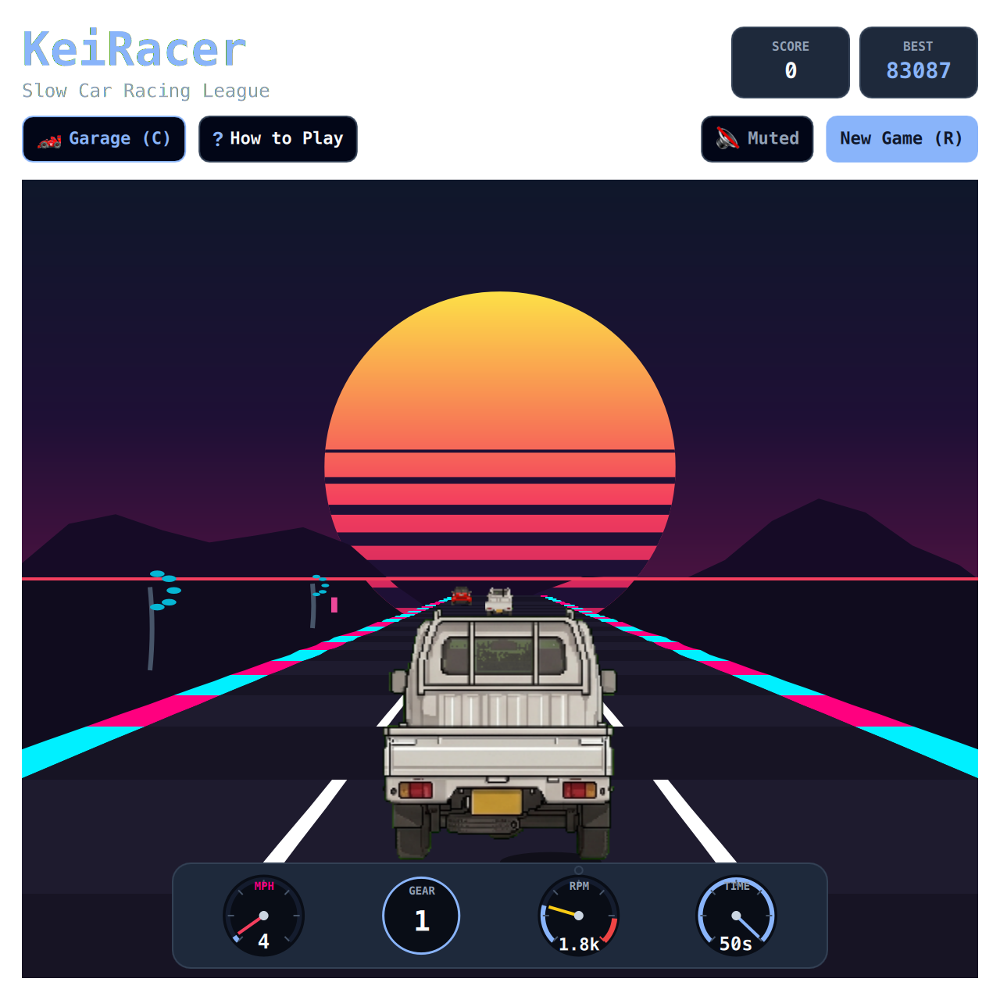

# KeiRacer (QML / QtQuick)



A fast-paced retro synthwave highway racer featuring authentic Japanese Kei cars, realistic drivetrain physics, analog cockpit gauges, and sector checkpoint racing.

Built natively with hardware acceleration for **Omarchy Linux**.

---

## Features

* **100% True Offline Play:** Zero internet required or used. No network sockets, zero cloud dependencies, zero telemetry, and zero ads. Plays completely offline forever.
* **Dynamic Omarchy Theming:** Automatically synchronizes with all 22 Omarchy system themes by reading `~/.config/omarchy/current/theme/colors.toml`. Live hot-reloads when changing themes via `Super + Space`!
* **Standardized 2048 Arcade Layout:** Top title & stats header, subheader with sound toggle, garage selector, help modal, and responsive play matrix.
* **Analog Cockpit Gauges:** Distinct analog dial cluster featuring circular Speedometer (MPH), Gear indicator pod, Tachometer (RPM) with redline arc and shift light, and Countdown Timer sweep gauge.
* **Compact Garage (Car Select):** Switch between iconic vehicles including the Suzuki Carry Kei Truck, Smart Fortwo, Fiat Panda 4x4, Suzuki Sidekick, Jeep Wrangler YJ, and Volkswagen Bus.
* **Responsive Toolbar Emoji Collapse:** When windows are narrow or toolbars crowded, control buttons automatically collapse into compact icon buttons (`🏎️`, `?`, `🔇`, `🔄`) so controls never push off-screen.
* **Retro Console Startup Screen:** ~1.0-second arcade startup sequence with CRT scanlines, retro stripes, and vector glint sheen (skips instantly on any key/click).
* **Keyboard-First Controls:** Arrow keys, WASD, and Vim (`H`, `J`, `K`, `L`) navigation supported across all interactions.
* **Zero-Overhead Audio:** Zero-overhead native audio (PipeWire / ALSA), defaulted to muted (`M` to toggle) with procedural engine acoustics.
* **Persistent High Scores:** Saves best scores and stats across sessions via `QSettings`.

---

## Controls

| Action | Primary Key | Secondary / Vim | Mouse / Touch |
| :--- | :--- | :--- | :--- |
| **Steer** | `A` / `D` | `H` / `L` or Left / Right Arrows | Steer vehicle |
| **Accelerate / Brake** | `W` / `S` | `K` / `J` or Up / Down Arrows | Throttle / Brake |
| **Drift** | `Space` | — | Handbrake slide |
| **Garage (Car Select)** | `C` | — | Click "Garage" in subheader |
| **Full / Compact View** | `Shift+F` | — | Click `⛶` / `🔲` button |
| **Mute / Unmute** | `M` | — | Click audio button in subheader |
| **Restart Game** | `R` | — | Click "New Game" in subheader |
| **How to Play / Help**| `?` or `Esc` | — | Click "Help" |

---

## Running

### From the Arcade Root:

```bash
./.venv/bin/python games/keiracer/main.py
```

### With a Specific Theme:

```bash
./.venv/bin/python games/keiracer/main.py --theme gruvbox
./.venv/bin/python games/keiracer/main.py --theme tokyonight
./.venv/bin/python games/keiracer/main.py --theme catppuccin
./.venv/bin/python games/keiracer/main.py --theme snow
```

---

## Author & Credits

Created by **Chris Thompson** ([@bigcjat](https://github.com/bigcjat) • [@bigcjat](https://x.com/bigcjat)) with assistance from **Gemini**.

---

## License & Attribution

* Released under the **MIT License**.
