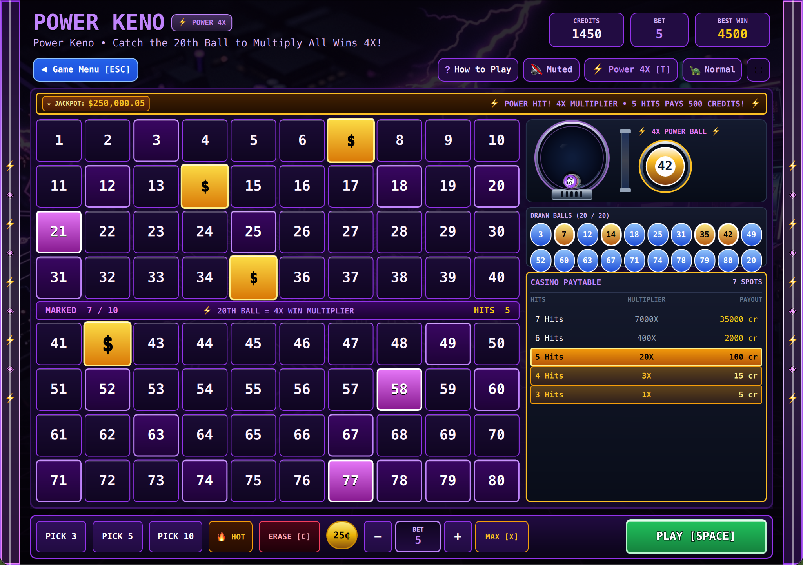

# VLT Keno • 8-in-1 Casino Terminal (QML / QtQuick)



A high-end, authentic casino recreation of the legendary video lottery terminal (VLT) Keno machine, built natively with hardware acceleration for **Omarchy Linux**.

Features **8 iconic casino game engines in a single unified terminal**, each with its own bespoke visual theme, authentic paytables, 3D lottery blower physics, interactive swipe selection, and responsive layouts for both widescreen and tall upright cabinet views.

---

## The 8 Built-In Casino Game Engines & Themes

1. **Classic Keno (Retro Vegas Midnight & Sapphire Blue):** Pure traditional casino odds. Select 2 to 10 numbers on the 80-number grid and watch 20 balls draw.
2. **Power Keno (Cyberpunk Ultraviolet Abyss & Lightning Fuchsia):** If the **20th (final) ball** hits one of your selected spots, your round win is **quadrupled ($4\times$)**!
3. **Super Keno (Royal Monte Carlo Mahogany & Bullion 24K Gold):** If the **1st ball** hits one of your selected spots, your round win is **quadrupled ($4\times$)**!
4. **Cleopatra Keno (Egyptian Tomb Turquoise & Scarab Emerald):** If the **20th ball** hits on a winning ticket, it awards **12 Free Games** where all payouts are **doubled ($2\times$)**!
5. **Caveman Keno (Jurassic Volcanic Jungle & Amber Lava Eggs):** 3 dinosaur eggs are laid on the grid. Catching them hatches the eggs to multiply wins up to **$8\times$**!
6. **Extra Draw Keno (Obsidian Brushed Steel & Red Alert Sirens):** Near-miss rounds trigger 3 extra emergency balls to turn misses into monster wins!
7. **Gold Mine Keno (1849 Gold Rush Mine Shaft & Sparkling Raw Nuggets):** Gold nuggets unearth cash bonuses and hidden dynamite detonations trigger cash multipliers!
8. **Triple Power Keno (Quantum Cyan Plasma Reactor & Arc Containment):** Hitting the 1st ball multiplies wins by $3\times$; hitting the 20th ball multiplies wins by $3\times$; hitting both unleashes a massive **$9\times$ Mega Multiplier**!

---

## Features

* **8-in-1 Engine Switcher (`T` / `Esc`):** Switch between all 8 game engines and their dedicated visual atmospheres dynamically via hotkey or interactive Game Menu.
* **Interactive Touch / Mouse Swipe Selection:** Click or drag/swipe across numbers to fluidly select or deselect groups of spots with instant audio feedback.
* **3D Glass Lottery Tumbler & Ball Caller:** Real-time physics-driven pneumatic tumbler blower and convex chrome magnifier lens calling each number.
* **Dynamic Adaptive Paytable:** Real-time recalibration of exact win multipliers as you select 2 to 10 spots, auto-scrolling to and highlighting winning hit tiers in bullion gold.
* **Responsive Vertical & Widescreen Layouts:** Seamlessly adapts between widescreen split view and authentic upright cabinet vertical split view (full-width grid, top info deck).
* **Responsive Toolbar Emoji Collapse:** Subheader action buttons collapse into clean emojis (`◀`, `?`, `🔊`, `⚡`, `🐢`, `⛶`) whenever window geometry is constrained.
* **100% True Offline Play:** Zero internet required. No network sockets, zero telemetry, and zero ads.
* **Desktop Theme Synchronization:** Automatically synchronizes and hot-reloads with all 22 Omarchy desktop themes (`colors.toml`).
* **Persistent Settings:** Automatically saves bankroll credits and best win across sessions via `QSettings`.

---

## Controls

| Action | Primary Key | Secondary / Alt | Mouse / Touch |
| :--- | :--- | :--- | :--- |
| **Start Draw / Play** | `Space` | `Enter` | Click "PLAY [SPACE]" button |
| **Select / Toggle Spots** | Click tile | Drag / Swipe | Click or swipe across numbers 1–80 |
| **Switch Variant** | `T` | `1`–`8` | Click Game Variant pill in subheader |
| **Quick Pick** | `Q` | `3`, `5`, `10` | Click "Pick 3", "Pick 5", "Pick 10" |
| **Hot Picks** | Click button | — | Click "🔥 HOT" button |
| **Clear Board** | `C` | — | Click "ERASE [C]" button |
| **Adjust Bet** | `B` / `Shift+B` | `+` / `−` | Click `+` / `−` buttons |
| **Bet Max (100)** | `X` | — | Click "MAX" button |
| **Toggle Draw Speed** | `S` | — | Click "⚡ Fast" / "🐢 Normal" |
| **Game Menu** | `Esc` | — | Click "◀ Game Menu" |
| **Rules & How to Play** | `?` | — | Click "?" button |
| **Full / Compact View** | `Shift+F` | — | Click `⛶` / `🔲` button |
| **Mute / Unmute** | `M` | — | Click "🔇" / "🔊" button |

---

## Running

### From the Arcade Root:

```bash
./.venv/bin/python games/keno/main.py
```

### With a Specific Theme:

```bash
./.venv/bin/python games/keno/main.py --theme tokyonight
./.venv/bin/python games/keno/main.py --theme catppuccin
./.venv/bin/python games/keno/main.py --theme gruvbox
```

---

## Author & Credits

Created by **Chris Thompson** ([@bigcjat](https://github.com/bigcjat) • [@bigcjat](https://x.com/bigcjat)) with assistance from **Gemini**.
