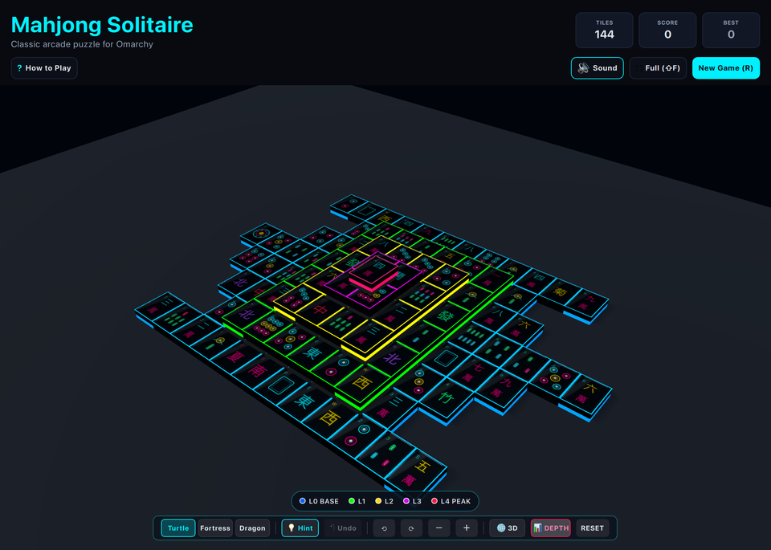

# Mahjong Solitaire (3D / QtQuick3D)



Authentic 3D Mahjong Solitaire built with true hardware-accelerated **QtQuick3D** for **Omarchy Linux**. Features 144 obsidian domino slabs with glowing neon intaglio face glyphs, true multi-layer spatial depth, 5-tier chromatic elevation highlights, 100% guaranteed solvable layouts (Turtle, Fortress, Dragon), smooth trackpad/keyboard camera orbit, and overhead inspection mode.

---

## Features

* **True 3D Spatial Geometry:** 144 physical obsidian stone tiles with beveled edge rims, realistic specular materials, and real-time contact drop shadows across layers.
* **5-Level Chromatic Elevation Spectrum:** Distinct, non-overlapping neon bevel highlights for instant visual depth recognition:
  - **Level 0 (Base Floor):** Deep Pure Blue (`#0066FF`)
  - **Level 1 (Tier 1):** Pure Lime Green (`#00FF00`)
  - **Level 2 (Tier 2):** Golden Yellow (`#FFD600`)
  - **Level 3 (Tier 3):** Electric Purple (`#D500F9`)
  - **Level 4 (Peak):** Fiery Crimson Red (`#FF1744`)
* **Overhead & 3D Orbit Modes:** Toggle between full 3D orbital perspective and top-down architectural overhead inspection with a single key (`V`).
* **Optimized Trackpad & Keyboard Camera:** Smooth two-finger trackpad drag for frictionless orbiting, plus single-key 45° spin (`A`/`D` or Arrow keys) and tilt controls (`W`/`S`).
* **100% Guaranteed Solvable Boards:** Advanced reverse-construction generation algorithm ensuring every Turtle, Fortress, and Dragon board is solvable without deadlocks.
* **Playable Tile Neon Underglow:** Open unblocked tiles emit a radiant cyan underglow; selected tiles pulse with warm gold.
* **Intelligent Hint & Undo System:** Press `H` for strategic pair recommendations and `U` for instant multi-step move rollbacks.
* **100% True Offline Play:** Zero internet sockets, zero accounts, zero telemetry, and zero ads. Plays completely offline forever.
* **Dynamic Omarchy Theming:** Synchronizes live with all 22 Omarchy desktop themes (`colors.toml`). Hot-reloads on the fly when switching themes!
* **Standardized Arcade 2048 Layout:** Conforms to the Master Arcade 2-row header hierarchy with Tile counter, Score, Best, and responsive action bar.

---

## Controls

| Action | Primary Key | Secondary / Alt | Mouse / Touchpad |
| :--- | :--- | :--- | :--- |
| **Select / Match Tile** | Click Tile | `Space` | Click any free tile |
| **Orbit Camera** | `A` / `D` (Spin 45°) | `←` / `→` | **Two-finger trackpad drag** or Left-click drag |
| **Tilt Camera Pitch** | `W` / `S` | `↑` / `↓` | Two-finger vertical scroll |
| **Zoom In / Out** | `+` / `-` | Mouse Wheel | Trackpad pinch |
| **Toggle 3D / Overhead** | `V` | — | Click "📐 TOP" / "🌐 3D" pill |
| **Toggle Depth Rims** | `L` | — | Click "📊 DEPTH" pill |
| **Strategic Hint** | `H` | — | Click "💡 Hint" button |
| **Undo Move** | `U` | `Ctrl+Z` | Click "↶ Undo" button |
| **Switch Layout** | `1` (Turtle), `2` (Fortress), `3` (Dragon) | — | Click layout pills |
| **New Game** | `R` | — | Click "New Game (R)" |
| **Full Window View** | `Shift+F` | — | Click "Full (⇧F)" |
| **Mute / Unmute** | `M` | — | Click audio button |
| **How to Play** | `?` | `Esc` | Click "? How to Play" |

---

## Running

### From the Arcade Root:

```bash
./.venv/bin/python games/mahjongsolitaire/main.py
```

### With Options:

```bash
# Launch with specific layout
./.venv/bin/python games/mahjongsolitaire/main.py --layout fortress
./.venv/bin/python games/mahjongsolitaire/main.py --layout dragon

# Launch with desktop theme override
./.venv/bin/python games/mahjongsolitaire/main.py --theme tokyonight
./.venv/bin/python games/mahjongsolitaire/main.py --theme catppuccin-latte

# Skip startup splash sequence
./.venv/bin/python games/mahjongsolitaire/main.py --no-splash
```
