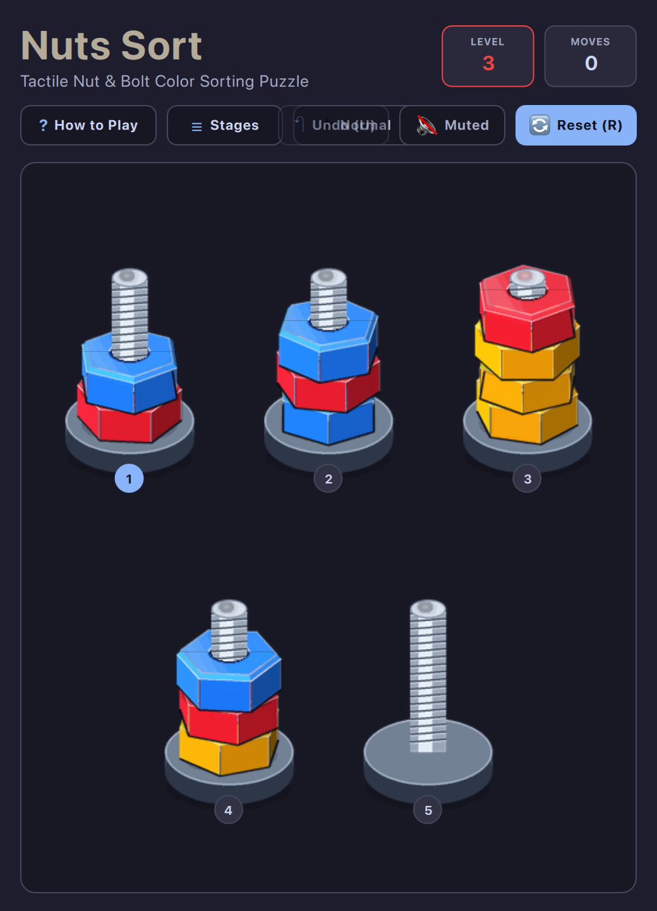

# Nuts Sort • Omarchy Arcade (OA-035)

A tactile 2.5D isometric mechanical color-sorting puzzle game built natively for **Omarchy Linux** and modern desktop window managers (Hyprland / macOS).

<p align="center">
  
</p>

---

## 🔩 Game Overview

**Nuts Sort** challenges you to sort scrambled anodized hexagonal nuts across threaded steel bolts until each bolt contains only one uniform color:

* **100% Offline Forever:** Zero trackers, zero cloud accounts, zero ads.
* **Fits on a Floppy Disk:** Highly optimized 1.00 MB total package size (comfortably under the 1.44 MB floppy budget).
* **Tactile 2.5D Isometric Engine:** 264 pre-rendered 3D isometric rotation frames (11 anodized colors × 12 camera perspectives), authentic threaded steel rods, cast-iron bolt bases, and fluid lift-and-spin transfer animations.
* **Difficulty Modes:** Switch anytime between **Casual** (generous buffer bolts for relaxing solves), **Normal** (balanced, calibrated progression with milestone challenges), and **Hard** (tight squeeze puzzles requiring precise foresight).
* **Automatic Deadlock Detection:** Instantly alerts you when a move leaves no legal transfers remaining, presenting quick Undo and Restart prompts so you never waste time on stuck states.
* **10,000+ Solvable Stages:** Features calibrated tutorial stages transitioning seamlessly into mathematically guaranteed solvable levels generated via reverse-move simulation.
* **Omarchy Theme Synchronization:** Live hot-reloading from `~/.config/omarchy/current/theme/colors.toml` with Dark/Light OS auto-switching.
* **Dynamic Keyboard Pills:** Numbered keyboard pill badges (`1`..`9`) for instant, effortless one-handed play.
* **Full Undo & Stage Navigation:** Infinite move backtracking with `U` / `↶ Undo`, restart with `R`, stage select modal with `L`, and automatic confetti victory celebrations.

---

## 🕹️ How to Play

### Rules
1. **Pick & Place:** Click on any non-empty bolt (or press `1`–`9` / `Space` over the selected bolt) to unscrew and lift the top nut.
2. **Transfer:** Click a destination bolt (or press its number) to thread the nut onto it.
3. **Legal Moves:**
   * A nut can only land on an **empty bolt**, OR
   * On a bolt whose current top nut matches the **same color**.
   * Each bolt holds a maximum of **4 nuts**.
4. **Victory:** Sort every bolt so it is either completely empty or contains 4 matching nuts of a single color.

---

## ⌨️ Controls Cheatsheet

| Key | Action |
| :--- | :--- |
| **`1` – `9`** | Direct select / transfer to bolt #1 through #9 |
| **`←` `↑` `→` `↓`** / **`H` `J` `K` `L`** / **`W` `A` `S` `D`** | Navigate selection cursor across bolts |
| **`Space`** or **`Enter`** | Lift nut from bolt / drop nut onto target bolt |
| **`U`** | Undo previous move |
| **`R`** | Restart current level |
| **`L`** | Open Stage / Level select modal |
| **`P`** / **`N`** | Previous / Next level |
| **`Shift+D`** | Cycle Difficulty mode (Casual / Normal / Hard) |
| **`Shift+F`** | Toggle Full Playfield / Floating Micro-HUD |
| **`M`** | Toggle audio mute |
| **`?`** or **`Esc`** | Open How to Play modal |
| **Mouse Click** | Tap any bolt to pick up or place nuts |

---

## 🛠️ Running Standalone

Launch directly from the repository root:

```bash
./.venv/bin/python games/nutssort/main.py
```

Preview with specific themes:

```bash
./.venv/bin/python games/nutssort/main.py --theme catppuccin-latte
./.venv/bin/python games/nutssort/main.py --theme tokyonight
./.venv/bin/python games/nutssort/main.py --theme gruvbox
```

Jump directly to a level:

```bash
./.venv/bin/python games/nutssort/main.py --level 6
```
