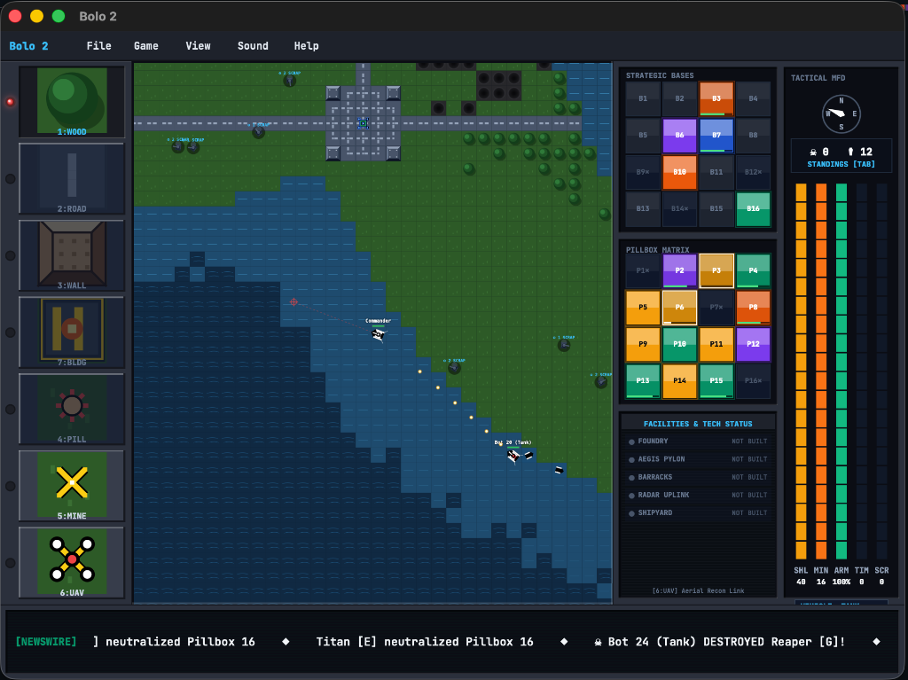

# OmarchyBolo II • Classic Tactical Tank Warfare (OA-029)



A faithful tactical armored combat simulation inspired by Stuart Cheshire's legendary 1987 Macintosh classic *Bolo*, featuring real-time territorial warfare, combat engineering, autonomous AI battlegroups, and peer-to-peer WebRTC multiplayer.

Integrated seamlessly into the **Omarchy Arcade** desktop suite with zero Node.js or Chromium runtime overhead.

---

## Features

* **Authentic Mac System 7 Aesthetic:** Classic UI windowing, retro typography, tactical radar map, and responsive vector/pixel canvas rendering.
* **3 Tactical Vehicle Classes:**
  * 🪖 **M4 Tank:** Heavy armor, rotating turret, explosive shell artillery, and builder engineering tools.
  * 🚙 **Armed Humvee:** High-speed scout vehicle with rapid-fire dual machine guns, ideal for flanking and deep reconnaissance.
  * 🚢 **Aircraft Carrier:** Ocean & river combat flagship capable of launching reconnaissance and airstrike helicopters.
* **Combat Engineering & Fortifications:**
  * **Forestry & Logistics:** Harvest trees for wood supplies using your onboard engineering unit.
  * **Pillboxes & Turrets:** Deploy automated pillbox bunkers to guard strategic bottlenecks and naval supply depots.
  * **Demolitions:** Lay concealed anti-tank mines and blast enemy fortifications.
  * **Bridge Construction:** Build and repair bridges across rivers to enable armored column offensives.
* **Intelligent AI Bots:**
  * Autonomous enemy tanks with pathfinding, territory capture, pillbox repair, and tactical ambushes.
* **Multiplayer Warfare:**
  * WebRTC Peer-to-Peer matchmaking allowing instant online skirmishes without dedicated servers.
* **Offline-First & Native Host:**
  * Fully playable offline against AI bots with zero external dependencies.
  * Universal Python launcher integration with automatic browser app-mode or native binary execution.

---

## Controls

| Action | Primary Key | Secondary / Alternative |
| :--- | :--- | :--- |
| **Accelerate / Reverse** | `W` / `S` | `↑` / `↓` |
| **Steer Left / Right** | `A` / `D` | `←` / `→` |
| **Aim Turret** | Mouse Cursor | Pointer position |
| **Fire Main Cannon** | `Left Click` or `Space` | Primary Fire |
| **Lay Anti-Tank Mine** | `M` | Deploy Explosive |
| **Deploy / Harvest (LGM)** | `E` or `H` | Engineering Unit |
| **Repair / Refuel** | Approach Friendly Pillbox or Base | Automatic docking |
| **Mission Configuration** | `Esc` | Setup dialog |

---

## Running

### From the Arcade Root:

```bash
python3 games/omarchybolo/main.py
```

### Standalone Web App Mode:

```bash
python3 games/omarchybolo/main.py --web
```

### Native Binary (if compiled):

```bash
python3 games/omarchybolo/main.py --native
```
