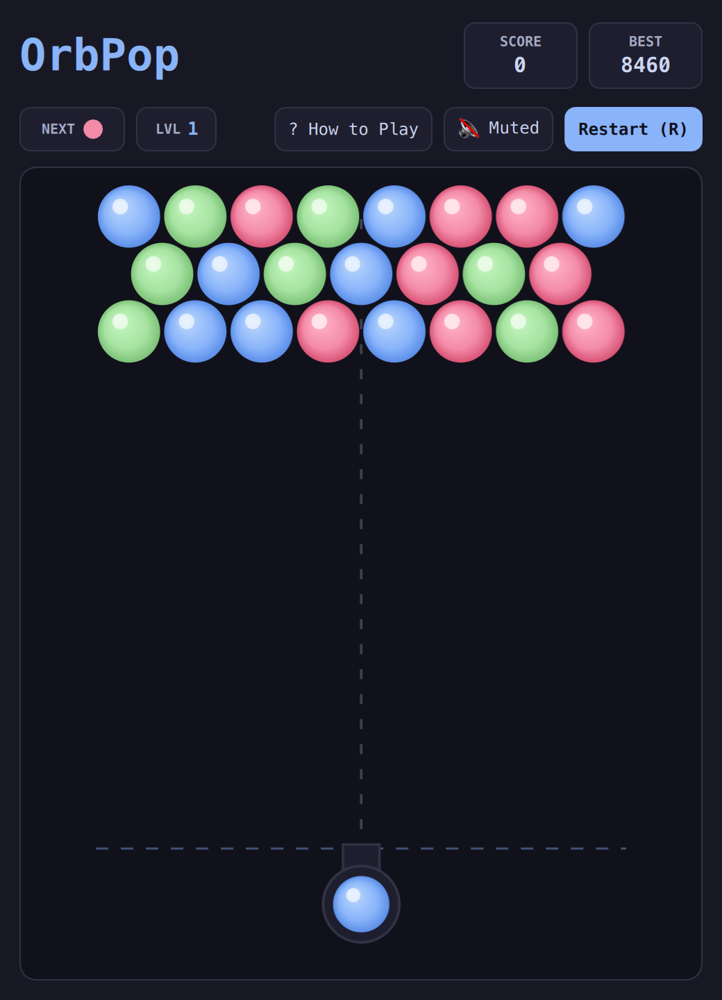

# OrbPop (QML / QtQuick)



A bubble shooter arcade classic featuring hexagonal physics and precision ricochet aiming. Direct your rotating cannon to launch vibrant vector orbs into the descending ceiling, bursting matching clusters and dislodging floating orphans.

Built natively with hardware acceleration for **Omarchy Linux**.

---

## Features

* **Hexagonal Close-Packed Grid:** Staggered bubble lattice with realistic cluster snapping and breadth-first matching.
* **Precision Ricochet Aiming:** Dotted laser guide dynamically projecting bounce angles off the side boundary walls.
* **Orphan Drop Mechanics:** Severing anchor connections to the ceiling drops all disconnected floating orbs for +100 bonus points each.
* **Ceiling Descent Pressure:** Every 5 non-matching shots advances the ceiling downward. Prevent bubbles from touching the danger boundary line.
* **Shaded Vector Spheres:** Anti-aliased radial gradients with specular gloss highlights themed to your desktop environment.
* **Dual Control Schemes:** Seamless support for intuitive mouse/touch aiming and firing, or full keyboard precision with WASD, arrow keys, and Vim keys.

---

## Controls

| Action | Primary Key | Secondary / Vim |
| :--- | :--- | :--- |
| **Aim Cannon** | `A` / `D` or `←` / `→` | Mouse Move / Vim `H` / `L` |
| **Fire Orb** | `Space` or `W` or `↑` | Mouse Click / Enter / Vim `K` |
| **How to Play** | `?` or `/` | Click "? How to Play" |
| **Full / Compact View** | `Shift+F` | Click `⛶` / `🔲` button |
| **Mute / Unmute** | `M` | Click Mute button |
| **Restart Game** | `R` | Click "Restart (R)" |

---

## Running

```bash
./.venv/bin/python games/orbpop/main.py
```

---

## License

* Released under the **MIT License**.
