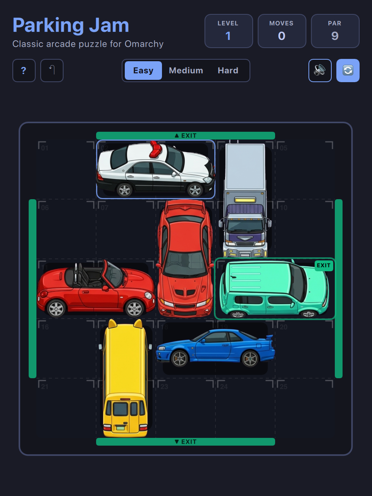

# Parking Jam (QML / QtQuick)



A tactile sliding block traffic puzzle where you untangle gridlocked Tokyo streets by sliding authentic Japanese sports cars, kei trucks, and city buses to guide vehicles to open exit gates. Features 56 mathematically verified multi-step puzzle layouts across three difficulty tiers with endless vehicle skin randomization.

Built natively with hardware acceleration for **Omarchy Linux**.

---

## Features

* **100% True Offline Play:** Zero internet required or used. No network sockets, zero cloud dependencies, zero telemetry, and zero ads. Plays completely offline forever.
* **Dynamic Omarchy Theming:** Automatically synchronizes with all 22 Omarchy system themes by reading `~/.config/omarchy/current/theme/colors.toml`. Live hot-reloads when changing themes via `Super + Space`!
* **Standardized 2048 Arcade Layout:** Top title & stats header (Level, Moves, Par), subheader with difficulty selector (Easy, Medium, Hard), sound toggle, undo, and restart buttons.
* **Responsive Toolbar Emoji Collapse:** When windows are narrow or toolbars crowded, control buttons automatically collapse into compact icon/emoji buttons (`?`, `↶`, `🔇`, `🔄`) so controls never push off-screen or smash together.
* **Responsive Tiling & Floating Micro-HUD:** Seamlessly shrinks down to narrow 1/4 and 1/2 screen Hyprland splits (`300×400`), automatically collapsing into a sleek 38px floating micro-HUD.
* **Mathematically Solvable Multi-Step Vault:** 56 curated, BFS-verified zero-overlap puzzles with guaranteed multi-move solutions across Easy (5×5), Medium (6×6), and Hard (6×6) tiers.
* **17 Authentic Japanese Vehicles:** AE86 Trueno, Civic Type-R EK9, RX-7 FD, Skyline GT-R R34, Impreza WRX STI, Lancer Evolution, Tokyo Crown Comfort Taxi, Police Patrol Cruiser, Kei Truck, HiAce Van, Nissan Cube, Daihatsu Copen, Delivery Box Truck, Fire Engine, Dekotora Art Truck, Yōchien Kindergarten Bus, and City Sanitation Truck.
* **Retro Console Startup Screen:** ~1.0-second arcade startup sequence with CRT scanlines, retro stripes, and vector glint sheen (skips instantly on any key/click).
* **Keyboard-First Controls:** Arrow keys, WASD, and Vim (`H`, `J`, `K`, `L`) navigation supported across all interactions, with Tab cycling and Space/Enter exit triggers.
* **Zero-Overhead Audio:** Zero-overhead native audio (CoreAudio on macOS, PipeWire / ALSA on Linux), defaulted to muted (`M` to toggle) with 0% CPU consumption when silent.
* **Persistent Progress & Settings:** Remembers difficulty preferences and best scores across sessions via `QSettings`.

---

## Controls

| Action | Primary Key | Secondary / Vim | Mouse / Touch |
| :--- | :--- | :--- | :--- |
| **Slide Selected Vehicle** | `W` / `A` / `S` / `D` | `H` / `J` / `K` / `L` or Arrow Keys | Click & Drag vehicle |
| **Exit Open Gate** | `Space` / `Enter` | — | Tap unblocked vehicle |
| **Cycle Vehicle Selection** | `Tab` / `Shift+Tab` | — | Click vehicle |
| **Undo Last Move** | `U` or `Ctrl+Z` | — | Click Undo (`↶`) in subheader |
| **Mute / Unmute** | `M` | — | Click audio button in subheader |
| **Restart Level** | `R` | — | Click "Restart" in subheader |
| **Toggle Full / Tiled View** | `Shift+F` | — | Resize window or click HUD pill |
| **How to Play / Help** | `?` or `Esc` | — | Click "How to Play" |

---

## Running

### From the Arcade Root:

```bash
./.venv/bin/python games/parkingjam/main.py
```

### With a Specific Theme:

```bash
./.venv/bin/python games/parkingjam/main.py --theme gruvbox
./.venv/bin/python games/parkingjam/main.py --theme tokyonight
./.venv/bin/python games/parkingjam/main.py --theme catppuccin
./.venv/bin/python games/parkingjam/main.py --theme catppuccin-latte
```

---

## Author & Credits

Created by **Chris Thompson** ([@bigcjat](https://github.com/bigcjat) • [@bigcjat](https://x.com/bigcjat)) with assistance from **Gemini**.

---

## License & Attribution

* Released under the **MIT License**.
