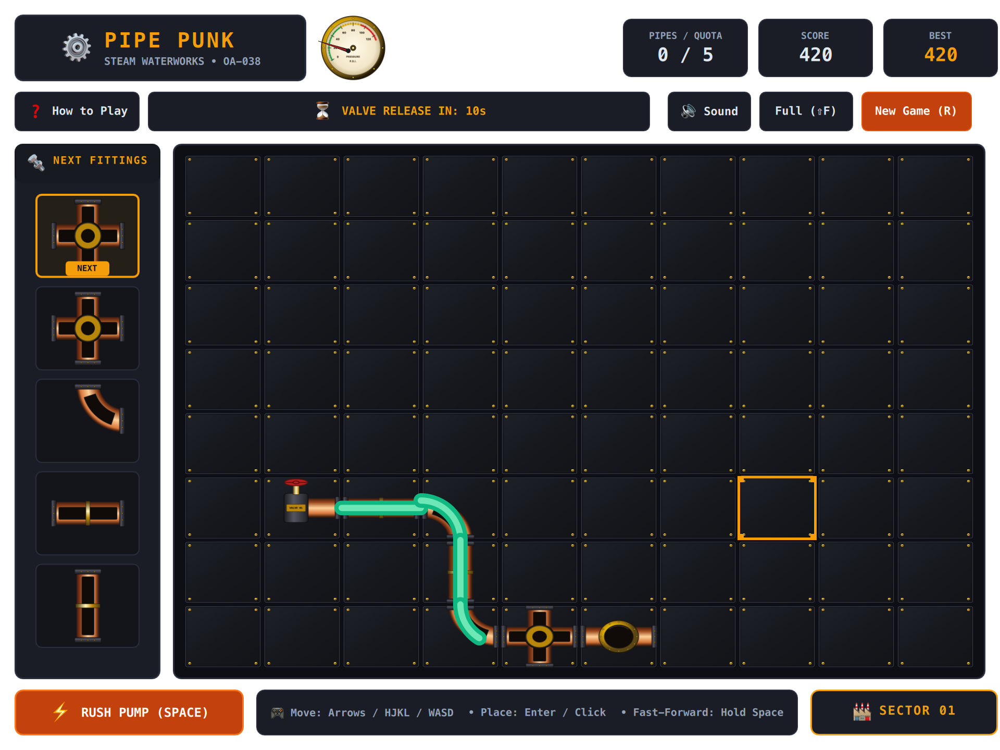

# Pipe Punk (QML / QtQuick)



Steampunk Victorian municipal waterworks pipe-routing puzzle built natively for **Omarchy Linux**. Route boiling, pressurized emerald reservoir water through a grid of modular brushed copper and cast-iron pipe fittings before the boiler pressure blows the line.

Inspired by Lucasfilm's 1989 classic *Pipe Mania* / *Pipe Dream*, redesigned with warm industrial mechanical fittings, cutaway glass channels, dynamic bubbling fluid simulation, and an analog circular PSI pressure gauge.

---

## Features

* **Authentic Steampunk Plumbing:** Modular brushed copper pipes with cast-iron flange couplings, brass hex rivets, and dark riveted boiler plates.
* **Cutaway Glass Fluid Dynamics:** Real-time bubbling emerald reservoir fluid flowing through straight pipes and radial elbow curves.
* **Quivering Analog Pressure Gauge:** High-precision circular brass dial with a real-time quivering needle that surges into the red zone as boiler pressure builds.
* **Mechanical Next-Pieces Hopper:** Vertical 5-slot dispenser hopper on the left with tactile copper fittings.
* **Dual-Pass Cross Junctions:** Specialized 4-way intersection pipes can be traversed twice (horizontally AND vertically) for +500 bonus points!
* **Fast-Forward Rush Pump:** Hold `Space` to engage high-gear turbine pumping at 5× speed for intense score multipliers.
* **Delay Reservoirs & Sector Hazards:** Higher sectors introduce brass expansion bulbs that buy valuable time, alongside impassable rusted boiler grates.
* **100% True Offline Play:** Zero network requests, zero telemetry, zero ads, zero DRM. Plays completely offline forever.
* **Dynamic Omarchy Theming:** Live hot-reloading synchronizing with all 22 Omarchy desktop themes (`colors.toml`).
* **Ultra-Lean Floppy Disk Footprint:** Entire game package is **737 KB**, leaving ~700 KB free on a standard 1.44 MB floppy diskette!

---

## Controls

| Action | Primary Key | Secondary / Vim | Mouse / Touch |
| :--- | :--- | :--- | :--- |
| **Move Cursor** | `W` / `A` / `S` / `D` | `H` / `J` / `K` / `L` or Arrows | Hover cell |
| **Place Pipe Fitting** | `Enter` / `Return` | `Space` (when placing) | Left Click cell |
| **Rush Pump (Fast-Forward)**| Hold `Space` | — | Click & Hold "RUSH PUMP" |
| **Restart / New Game** | `R` | — | Click "New Game (R)" |
| **Mute / Unmute** | `M` | — | Click audio button in subheader |
| **Full Window Mode** | `Shift+F` | — | Click "Full (⇧F)" |
| **How to Play / Help** | `?` or `Esc` | — | Click "? How to Play" |

---

## Running

### From the Arcade Root:

```bash
./.venv/bin/python games/pipepunk/main.py
```

### With Specific Theme:

```bash
./.venv/bin/python games/pipepunk/main.py --theme gruvbox
./.venv/bin/python games/pipepunk/main.py --theme tokyonight
./.venv/bin/python games/pipepunk/main.py --theme catppuccin
```

### Skip Splash Screen:

```bash
./.venv/bin/python games/pipepunk/main.py --no-splash
```

---

## Author & Credits

Created by **Chris Thompson** ([@bigcjat](https://github.com/bigcjat) • [@bigcjat](https://x.com/bigcjat)) with assistance from **Gemini**.
