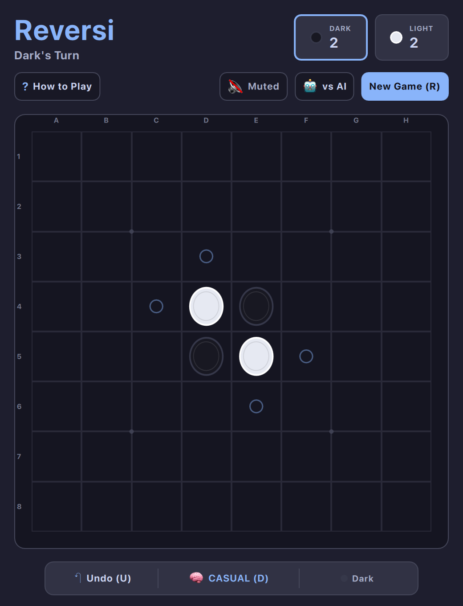

# Reversi / Othello (QML / QtQuick)



A polished, tactile implementation of **Reversi** (Othello), the timeless 1883 territorial disc-flipping strategy game ("a minute to learn, a lifetime to master").

Built natively with hardware acceleration for **Omarchy Linux**.

---

## Features

* **Authentic 8×8 Reversi Rules:** Full directional bracket detection in all 8 directions, forced passing, and terminal evaluation.
* **Smooth 3D Coin-Flip Animations:** Discs flip dynamically when captured, rotating along their axis.
* **Intelligent AI Engine:** Powered by Minimax with alpha-beta pruning and dynamic positional weighting (corner valuation, edge stability, X/C square safety, and endgame parity solver).
* **3 Configurable Difficulties:** Novice, Casual, and Master tiers.
* **Pass & Play / Solo Modes:** Play against the AI or challenge a friend in local 2-player pass-and-play.
* **Tactile Board Visuals:** Checkered felt board with algebraic coordinate markers (A–H, 1–8), star points, and ghost legal move circles.
* **Interactive Hover Preview:** Hovering over any legal placement highlights the exact opponent discs that will be flipped.
* **Infinite Undo:** Rewind turns with `U` or the bottom toolbar.
* **Universal Keyboard & Mouse Navigation:** Navigate via Arrows, WASD, or Vim (`HJKL`) and place discs with `Space` or `Enter`, or click with mouse/touch.
* **Dynamic Omarchy Theming:** Live hot-reloading across all 22 system themes with WCAG-compliant high-contrast discs and button text.

---

## Controls

| Action | Primary Key | Secondary / Mouse |
| :--- | :--- | :--- |
| **Navigate Grid** | `W` / `A` / `S` / `D` or Arrows | `H` / `J` / `K` / `L` or Mouse Hover |
| **Place Disc** | `Space` / `Enter` | Click highlighted legal circle |
| **Undo Move** | `U` | Click "Undo" in bottom toolbar |
| **Cycle Difficulty** | `D` | Click Difficulty pill in bottom toolbar |
| **Toggle Game Mode** | `P` | Click "vs AI" / "2-Player" in subheader |
| **Mute / Unmute** | `M` | Click audio button in subheader |
| **Restart Game** | `R` | Click "New Game" |
| **How to Play** | `?` or `Esc` | Click "?" button |

---

## Running

### From the Arcade Root:

```bash
./.venv/bin/python games/reversi/main.py
```

### With a Specific Theme:

```bash
./.venv/bin/python games/reversi/main.py --theme tokyonight
./.venv/bin/python games/reversi/main.py --theme catppuccin-latte
./.venv/bin/python games/reversi/main.py --theme gruvbox
```

---

## Author & Credits

Created by **Chris Thompson** ([@bigcjat](https://github.com/bigcjat)) with assistance from **Gemini**.

---

## License

* Released under the **MIT License**.
