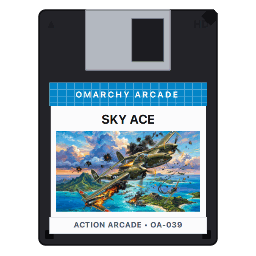

# Sky Ace • 194X Global Air War (PySide6 / Qt6)



A high-intensity vertical scrolling WW2 aerial combat arcade game built natively for **Omarchy Linux**. Homage to Capcom's legendary *1942* and *1943: The Battle of Midway*, expanded into an epic global air war spanning 10 historical theaters and free international matchups.

Featuring pre-rendered 3D hardware-accelerated warbirds, realistic aerodynamic roll and banking physics, procedural radial prop audio synthesis, carrier takeoffs & arrested landings, destructible naval fleets, fortified mainland bases, and colossal Super Fortress multi-phase bosses.

---

## Features

* **10 Global Playable Warbirds & Free Matchups:**
  * 🇺🇸 **USA:** Lockheed P-38 Lightning (USS Enterprise)
  * 🇯🇵 **Japan:** Mitsubishi A6M Zero (IJN Akagi)
  * 🇬🇧 **Britain:** Supermarine Spitfire Mk.IX (HMS Ark Royal)
  * 🇩🇪 **Germany:** Messerschmitt Bf 109G (KMS Graf Zeppelin)
  * 🇷🇺 **Soviet Union:** Yakovlev Yak-3 (Krasny Luch Frontline Base)
  * 🇨🇦 **Canada:** de Havilland Mosquito (HMCS Warrior)
  * 🇮🇹 **Italy:** Macchi C.202 Folgore
  * 🇫🇷 **France:** Dewoitine D.520
  * 🇵🇱 **Poland:** PZL P.11c
  * 🇨🇿 **Czechoslovakia:** Avia B-534
* **3 Secret Coalition Prototypes (Operation Blackout):**
  * 🇩🇪 **Horten Ho 229:** Twin-jet flying wing with forward high-velocity plasma blasters.
  * 🇺🇸 **Boeing B-29 Superfortress:** Airborne dreadnought with 360° defensive turrets.
  * 🇯🇵 **Kyushu J7W1 Shinden:** Canard rear-pusher interceptor with quad 30mm heavy cannons.
* **3-Tier Campaign Theater Structure:**
  * **Round 1 (Stratosphere):** High-altitude cloud penetration dogfight over deep ocean swells.
  * **Round 2 (Island Archipelago & Naval Fleet):** Ocean patrol past tropical atolls, Japanese gunboats, and heavy cruisers.
  * **Round 3 (Mainland Assault & Base Fortifications):** Low-altitude ground assault against authentic historical tanks (Tiger, Sherman, Chi-Ha, T-34, Churchill), concrete pillboxes, Flak 88 batteries, and fuel depots.
* **Colossal Super Fortress Multi-Phase Bosses:**
  * 🇯🇵 **IJN Super Fortress 'Ayako'** (Pacific)
  * 🇺🇸 **USAAF Heavy Fortress 'B-24 Liberator'** (South Pacific)
  * 🇩🇪 **Luftwaffe Leviathan 'BV 238'** (Channel Front)
  * 🇬🇧 **RAF Heavy Bomber 'Avro Lancaster'** (Battle of Britain)
  * 🇷🇺 **VVS Red Army Fortress 'Pe-8'** (Eastern Front)
  * 🇨🇦 **RCAF Strategic Heavy 'Canada Goose'** (Arctic)
  * 🇮🇹 **Regia Aeronautica 'Piaggio P.108'** (Mediterranean)
  * 🇫🇷 **Armée de l'Air 'Farman F.222'** (Western Europe)
  * 🇵🇱 **Polish Air Force 'PZL.37 Łoś'** (Central Europe)
  * 🇨🇿 **Czechoslovak Heavy 'Aero A.300'** (Continental Front)
* **Pre-Baked 3D Engine with Zero Heavy Dependencies:**
  * Over 700 pre-baked high-resolution 3D flight frames (banking, steep climb, dive, loop-the-loop, and 360° hangar showcases).
  * Runs with instant ~0.9s boot time directly using standard PySide6 with zero mandatory numpy/PIL dependencies. Optional `--bake-3d` developer mode available.
* **Hardware-Accelerated Audio Engine:**
  * Multi-channel volume controls (Music, Combat SFX, Engine Pitch).
  * Procedural prop sound synthesis reacting in real time to throttle and banking g-forces.
  * Native stereo OGG arcade soundtrack via Qt FFmpeg.
* **Standard Arcade Template Header:**
  * Non-intrusive collapsible header, space-saving in-game combat HUD, and interactive bottom-center battle matchup badge (`[Flag] VS [Flag]`).

---

## Controls

| Action | Primary Key | Secondary / Vim | Mouse |
| :--- | :--- | :--- | :--- |
| **Steer Warbird** | `Arrows` | `W` / `A` / `S` / `D` | Mouse Movement |
| **Twin Cannons (Fire)** | `Z` | `X` / `V` / `Ctrl` | Left Click |
| **Loop-the-Loop** | `Space` | `Return` | Right Click |
| **Mega Crash Bomb** | `B` | — | Middle Click |
| **Tactical Air Support** | `C` | — | — |
| **Cycle Weapon Mode** | `Q` / `E` | — | — |
| **Hot-Swap Aircraft** | `Tab` / `0` | — | — |
| **Carrier Arrested Landing**| `L` | — | — |
| **Pause / Resume** | `P` | `Esc` | — |
| **Audio Controls Menu** | `M` | Click Audio Button | — |
| **How to Play / Help** | `?` | Click Help Button | — |

---

## Running

```bash
# Launch standard game:
./.venv/bin/python games/skyace/main.py

# Launch directly into Top Secret Operation Blackout briefing:
./.venv/bin/python games/skyace/main.py --secret

# Developer Mode: Re-bake all 700 3D airframe frames:
./.venv/bin/python games/skyace/main.py --bake-3d
```
