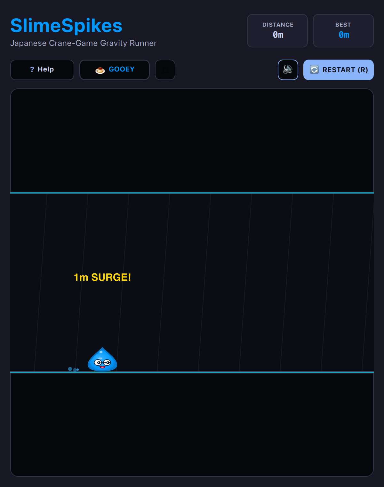

# SlimeSpikes (Japanese Crane-Game Slime Gravity Runner • QML / QtQuick)



A high-speed reflex corridor runner inspired by classic arcade gravity-flip reflex games and beloved Japanese UFO crane-game teardrop plushies. Guide lovable gelatinous slimes through a high-voltage neon hazard corridor, dynamically flipping gravity between floor and ceiling to dodge razor-sharp crystalline spikes with organic squash & stretch physics!

Built natively with hardware acceleration for **Omarchy Linux** and tiling window managers.

---

## Features

* **6 Playable Japanese Slime Plushies:**
  * **Gooey (`#00E5FF` Cyan / Blue):** The classic Japanese arcade crane-game mascot slime with cheerful bouncing physics.
  * **Cherry (`#FF4081` Coral Pink):** A peppy berry slime adorned with rosy blush cheeks.
  * **Lime (`#76FF03` Neon Green):** A fizzy citrus drop featuring glowing neon highlights.
  * **Metal (`#E0E0E0` Chrome Silver):** A rare polished liquid-metal slime with high-specular reflective gleam.
  * **Gold (`#FFD700` Amber King):** A prestigious royal slime crowned with a 3-point gold crown and sparkling ruby gem.
  * **Angel (`#F3E5F5` Pearl White):** A heavenly seraph slime sporting fluttering feathered wings and a floating golden halo.
* **Organic Squash & Stretch Physics:**
  * Procedural Bezier teardrop geometry with pointed top swirl tip and chubby bottom cheeks.
  * Launch elongation ($scaleY: 1.65, scaleX: 0.62$) pulling the slime like molten taffy during flips.
  * Pancake splat impact ($scaleX: 1.62, scaleY: 0.52$) with elastic spring bounce-back upon landing.
  * Grounded breathing squash-bob and trailing slime droplet particles.
* **Expressive Japanese Googly Eyes & Reactions:**
  * Expressive round white eyes with pupil tracking oriented toward the flight path.
  * Wide open cheerful smile (`:D`) during normal runs and ecstatic flight.
  * Playful blinking and happy squinting animations (`^ ^`).
  * Instant pancake splat and particle burst on spike contact.
* **Dynamic Procedural Obstacle Waves:**
  * Progressive hazard pacing ramping from single spikes to alternating ceiling/floor zig-zags and rapid spike clusters.
  * Precise analytical circle-triangle collision detection.
  * Smooth corridor velocity scaling as distance milestones increase.
* **Omarchy 2048 Standard Interface:**
  * Distance and Best Distance stat cards.
  * Character quick-select tray with hotkeys `1`–`6` and real-time live preview.
  * Responsive auto-tiling architecture supporting compact splits and full-window mode.

---

## Controls

| Action | Primary Key | Secondary / Vim | Mouse |
| :--- | :--- | :--- | :--- |
| **Flip Gravity** | `Space` | `Return` / `W` / `S` / Arrows | Left Click |
| **Character Select** | `1` – `6` | Press `C` to open tray | Click Character Badge |
| **Full Playfield Mode** | `F` | — | Click `⛶` button |
| **Pause / Resume** | `P` | `Esc` | Click `⏸` button |
| **How to Play** | `?` | `/` | Click `?` button |
| **Mute / Unmute** | `M` | — | Click `🔊` button |
| **Instant Restart** | `R` | `Space` (when Game Over) | Click `🔄` button |

---

## Running

```bash
./.venv/bin/python games/slimespikes/main.py
```

---

## License

* Released under the **MIT License**.
