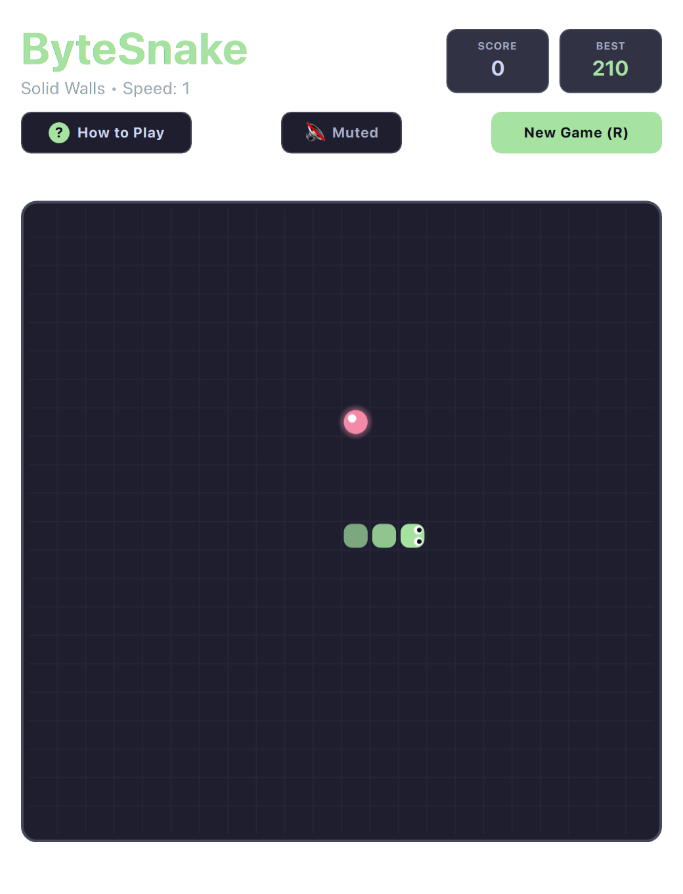

# Snake (QML / QtQuick)



A modern, fluid rendition of the beloved arcade classic. Features rounded segmented snake rendering, queued directional inputs, glowing apple orbs, and responsive grid movement.

Runs natively with hardware acceleration on both **macOS** and **Linux (Omarchy)**.

---

## Features

* **Sub-Frame Input Buffering:** Prevents accidental 180-degree self-reversals when tapping rapid turns.
* **Rounded Segment Rendering:** Smooth, modern rounded body segments with subtle glow effects on food items.
* **Progressive Speed Scaling:** Movement frequency subtly accelerates as the snake elongates, increasing tension.
* **Dynamic Omarchy Palette:** Board grid, snake body, and food orbs automatically style to your current system theme.
* **Keyboard-First Controls:** Arrow keys, WASD, and Vim (`H`/`J`/`K`/`L`) fully supported.

---

## Controls

| Action | Primary Key | Secondary / Vim |
| :--- | :--- | :--- |
| **Move Up** | `W` or `↑` | Vim `K` |
| **Move Down** | `S` or `↓` | Vim `J` |
| **Move Left** | `A` or `←` | Vim `H` |
| **Move Right** | `D` or `→` | Vim `L` |
| **Mute / Unmute** | `M` | Subheader Mute button |
| **Restart Game** | `R` | Subheader "Restart" |

---

## Running

```bash
./.venv/bin/python games/snake/main.py
```

---

## License

* Released under the **MIT License**.
