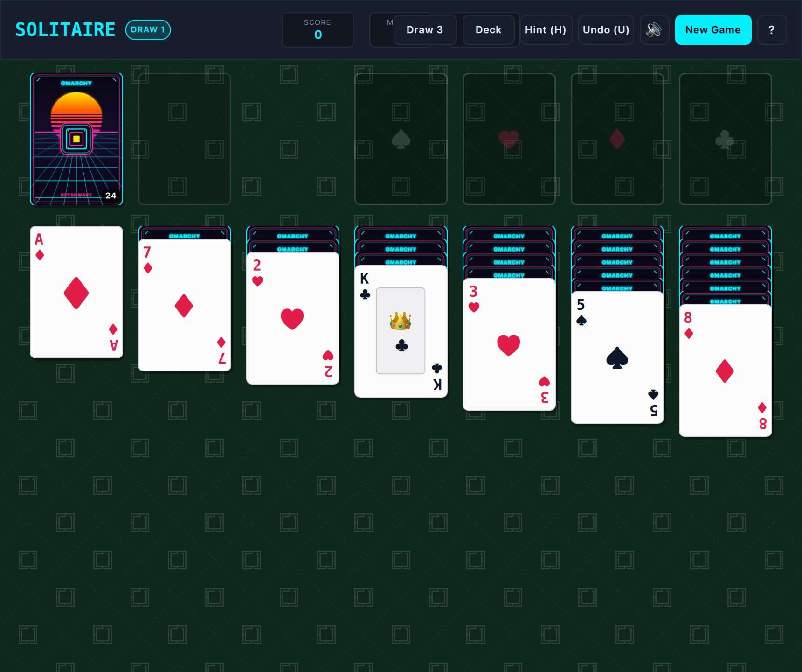

# Solitaire (QML / QtQuick)



Classic Klondike Solitaire built natively with hardware acceleration for **Omarchy Linux**. Features 3D card flips, 4 custom vector card decks, Draw-1 and Draw-3 modes, smart single-click auto-moves, full undo history, hints, and victory celebration.

---

## Features

* **3D Card Flip Animations:** Realistic card flip transitions with drop shadows, customizable vector deck backs (**Synthwave**, **Crimson**, **Sapphire**, and **Obsidian**), and dynamic sizing.
* **Draw-1 & Draw-3 Modes:** Switch seamlessly between relaxing single-card draw or classic casino Draw-3 play via hotkey `D` or the top toolbar toggle.
* **Smart Single-Click & Auto-Foundation:** Click any card to automatically move it to the best available position (Foundation or Tableau). Double-click sends cards straight to Foundation.
* **Auto-Complete Finish:** When all tableau cards are face-up and the stock is empty, an auto-complete cascade finishes building all foundations automatically.
* **Intelligent Hint System:** Press `H` to highlight the best strategic move with a radiant pulsing cyan halo.
* **Full Move Undo:** Press `U` to undo any number of moves with complete state restoration and score tracking.
* **100% True Offline Play:** Zero internet required or used. No network sockets, zero cloud dependencies, zero telemetry, and zero ads. Plays completely offline forever.
* **Dynamic Omarchy Theming:** Automatically synchronizes with all 22 Omarchy system themes by reading `~/.config/omarchy/current/theme/colors.toml`. Live hot-reloads when changing themes via `Super + Space`!
* **Standardized 2048 Arcade Layout:** Top title & stats header with Score, Moves, Time, and Best Score, responsive action toolbar, and clean 7-column felt playfield.
* **Responsive Toolbar Emoji Collapse:** When windows are narrow, control buttons automatically collapse into compact icon/emoji buttons (`🃏`, `🎴`, `💡`, `↩️`, `🔊`, `🔄`, `?`) to prevent overlap.
* **Retro Console Startup Screen:** ~1.0-second arcade startup sequence with CRT scanlines, retro stripes, and vector glint sheen (skips instantly on any key/click).
* **Keyboard-First Controls:** Single-key tactile hotkeys: Space to draw from Stock, U to Undo, H for Hint, D to toggle Draw 1/3, K to cycle Deck styles, N for New Game, ? for Help.
* **Persistent Settings:** Automatically saves your high score, best time, preferred deck style, and draw mode across sessions via `QSettings`.

---

## Controls

| Action | Primary Key | Secondary / Alt | Mouse / Touch |
| :--- | :--- | :--- | :--- |
| **Auto Move Card** | Click Card | `Enter` | Single click card |
| **Send to Foundation** | Double-Click | — | Double-click card |
| **Draw Stock Card** | `Space` | Click Stock | Click Stock pile top-left |
| **Undo Move** | `U` | `Ctrl+Z` | Click "Undo (U)" button |
| **Strategic Hint** | `H` | — | Click "Hint (H)" button |
| **Toggle Draw 1 / Draw 3** | `D` | — | Click "Draw 1" / "Draw 3" |
| **Cycle Deck Style** | `K` | — | Click "Deck" button |
| **New Game** | `N` | `R` | Click "New Game" button |
| **Mute / Unmute** | `M` | — | Click audio button in header |
| **Rules & Cheatsheet** | `?` | `F1` | Click "?" button |
| **Back / Exit** | `Esc` | `Q` | Close window |

---

## Running

### From the Arcade Root:

```bash
./.venv/bin/python games/solitaire/main.py
```

### With Options:

```bash
# Skip startup splash screen
./.venv/bin/python games/solitaire/main.py --no-splash

# Launch in Draw-3 mode
./.venv/bin/python games/solitaire/main.py --draw 3

# Launch with Synthwave deck style
./.venv/bin/python games/solitaire/main.py --deck synthwave

# Launch with a specific Omarchy theme
./.venv/bin/python games/solitaire/main.py --theme catppuccin-mocha
```

---

## Klondike Rules Summary

1. **Foundations (Top Right):** Build 4 piles up from Ace to King by suit (♠, ♥, ♦, ♣).
2. **Tableau (7 Columns):** Build columns down in alternating colors (red on black, black on red).
3. **Column Sequences:** You can move entire sequences of face-up cards between tableau columns.
4. **Empty Columns:** Only a **King** (or sequence starting with a King) can fill an empty column.
5. **Stock Pile:** Flip cards from the Stock to the Waste pile. When the stock is exhausted, click the empty outline to recycle the waste pile.
6. **Victory:** Move all 52 cards into the 4 foundation piles to win!
