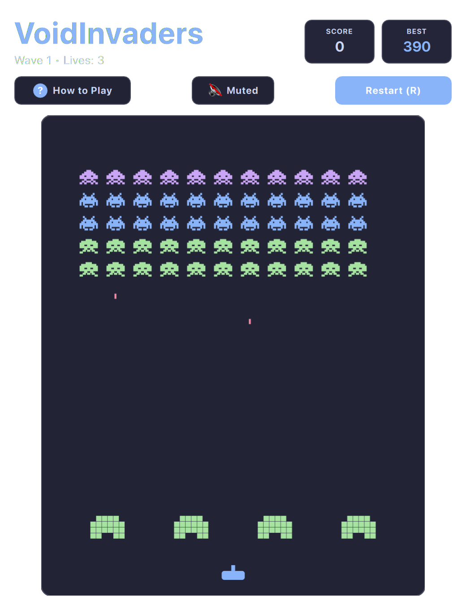

# Space Invaders (QML / QtQuick)



A pixel-faithful recreation of the arcade grandfather that launched an era. Defend Earth against descending alien formations, blast mystery flying saucers, and take cover behind disintegrating defensive bunkers.

Runs natively with hardware acceleration on both **macOS** and **Linux (Omarchy)**.

---

## Features

* **Authentic Invader March:** 5 rows of classic invaders (Squids, Crabs, Octopi) marching in lockstep, subtly accelerating as their ranks dwindle.
* **Destructible Defense Bunkers:** Four protective shields that dynamically erode and crumble under alien and player laser fire.
* **Mystery Flying Saucer:** High-value mystery UFOs cruise across the upper atmosphere yielding 50–300 bonus points.
* **Tension Step Audio:** Accelerating four-note marching cadence matching the descending armada.
* **Vector Glow & Retro CRT Filter:** Styled to blend seamlessly with both modern flat and retro scanline themes.

---

## Controls

| Action | Primary Key | Secondary / Vim | Mouse |
| :--- | :--- | :--- | :--- |
| **Move Cannon Left** | `A` | `←` or Vim `H` | Mouse move left |
| **Move Cannon Right** | `D` | `→` or Vim `L` | Mouse move right |
| **Fire Laser Cannon** | `Space` | `W` or `↑` or Vim `K` | Left Click |
| **Mute / Unmute** | `M` | — | Click Mute button |
| **Restart Game** | `R` | — | Click "Restart" |

---

## Running

```bash
./.venv/bin/python games/spaceinvaders/main.py
```

---

## License

* Released under the **MIT License**.
