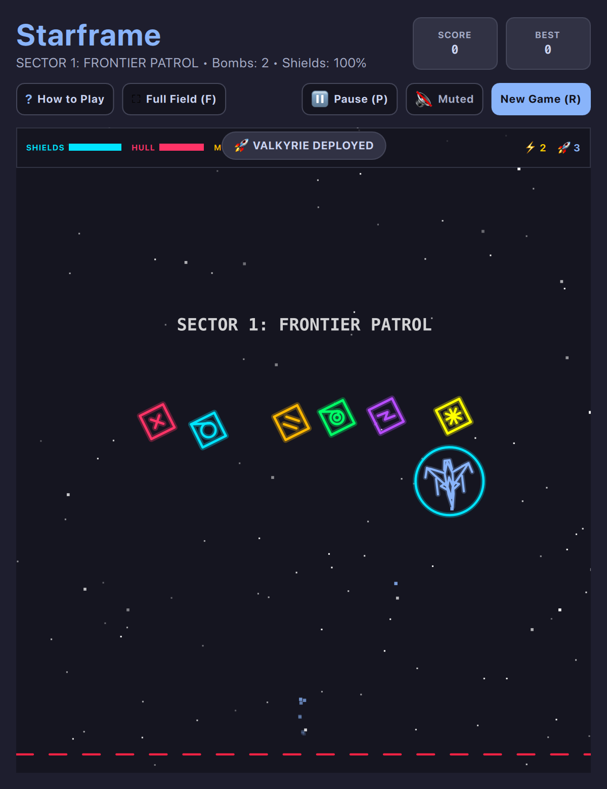

# Starframe (Vector SHMUP • QML / QtQuick)



A high-octane neon vector arcade space shooter engineered with glowing CRT phosphor bloom, fluid 60 FPS physics, and relentless deep-space combat. Command 3 distinct tactical starfighters across 4 hazard-packed sectors, harvesting color-coded weapon power-ups, battering enemy craft with kinetic shields, and challenging massive sector bosses.

Built natively with hardware acceleration for **Omarchy Linux** and tiling window managers.

---

## Features

* **3 Playable Starfighter Classes:**
  * **MK-I Interceptor:** Balanced general-purpose fighter with agile thrusters and dual synchronized blasters.
  * **MK-II Valkyrie:** High-velocity interceptor featuring swept forward wings, hyper agility, and quad rapid blasters.
  * **MK-III Titan:** Heavy siege dreadnought armored with reinforced hull plating and high-impact siege autocannons.
* **4-Gun Simultaneous Weapon System:** Fire your primary blasters, rapid Machine Gun, piercing Plasma Cannon spheres, and chaining EMP Arc bolts simultaneously.
* **Unified Color & Iconography Standard:**
  * 🛡️ **Shields (`#00E5FF` Cyan - `○`):** Kinetic barrier protecting hull against weapon fire and ramming impact.
  * ❤️ **Hull Repair (`#FF3366` Crimson - `+`):** Emergency structural nanite repair kits.
  * 🟡 **Machine Gun (`#FFB800` Solar Gold - `||`):** High-speed ballistic needle stream.
  * 🟢 **Plasma Cannon (`#00FF66` Acid Green - `◎`):** Concentric piercing plasma spheres.
  * 🟣 **EMP Arc (`#B84DFF` Electric Violet - `⚡`):** Crackling high-damage chaining bolts.
  * ⭐ **200% Super Shield (`#FFFF00` Starburst - `✱`):** Overcharges shields to 1000 HP for unstoppable battering ram speed.
* **Kinetic Shield Ramming:** Offensive shield mechanics allowing pilots to ram smaller enemy vessels and vaporize them in bursts of sparks.
* **Zero-Pass Penalty:** Enemies that escape past the bottom defense perimeter deduct 1 Life.
* **Incandescent White Core Overload:** Hostile vessels flash incandescent white (`#FFFFFF`) when damaged to critical thresholds ($\le 35\%$).
* **1.0-Second Boss Spawn Protection:** Sector dreadnoughts enter with a protective energy barrier before engaging in combat.
* **Responsive Tiling Architecture:** Automatically adapts between standard windowed view and full-bleed playfield with floating mini HUD for tiling desktop layouts.

---

## Controls

| Action | Primary Key | Secondary / Vim | Mouse |
| :--- | :--- | :--- | :--- |
| **Steer Starfighter** | `W` `A` `S` `D` | Arrows or Vim `H` `J` `K` `L` | Move Mouse |
| **Fire All Weapons** | `Space` | `Return` / `Enter` | Left Click |
| **EMP Super Bomb** | `B` | — | Right Click |
| **Full Playfield Mode** | `Shift+F` | — | Click `⛶` button |
| **Pause / Resume** | `P` | `Esc` | Click `⏸` button |
| **How to Play** | `?` | `/` | Click `?` button |
| **Mute / Unmute** | `M` | — | Click `🔊` button |
| **Tactical Hangar / New Game** | `R` | — | Click `🔄` button |

---

## Running

```bash
./.venv/bin/python games/starframe/main.py
```
