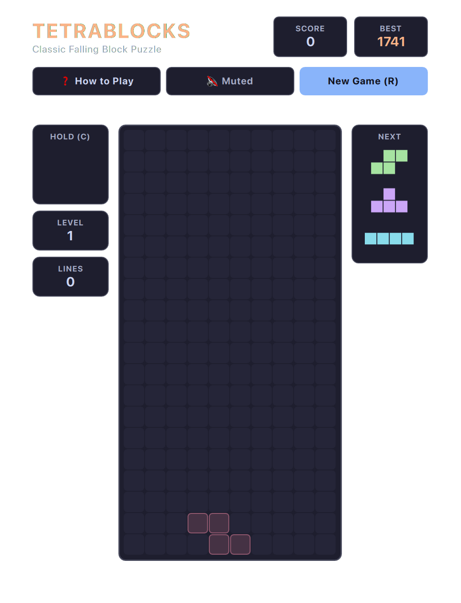

# TetraBlocks (QML / QtQuick)



A minimalist, high-performance **falling block arcade puzzle** written in **QML** and **JavaScript**, styled to match Omarchy / Hyprland desktops.

Built natively with hardware acceleration for **Omarchy Linux**.

---

## Features
* **7-Bag Randomizer:** Guarantees fair piece distribution (no droughts of straight bars).
* **Super Rotation System (SRS):** Full wall kick offset tables for all pieces so spins against walls feel fluid.
* **Lock Delay:** ~480ms grace period on landing, resetting on move/rotate.
* **Ghost Piece Projection:** Semi-transparent silhouette showing exact landing location.
* **Hold Queue:** Hold slot with instant swapping (`C` or `Shift`).
* **Next Queue:** Previews upcoming 3 pieces.
* **Responsive Sizing:** Dynamically scales board and sidebars to fit any window size from compact tiles to widescreen.
* **Line Clear Animations:** Brilliant white flashes, horizontal beam sweeps, and floating score/combo banners.
* **Pause & Resume:** Click the matrix directly or press `P` / `Esc` to safely pause and resume.
* **Dynamic Omarchy Theming:** Automatically synchronizes with all 22 Omarchy system themes by reading `~/.config/omarchy/current/theme/colors.toml`.
* **Zero-Overhead Audio:** Zero-overhead native audio (PipeWire / ALSA), defaulted to muted (`M` to toggle).
* **Persistent High Scores:** Saves best score across sessions via `QSettings`.

---

## Controls

* **Movement:** `A` / `D` or `←` / `→` or Vim `H` / `L`
* **Rotate Clockwise:** `W` or `↑` or Vim `K`
* **Rotate Counter-Clockwise:** `Z`
* **Soft Drop:** `S` or `↓` or Vim `J`
* **Hard Drop (Instant Slam):** `Space` or Double-Tap `↓` / `S`
* **Hold Piece:** `C` or `Shift`
* **Pause / Resume:** Click the board or press `P` / `Esc`
* **Full / Compact View:** `Shift+F` or click `⛶` / `🔲`
* **Toggle Sound:** `M` (Defaulted to Muted)
* **Restart:** `R`
* **Help:** `?` or click "How to Play"

---

## Running

### From the arcade root:
```bash
./.venv/bin/python games/tetrablocks/main.py
```

### With a specific theme:
```bash
./.venv/bin/python games/tetrablocks/main.py --theme gruvbox
./.venv/bin/python games/tetrablocks/main.py --theme tokyonight
./.venv/bin/python games/tetrablocks/main.py --theme snow
```

---

## License & Legal
* Public domain falling block mechanics.
* Released under the **MIT License**. See [LICENSE](LICENSE) for details.
