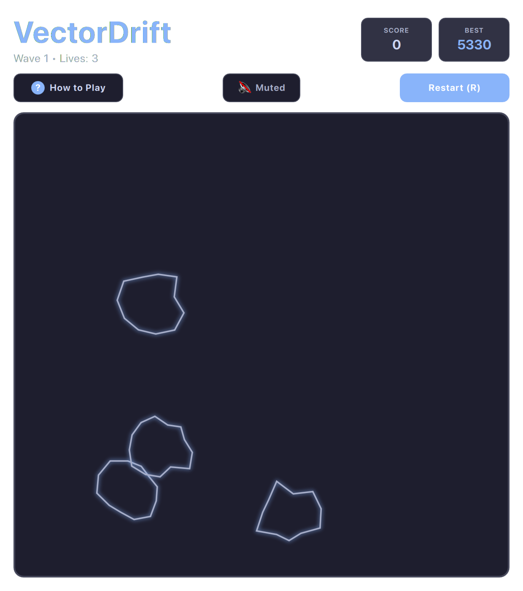

# VectorDrift / Asteroids (QML / QtQuick)



A high-performance, authentic vector wireframe arcade space shooter inspired by the 1979 classic. Features authentic Newtonian physics, procedural polygonal asteroid fracturing, intelligent enemy saucers, and vibrant vector glowing visuals tailored to your desktop theme.

Built natively with hardware acceleration for **Omarchy Linux**.

---

## Features

* **Authentic Vector Graphics:** Glowing procedural polygonal wireframes rendered smoothly via HTML5-compatible Canvas at 60 FPS.
* **Newtonian Space Physics:** Realistic linear inertia, rotational drag, velocity capping, and toroidal screen wraparound.
* **3-2-1 Safe Respawn Countdown:** Pulsing targeting reticle and visual countdown timer with classic heartbeat sound cues; gently clears the center sector so respawns are safe and predictable.
* **Hyperspace Jump:** Emergency escape mechanism to warp to a random screen coordinate.
* **Alien Flying Saucers:** Periodic incursions by large and small hostile saucers with laser defenses.
* **Dynamic Tension Audio:** Accelerating heartbeat rhythms that sync with asteroid density, along with retro laser sweeps and explosion booms.
* **Dynamic Omarchy Theming:** Real-time synchronization with all 22 Omarchy system themes.

---

## Controls

| Action | Primary Key | Secondary / Vim | Mouse |
| :--- | :--- | :--- | :--- |
| **Rotate Ship** | `A` / `D` | `←` / `→` or Vim `H` / `L` | — |
| **Thrust Forward** | `W` | `↑` or Vim `K` | — |
| **Fire Lasers** | `Space` | — | Left Click |
| **Hyperspace Jump** | `Shift` or `S` | `↓` or Vim `J` | — |
| **Full / Compact View** | `Shift+F` | — | Click `⛶` / `🔲` button |
| **Mute / Unmute** | `M` | — | Subheader Audio button |
| **Restart Game** | `R` | — | Subheader "Restart" |
| **Help / How to Play** | `?` or `Esc` | — | Subheader "How to Play" |

---

## Running

### From the Arcade Root:

```bash
./.venv/bin/python games/vectordrift/main.py
```

### With a Specific Theme:

```bash
./.venv/bin/python games/vectordrift/main.py --theme tokyonight
./.venv/bin/python games/vectordrift/main.py --theme gruvbox
./.venv/bin/python games/vectordrift/main.py --theme catppuccin
```

---

## License

* Released under the **MIT License**.
