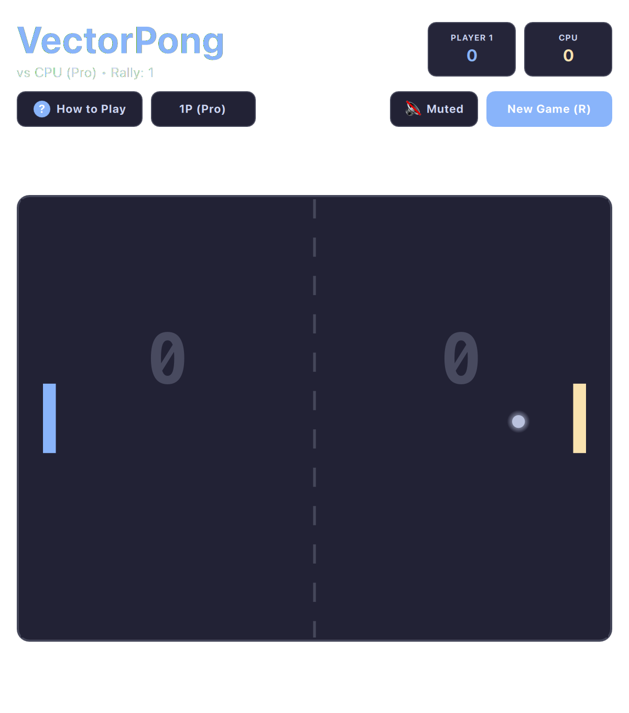

# Pong (QML / QtQuick)



The pioneer of video games rebuilt with modern responsive styling, razor-sharp collision physics, ball spin mechanics, and an adaptive AI sparring partner.

Built natively with hardware acceleration for **Omarchy Linux**.

---

## Features

* **Adaptive AI Opponent:** Neural tracking algorithm with humanized reaction delays and difficulty scaling.
* **Spin & Angle Slicing:** Moving the paddle while striking the ball applies spin and acute deflection angles.
* **Escalating Rally Speed:** Ball velocity accelerates on consecutive paddle volleys for tense, rapid exchanges.
* **Local 2-Player Option:** Play head-to-head on a single keyboard (W/S vs Up/Down).
* **Retro Audio Cues:** Crisp square-wave blips for wall bounces, paddle impacts, and point scoring.

---

## Controls

| Action | Player 1 | Player 2 (2P Mode) |
| :--- | :--- | :--- |
| **Move Up** | `W` or Vim `K` | `↑` |
| **Move Down** | `S` or Vim `J` | `↓` |
| **Serve Ball** | `Space` / `Enter` | `Space` / `Enter` |
| **Toggle AI / 2P** | `T` key | Click mode button |
| **Full / Compact View** | `Shift+F` | Click `⛶` / `🔲` button |
| **Mute / Unmute** | `M` | Subheader Audio button |
| **Restart Game** | `R` | Subheader "Restart" |

---

## Running

```bash
./.venv/bin/python games/vectorpong/main.py
```
