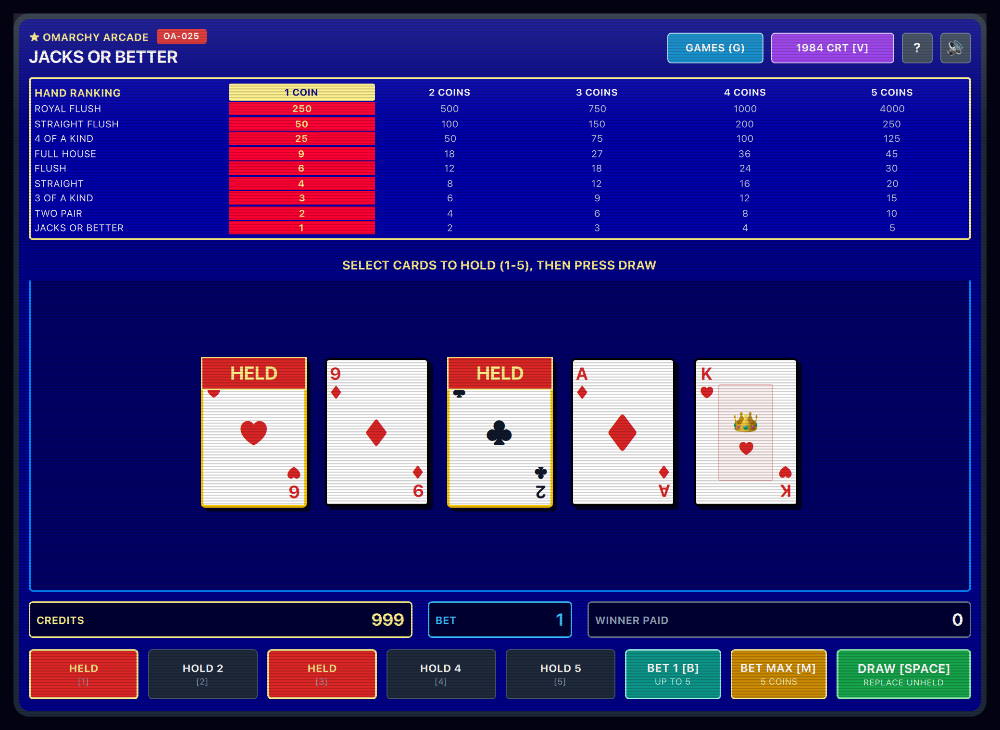

# Video Poker & Multi-Terminal (QML / QtQuick)



Authentic multi-game casino video terminal built natively with hardware acceleration for **Omarchy Linux**. Features 8 complete casino game engines, an instant **Dual-Era Visual Switcher** (1984 Vegas Cobalt CRT ↔ Neo-Tokyo Cyber Glass), authentic 5-column paytables, Double-Up high-card bonus gamble, and full keyboard arcade hotkeys.

---

## The 8 Shipped Game Engines

1. **Jacks or Better (9/6 Full Pay):** Standard 52-card deck. Pair of Jacks or better pays 1:1, Full House 9:1, Flush 6:1, and a maximum 4,000 coin Royal Flush jackpot on 5 coins.
2. **Deuces Wild:** All four 2s are wildcards! Four Deuces pays 200:1, Wild Royal 25:1, Five of a Kind 15:1, with 3 of a Kind minimum pay.
3. **Joker Poker (Kings or Better):** 53-card deck with 1 Joker wildcard. Five of a Kind pays 200:1, Kings or Better minimum pay.
4. **Double Double Bonus Poker:** Ultra-high volatility video poker variant with massive kicker payouts: 4 Aces with 2-4 kicker pays 400:1 (2,000 coins on 5 coins!), 4 2-4s with A-4 kicker pays 160:1, and 4 Aces pays 160:1.
5. **Bonus Poker Deluxe:** Flat 80:1 jackpot payout across any Four of a Kind hand regardless of rank.
6. **Red Dog (In-Between / Acey-Deucey):** Classic table game. Deals two cards; consecutive cards push; pairs pay 11:1 on matching 3rd card; spreads from 1 to 11 allow Call or Raise (Spread 1 pays 5:1, Spread 2 pays 4:1, Spread 3 pays 2:1, Spread 4–11 pays 1:1).
7. **Single-Deck Video Blackjack:** 3:2 natural blackjack payout, dealer peeks on 10/Ace, Hit, Stand, and Double Down on any initial 2 cards. Dealer hits soft 16 and stands on all 17s.
8. **Casino War:** High card showdown against the dealer (Aces always high). Ties offer **Go to War** (matching original bet with 3 burned cards; win pays 1:1) or **Surrender** (forfeiting 50% of the bet).
9. **Bonus Double-Up Gamble:** Available after any winning hand. Beat the dealer's face-up card from 4 hidden cards to double your winnings (or press `C` to collect)!

---

## Features

* **Dual-Era Visual Switcher (`V`):**
  * **1984 Vegas Cobalt CRT:** Deep `#000088` phosphor tube with scanline raster canvas, curved CRT glass bezel, chunky monospace arcade typography, and tactile illuminated 3D push buttons (`[HOLD 1]`–`[HOLD 5]`, `[BET 1]`, `[BET MAX]`, `[DEAL/DRAW]`).
  * **Neo-Tokyo Cyber Glass:** Obsidian glassmorphism (`#0B0E14`), glowing laser column HUD, and dynamic synchronization with all 22 Omarchy desktop themes (`colors.toml`).
* **HELD Badge Stamping:** True to classic video poker cabinets, held cards stamp an iconic bold red/gold `HELD` ribbon banner across the card face.
* **Double-Up Gamble Mode (`D`):** Authentic high-card bonus game offered after every win to risk your payout for 2X.
* **Complete Physical Arcade Controls:** Keyboard hotkeys `1`–`5` for holds/actions, `Space`/`Enter` for Deal/Draw, `B` for Bet 1, `M` for Max Bet, `G` for Game selection, `V` for visual era toggle, `C` to collect or add credits.
* **100% True Offline Play:** Zero internet required. No network sockets, zero cloud dependencies, zero telemetry, and zero ads. Plays completely offline forever.
* **Persistent Settings:** Automatically saves bankroll credits, best win, hands played, preferred visual mode, and active game across sessions via `QSettings`.

---

## Controls

| Action | Primary Key | Secondary / Alt | Mouse / Touch |
| :--- | :--- | :--- | :--- |
| **Deal / Draw / Next** | `Space` | `Enter` | Click "DEAL [SPACE]" button |
| **Hold Cards 1–5** | `1`, `2`, `3`, `4`, `5` | — | Click card or bottom "HOLD 1-5" buttons |
| **Bet 1 Coin** | `B` | — | Click "BET 1 [B]" button |
| **Bet Max (5 Coins)** | `M` | — | Click "BET MAX [M]" button |
| **Switch Visual Era** | `V` | — | Click "1984 CRT [V]" / "CYBER GLASS [V]" in header |
| **Open Game Menu** | `G` | — | Click "GAMES (G)" in header |
| **Double-Up Gamble** | `D` | — | Click "DOUBLE UP [D]" button after any win |
| **Collect / Cash Out**| `C` | `Esc` | Click "COLLECT (C)" during Double-Up |
| **Rules & Instructions** | `?` | `H` | Click "?" button in header |
| **Mute Audio** | `U` | Click Icon | Click speaker icon in header |

---

## Running

### From the Arcade Root:

```bash
./.venv/bin/python games/videopoker/main.py
```

### With Options:

```bash
# Skip startup arcade screen
./.venv/bin/python games/videopoker/main.py --no-splash

# Launch in Cyber Glass mode directly
./.venv/bin/python games/videopoker/main.py --mode cyber

# Launch directly into Deuces Wild, Red Dog, or Blackjack
./.venv/bin/python games/videopoker/main.py --game deuces_wild
./.venv/bin/python games/videopoker/main.py --game red_dog
./.venv/bin/python games/videopoker/main.py --game blackjack
```
