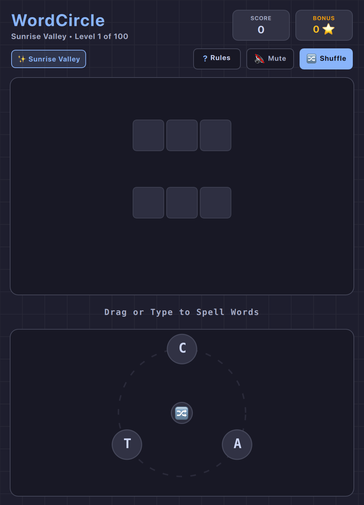

# WordCircle (QML / QtQuick)



An addictive circular-letter crossword puzzle game. Swipe or type through letters arranged around a circular dial to discover interlocking words and fill the crossword grid!

Built natively with hardware acceleration for **Omarchy Linux**.

---

## Features

* **100% True Offline Play:** Zero internet required or used. No network sockets, zero cloud dependencies, zero telemetry, and zero ads. Plays completely offline forever.
* **100 Curated Crossword Levels:** 5 thematic chapters (*Sunrise Valley*, *Emerald Forest*, *Sapphire Ocean*, *Neon Nebula*, *Galactic Core*) with progressive difficulty scaling from 3-letter roots up to 7-letter anagram wheels.
* **Dual Input Support:** Connect letters via smooth mouse/touch dragging with neon glowing laser lines, or type directly on your keyboard with instant trail highlights and `Enter` submission.
* **Bonus Words Jar:** Discover additional valid English sub-words not on the primary crossword board to bank bonus stars and score multipliers.
* **Dynamic Omarchy Theming:** Automatically synchronizes with all 22 Omarchy system themes by reading `~/.config/omarchy/current/theme/colors.toml`. Live hot-reloads when changing themes via `Super + Space`!
* **Standardized Arcade Layout:** Score, bonus tracker, chapter badges, audio toggle, and letter shuffle button with responsive toolbar collapse on narrow splits.
* **Retro Console Startup Screen:** ~1.0-second arcade startup sequence with CRT scanlines, retro stripes, and vector glint sheen (skips instantly on any key/click).
* **Zero-Overhead Audio:** Zero-overhead native audio (PipeWire / CoreAudio / ALSA), defaulted to muted (`M` to toggle) with 0% CPU consumption when silent.
* **Persistent Progress:** Automatically saves your highest score and current level progress across sessions via `QSettings`.

---

## Controls

| Action | Primary Key | Secondary | Mouse / Touch |
| :--- | :--- | :--- | :--- |
| **Spell / Connect** | Type letters (`A`–`Z`) | — | Click & Drag through circular letter nodes |
| **Submit Word** | `Enter` / `Return` | — | Release mouse drag |
| **Shuffle Letters** | `Space` | Click `🔀` | Click `🔀 Shuffle` button |
| **Undo Letter** | `Backspace` / `Delete` | — | Drag back to previous node |
| **Clear Selection** | `Escape` | — | Click background |
| **Full / Compact View** | `Shift + F` | — | Click view toggle |
| **Mute / Unmute** | `M` | — | Click audio button in subheader |
| **Restart Level** | `R` | — | Click "New Game" |
| **How to Play / Help** | `?` or `Esc` | — | Click "Rules" |

---

## Running

### From the Arcade Root:

```bash
./.venv/bin/python games/wordcircle/main.py
```

### With a Specific Theme:

```bash
./.venv/bin/python games/wordcircle/main.py --theme catppuccin
./.venv/bin/python games/wordcircle/main.py --theme tokyonight
./.venv/bin/python games/wordcircle/main.py --theme gruvbox
```

---

## Author & Credits

Created by **Chris Thompson** ([@bigcjat](https://github.com/bigcjat) • [@bigcjat](https://x.com/bigcjat)) with assistance from **Gemini**.

---

*Part of the Omarchy Arcade suite of offline native Linux desktop games.*
