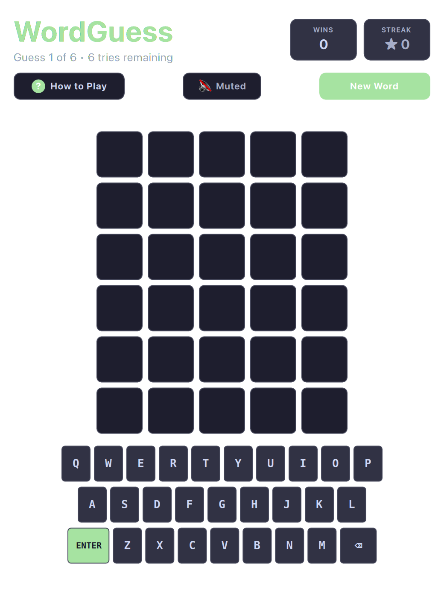

# Wordle (QML / QtQuick)



An elegant, snappy desktop implementation of the daily five-letter deduction word puzzle with fluid 3D tile flip animations, on-screen keyboard status tracking, and offline dictionary verification.

Runs natively with hardware acceleration on both **macOS** and **Linux (Omarchy)**.

---

## Features

* **3D Tile Flip Reveals:** Satisfying sequential tile flipping animations revealing Correct (Green), Present (Yellow), and Absent (Gray) letter placements.
* **Smart Virtual & Physical Keyboards:** Full physical typing support alongside an interactive on-screen keyboard reflecting letter discovery states.
* **Shake Warning on Invalid Words:** Horizontal shake jitter feedback when an entered 5-letter sequence is not in the dictionary.
* **Curated Offline Dictionary:** Extensive embedded word lists for both valid guesses and target solutions requiring zero internet access.
* **Unlimited & Random Replay:** Play endless consecutive puzzle rounds without waiting 24 hours.

---

## Controls

| Action | Physical Keyboard | On-Screen Keyboard |
| :--- | :--- | :--- |
| **Type Letters** | `A` through `Z` | Click on-screen letter keys |
| **Delete Letter** | `Backspace` | Click `⌫` key |
| **Submit Guess** | `Enter` / `Return` | Click `ENTER` key |
| **New Puzzle** | `R` | Click "Restart" in subheader |
| **Mute / Unmute** | `M` | Click Mute button |

---

## Running

```bash
./.venv/bin/python games/wordle/main.py
```

---

## License

* Released under the **MIT License**.
