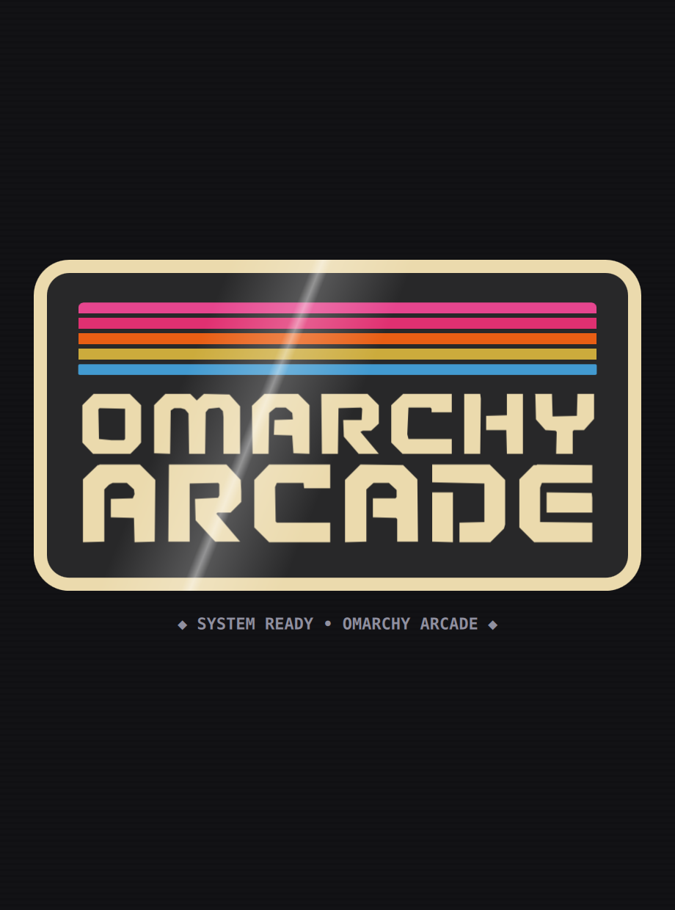

<p align="center">
  
</p>

<p align="center">
  <strong>The Native Offline Desktop Game Suite & Retro Arcade Launcher for Omarchy Linux.</strong>
</p>

<p align="center">
  
  
  
  
  
  
</p>

---

<p align="center">
  
</p>

## Meet Omarchy Arcade

**Omarchy Arcade** is a dedicated, distraction-free desktop game launcher and catalog of 23 full-featured offline arcade games built specifically for **Omarchy Linux** and tiling window managers (Hyprland).

Modern casual gaming has been bogged down by online logins, tracking SDKs, ad networks, and multi-gigabyte bloat. Omarchy Arcade delivers instant, tactile, distraction-free retro arcade gaming right from your desktop—running with native **Qt6 / QML** hardware acceleration.

### Why You'll Love It

* 🔌 **Always Offline:** Zero accounts, zero tracking, zero ads, zero internet dependencies. Plays anywhere, anytime—on trains, planes, or off-grid.
* ⚡ **Built for Keyboards & Tiling:** Instant Vim (`HJKL`) and arrow navigation, numbers `1`–`9` for category jumps, and `/` search. No mouse required.
* 🎨 **Live System Theme Syncing:** Connects directly with your Omarchy desktop theme (`colors.toml`). Switch themes on your desktop and the arcade hot-reloads its colors on the fly.
* 🪟 **Tiling-Native Flow:** Launch a game and the launcher automatically hides to keep your workspace clear. Exit the game and the launcher instantly reappears and re-focuses.
* 🎮 **23 Built-In Games:** Blocks, puzzles, retro vector space combat, casino card games, grandmaster chess, tactical checkers, brick breakers, city simulation, and classic action arcade games—ready to launch in milliseconds.

---

## The Future of Lean Software: 438 KB vs 231 MB

Why should simple casual games require 200+ MB of ad mediation libraries and tracking telemetry? Omarchy Arcade strips away the monetization machinery and delivers pure, joyful software:

| Feature / Metric | Typical Mobile App Store Release | Omarchy Arcade |
| :--- | :--- | :--- |
| **Download / Install Size** | **231.3 MB** | **438 KB** (~0.4 MB) |
| **Ad Networks & SDKs** | AppLovin, AdMob, Mintegral, Unity Ads | **Zero** |
| **Telemetry & Trackers** | Attribution SDKs, crash logging, user tracking | **Zero** |
| **Network Traffic** | Constant ad auctions & video buffering | **Zero network sockets** (Offline forever) |

---

## How to Install

Install Omarchy Arcade however you prefer—as a fast one-command setup, an official native package, a portable executable, or a flatpak container.

### 1. One-Line Automated Installer (Fastest for Omarchy)

Run this single command in your terminal:

```bash
curl -sSL https://raw.githubusercontent.com/bigcjat/omarchyarcade/main/install.sh | bash
```

**What this sets up automatically:**
- Installs Qt6 dependencies (`python-pyside6`, `qt6-declarative`) via `pacman`.
- Symlinks the `arcade` CLI command into `~/.local/bin/arcade`.
- Adds the application icon to your system menu (Rofi / Walker / Fuzzel).
- Configures Hyprland floating rules and binds **`Super + G`** for quick launcher access.

---

### 2. Native Arch / Omarchy Package (`makepkg` / `pacman`)

Build and install a native package managed directly by your system package manager:

```bash
git clone https://github.com/bigcjat/omarchyarcade.git
cd omarchyarcade
makepkg -si
```

*Uninstall cleanly at any time with `sudo pacman -R omarchy-arcade`.*

---

### 3. Portable AppImage (Zero-Install Executable)

Download the standalone `Omarchy_Arcade-x86_64.AppImage` from [GitHub Releases](https://github.com/bigcjat/omarchyarcade/releases), make it executable, and run:

```bash
chmod +x Omarchy_Arcade-x86_64.AppImage
./Omarchy_Arcade-x86_64.AppImage
```

*(You can also build the AppImage locally anytime with `./packaging/appimage/build_appimage.sh`).*

---

### 4. Flatpak (Sandboxed KDE Qt6 Runtime)

Build and install locally using Flatpak:

```bash
cd packaging/flatpak
flatpak-builder --user --install --force-clean build-dir org.omarchy.Arcade.yml
flatpak run org.omarchy.Arcade
```

---

## Keyboard Controls Cheatsheet

| Key | Action |
| :--- | :--- |
| **`←` `↑` `→` `↓`** / **`H` `J` `K` `L`** | Navigate through games across the grid |
| **`1` – `9`** | Jump directly to category tab |
| **`[` / `]`** or **`Tab` / `Shift+Tab`** | Cycle through categories |
| **`/`** or **`Ctrl+F`** | Instant search filter (*type to find any title or tag*) |
| **`Escape`** | Close search / close game detail modal / back to grid |
| **`Enter` / `Space`** | Open game presentation sheet (*press Enter again to play*) |
| **`?` / `F1`** | Open About & Credits dialog |
| **`M`** | Toggle audio mute across all games |

---

## Running Standalone Games

Every game can also be run independently from the command line:

```bash
python games/2048/main.py
python games/vectordrift/main.py
python games/bytecity/main.py
```

You can also preview games directly in any of Omarchy's 22 color themes:

```bash
python games/dinorunner/main.py --theme tokyonight
python games/wordguess/main.py --theme gruvbox
```

---

## Contributing & License

* **Adding New Games:** Check out the starter template in [`template/`](../template/).
* **License:** Released under the **MIT License**.
